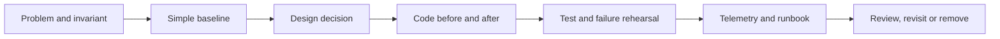

# PHP Design Patterns Handbook

> Cẩm nang thực hành Design Pattern, Software Design và Production Architecture cho PHP 8.2+, phục vụ tự học, đào tạo nội bộ, code review, phỏng vấn và ra quyết định kỹ thuật có bằng chứng.

[](https://www.php.net/)
[](REVIEW_REPORT.md)
[](LICENSE)

## Repository này giải quyết điều gì?

Nhiều tài liệu Design Pattern dừng ở định nghĩa và UML. Repository này đi xa hơn: mỗi chủ đề phải chỉ ra **bối cảnh**, **invariant**, **failure mode**, **lực thay đổi**, **baseline đơn giản**, **thiết kế đề xuất**, **code chạy được**, **test/evidence**, **trade-off**, **cách vận hành** và **điều kiện xóa abstraction**.

Luồng học chuẩn:



## Giá trị nổi bật

- **23 GoF Pattern** và **7 Enterprise Pattern** được giải thích bằng bài toán PHP thực tế.
- Ví dụ before/after, unit/contract test, lab, kata và mini-application CLI có thể chạy.
- Laravel và Symfony Integration tập trung lifecycle, transaction, queue, persistence và framework leakage.
- Production case study cho Payment, Notification, Booking, Inventory, CRM và Order Management.
- Engineering Handbook về Refactoring, Clean Architecture, DDD, Microservices và Engineering Playbook.
- Interview bank theo Junior, Middle, Senior và Tech Lead, kèm đáp án và cách ghi điểm.
- Training package 15 buổi có slides, speaker notes, exercise, quiz và demo PHP.
- Hệ thống audit tự động chống nội dung lặp, sơ đồ generic, link hỏng và tài liệu quá mỏng.

## Bắt đầu nhanh

### Yêu cầu

- PHP 8.2 trở lên.
- Composer 2 trở lên để chạy PHPUnit, PHPStan và PHP CS Fixer.

```bash
composer install
composer quality
```

Không có Composer dependencies vẫn có thể chạy các tài nguyên độc lập:

```bash
php scripts/run-source-smoke-tests.php
bash scripts/run-examples.sh
bash scripts/run-playgrounds.sh
bash scripts/run-katas.sh
bash scripts/run-benchmarks.sh
```

## Lộ trình học

| Cấp độ | Trọng tâm | Điểm bắt đầu |
|---|---|---|
| Junior | OOP, SOLID, Strategy, Factory, Adapter | [Foundations](docs/00-foundations/README.md) |
| Middle | Behavioral/Structural patterns, refactoring, testing | [GoF Overview](cheatsheets/gof-overview.md) |
| Senior | Enterprise patterns, DDD, failure semantics | [Enterprise Patterns](docs/04-enterprise-patterns/README.md) |
| Tech Lead | ADR, governance, production evidence, training | [Expert Practice](docs/09-expert-practice/README.md) |

Bản đồ đầy đủ: [OVERVIEW.md](OVERVIEW.md) và [Learning Path](learning-path/README.md).

## Cấu trúc repository

```text
php-design-patterns-handbook/
├── benchmarks/             # Thí nghiệm hiệu năng có checksum và giới hạn suy luận
├── cheatsheets/            # Decision matrix, code smell, testing và production quick reference
├── decisions/              # ADR thực tế, rollout, verification và revisit condition
├── docs/                   # Foundations, GoF, Enterprise, Laravel, case study, interactive, expert
├── examples/               # Before/after/test theo use case
├── exercises/              # 52 module Foundation/Production + lời giải
├── framework-integration/  # Laravel và Symfony chuyên sâu
├── framework-source-tours/ # Protocol đọc source theo tag/commit cố định
├── handbook/               # Software Design, Refactoring, Clean Architecture, DDD, Microservices
├── incident-packets/       # Template và sample incident/postmortem
├── interviews/             # Câu hỏi, đáp án, live design và playbook
├── kata/                   # 204 bài refactor ngắn có solution
├── labs/                   # Starter, solution, acceptance/failure tests
├── learning-path/          # Lộ trình học theo level và evidence
├── playground/             # 108 drill + 12 flagship mini-application
├── production/             # 54 production modules, metrics và runbook
├── src/                    # Mã PHP reusable theo PSR-4
├── tests/                  # Unit, integration và architecture tests
├── training/               # 15 lesson package có slides, notes, exercise, quiz, demo
└── scripts/                # Quality gates và executable checks
```

Chi tiết tiêu chí từng thư mục: [DIRECTORY_QUALITY_MATRIX.md](DIRECTORY_QUALITY_MATRIX.md). Ma trận nối pattern với invariant, failure, test, metric và runbook: [Enterprise Operability Matrix](ENTERPRISE_OPERABILITY_MATRIX.md).

## Cách học một pattern

1. Đọc problem, invariant và code smell.
2. Chạy code `before` và ghi characterization test.
3. Vẽ dependency/sequence trước khi đọc lời giải.
4. Chạy code `after`, contract test và failure test.
5. So sánh với baseline trực tiếp; ghi chi phí abstraction.
6. Làm lab hoặc kata liên quan.
7. Viết ADR ngắn: chọn gì, vì sao, rollback và revisit trigger.
8. Đối chiếu production module để hiểu telemetry, reconciliation và runbook.

## Source có thể review và chạy

`src/` chứa implementation nhỏ, tập trung semantics và testability:

- Strategy, State, Observer, Adapter, Decorator, Factory.
- Repository, Service Layer, Query Object, Specification, Unit of Work, Data Mapper, Active Record.
- Idempotency Store, Transactional Outbox, Retry Policy và Circuit Breaker.
- Command Bus, Money Value Object, Clock và cursor Page.
- Distributed Bulkhead, Rate Limiter, Bounded Work Queue, deterministic Failure Injector, Dual-run Comparator và Messaging Deduplication Window.

Đọc [src/README.md](src/README.md) và [SOURCE_ENTERPRISE_REVIEW.md](SOURCE_ENTERPRISE_REVIEW.md) trước khi dùng code như production library. Các implementation in-memory/synchronous là mô hình học tập; production cần persistence, concurrency, telemetry và operational controls phù hợp.

## Quality gates

Chạy toolchain đầy đủ:

```bash
composer test
composer analyse
composer lint
```

## Tài liệu phát hành và audit

- [CHANGELOG.md](CHANGELOG.md): lịch sử cải tiến tổng hợp, không chia version.
- [MANIFEST.md](MANIFEST.md): số liệu và bản đồ artifact.

## Đóng góp

Đọc [CONTRIBUTING.md](CONTRIBUTING.md). Pull Request phải nêu problem, evidence, failure path và lệnh verification. Không chấp nhận bài chỉ đổi tiêu đề hoặc thêm abstraction mà không chứng minh giá trị.

## Tác giả

**TuanTQ**  
Email: [quoctuanit2018@gmail.com](mailto:quoctuanit2018@gmail.com)

## Cảm ơn và ủng hộ

Nếu repository hữu ích cho việc học, mentoring hoặc architecture review, hãy đánh dấu **⭐** để hỗ trợ việc duy trì tài liệu.

## Giấy phép

Phát hành theo [MIT License](LICENSE).

## Chọn lộ trình theo nhu cầu thực tế

| Nhu cầu | Điểm bắt đầu | Artifact nên hoàn thành |
|---|---|---|
| Refactor `if/switch` đang tăng | Strategy/State/Factory comparisons | Characterization test + ADR ngắn |
| Tích hợp SDK/vendor | Adapter, ACL, HTTP Client Adapter | Contract test + failure mapping table |
| Xử lý queue/event | Jobs, Observer, Outbox/Inbox | Idempotency test + runbook duplicate |
| Thiết kế workflow | State, Command, Process Manager | State diagram + transition/failure matrix |
| Tối ưu query/report | Query Object, projection, cursor | Explain plan + stable pagination test |
| Chuẩn bị production review | Production modules + Expert Practice | Review packet + dashboard + rollback trigger |

Repository không yêu cầu học tuần tự toàn bộ. Hãy bắt đầu từ vấn đề thật, chọn một baseline nhỏ, chạy code/test, sau đó mới dùng pattern để cô lập trục thay đổi hoặc failure boundary.
