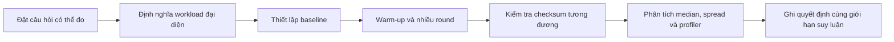

# Benchmark Suite

`Benchmark` trong repository nhằm giúp người học **nhìn thấy chi phí runtime tương đối** của một số lựa chọn thiết kế. Mục tiêu không phải chứng minh pattern nào “nhanh nhất”. Design Pattern chủ yếu tối ưu khả năng thay đổi, testability và giao tiếp trong đội ngũ; chi phí CPU thường chỉ là một phần nhỏ của quyết định.

## Cách chạy

```bash
composer benchmarks
```

Hoặc chạy riêng:

```bash
php benchmarks/strategy-vs-switch/benchmark.php
```

## Phương pháp

Mỗi benchmark:

- Có hai implementation tạo ra cùng một kết quả.
- Warm-up trước khi đo.
- Chạy nhiều round và báo median, min, max.
- Có checksum để tránh benchmark một đoạn code không tạo ra kết quả.
- Không thực hiện I/O, network hoặc database để tập trung vào dispatch/object overhead.

## Cách diễn giải

- Chênh lệch microsecond trong một use case gọi vài lần thường không đáng đổi lấy code khó bảo trì.
- Với hot path gọi hàng triệu lần, hãy benchmark bằng workload thật và profiler.
- Không suy rộng kết quả giữa PHP version, JIT setting hoặc hardware khác nhau.
- Luôn đánh giá cùng readability, testability, extensibility và operational risk.

## Danh sách thí nghiệm

| Benchmark | Câu hỏi |
| --- | --- |
| [Strategy vs Switch](strategy-vs-switch/README.md) | Dynamic dispatch qua interface tốn bao nhiêu so với `match`? |
| [Factory vs Direct New](factory-vs-direct-new/README.md) | Factory thêm chi phí gì khi tạo object? |
| [Decorator vs Inheritance](decorator-vs-inheritance/README.md) | Chuỗi wrapper ảnh hưởng call depth ra sao? |
| [Event Sync vs Direct Call](event-sync-vs-direct-call/README.md) | Dispatcher đồng bộ tốn bao nhiêu so với gọi thẳng? |
| [Pipeline vs Loop](pipeline-vs-loop/README.md) | Closure middleware chain so với vòng lặp tuần tự thế nào? |
| [Repository Overhead](repository-overhead/README.md) | Một lớp repository mỏng thêm bao nhiêu indirection? |

## Vòng đời một thí nghiệm benchmark



Một benchmark chỉ có giá trị khi hai phương án giữ nguyên semantics. Trước khi nhìn thời gian chạy, hãy xác nhận output, exception và side effect tương đương. Nếu một phương án bỏ validation hoặc tạo ít object hơn vì đã thay đổi behavior, số liệu không còn trả lời câu hỏi thiết kế ban đầu.

## Hồ sơ thí nghiệm cần lưu

- Phiên bản PHP, trạng thái JIT/OPcache và cấu hình CPU.
- Kích thước input, số iteration, warm-up và số round.
- Median, min, max; thêm percentile khi workload có I/O.
- Checksum hoặc assertion chứng minh hai phương án cho cùng kết quả.
- Profiler trace khi chênh lệch đủ lớn để ảnh hưởng SLO.
- Kết luận về maintainability, không chỉ throughput.

## Khi không nên dùng micro-benchmark

Không dùng micro-benchmark để quyết định ranh giới domain, transaction boundary hoặc ownership. Những lựa chọn đó cần evidence từ change frequency, defect rate, lead time, incident và test isolation. Micro-benchmark chỉ phù hợp khi overhead nằm trên hot path đã được profiler xác nhận.
