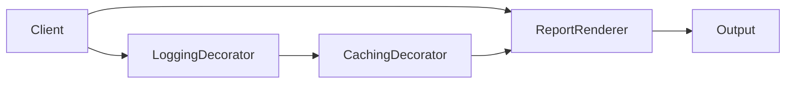

# Benchmark: Decorator vs Inheritance

## Mục đích

So sánh một implementation cố định với chuỗi ba decorator cho text formatter. Mục tiêu là thấy chi phí của composition khi hành vi được ghép động.

## Câu hỏi cần trả lời

- Chi phí wrapper tăng theo độ sâu chain như thế nào?
- Wrapper order có đổi output và làm benchmark không còn tương đương không?
- Inheritance baseline có thực sự mô hình hóa cùng khả năng kết hợp runtime?

## Chạy

```bash
php benchmarks/decorator-vs-inheritance/benchmark.php
```

## Không được kết luận

- Không coi inheritance là baseline tương đương nếu nó không hỗ trợ composition.
- Không bỏ qua allocation của chain khi production build mỗi request.
- Không tối ưu wrapper trước khi profiler chỉ ra hotspot.

Đọc thêm [hướng dẫn benchmark](../README.md).

## Phương pháp mở rộng

Thay đổi chiều dài wrapper chain và thứ tự. Xác minh output/checksum giống nhau và đo allocation.

Khi đo **Benchmark: Decorator vs Inheritance**, hãy ghi PHP version, OPcache/JIT, CPU, kích thước workload, warm-up, số sample và median/p95. Giữ cùng dữ liệu đầu vào và cùng môi trường; kết quả chỉ có giá trị cho giả thuyết của benchmark này, không phải kết luận kiến trúc tổng quát.

## Khi benchmark có giá trị

Benchmark có giá trị khi profile cho thấy wrapper chain nằm trên hot path hoặc số decorator tăng theo configuration. Quyết định maintainability vẫn phải dựa trên khả năng compose, test và thay đổi behavior.

## Mô hình phép đo



Đo chain wrapper theo độ sâu và thứ tự. Kiểm tra output/side effect tương đương trước khi so thời gian.

## Ma trận workload khuyến nghị

| Biến số | Các mức nên đo | Lý do |
| --- | --- | --- |
| Chain depth | 1, 3, 5, 10 | đo call-stack/wrapper overhead |
| Side effect | none, log buffer, cache hit | tách dispatch khỏi I/O |
| Order | log→cache, cache→log | order có thể đổi semantics |
| Base workload | nhẹ, nặng | xác định overhead tương đối |

## Giả thuyết cần kiểm chứng

Đo cost của wrapper chain theo độ sâu 1/3/5 và kiểm tra thứ tự wrapper có làm thay đổi behavior hay không.

## Báo cáo kết quả

Ghi rõ chain order, cache hit ratio và logging sink. Performance chỉ là một force; khả năng kết hợp behavior và giảm subclass explosion phải được review riêng.
