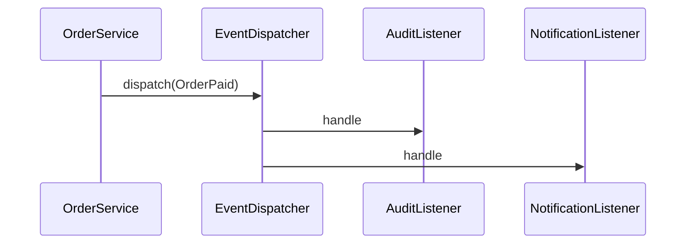

# Benchmark: Event Sync vs Direct Call

## Mục đích

Đo overhead của event dispatcher đồng bộ với hai listener so với hai method call trực tiếp. Không mô phỏng queue hay network.

## Câu hỏi cần trả lời

- Dispatcher có bao nhiêu listener và có filter/prioritization không?
- Exception propagation và transaction semantics có giống direct call không?
- Lợi ích decoupling có cần thiết nếu chỉ có một subscriber ổn định?

## Chạy

```bash
php benchmarks/event-sync-vs-direct-call/benchmark.php
```

## Không được kết luận

- Không dùng benchmark sync để suy luận queue/async performance.
- Không so hai implementation có error handling khác nhau.
- Không bỏ event chỉ vì nanoseconds nếu audit/extensibility là requirement.

Đọc thêm [hướng dẫn benchmark](../README.md).

## Phương pháp mở rộng

Đo số listener, exception policy và payload size. Benchmark sync dispatcher không đại diện broker/network.

Khi đo **Benchmark: Event Sync vs Direct Call**, hãy ghi PHP version, OPcache/JIT, CPU, kích thước workload, warm-up, số sample và median/p95. Giữ cùng dữ liệu đầu vào và cùng môi trường; kết quả chỉ có giá trị cho giả thuyết của benchmark này, không phải kết luận kiến trúc tổng quát.

## Khi benchmark có giá trị

Benchmark có giá trị khi có nhiều listener đồng bộ và request latency bị ảnh hưởng. Nếu chuyển async, phải đo thêm broker, queue lag và delivery semantics thay vì dùng kết quả dispatcher nội bộ.

## Mô hình phép đo



Benchmark này chỉ đo fan-out đồng bộ trong process; không đại diện queue, broker hoặc network delivery.

## Ma trận workload khuyến nghị

| Biến số | Các mức nên đo | Lý do |
| --- | --- | --- |
| Listener count | 1, 5, 20 | fan-out scale |
| Listener workload | no-op, CPU, buffered I/O | phân biệt dispatcher và handler cost |
| Priority | none, ordered | đo sorting/ordering |
| Error policy | fail-fast, collect | semantics ảnh hưởng đường chạy |

## Giả thuyết cần kiểm chứng

Đo synchronous fan-out với 1/5/20 listener; không suy diễn sang queue hoặc network broker.

## Báo cáo kết quả

Báo cáo số listener, error policy và tổng side effect. Không dùng kết quả để so với async messaging; event đồng bộ cần được đánh giá thêm về coupling và transaction behavior.
