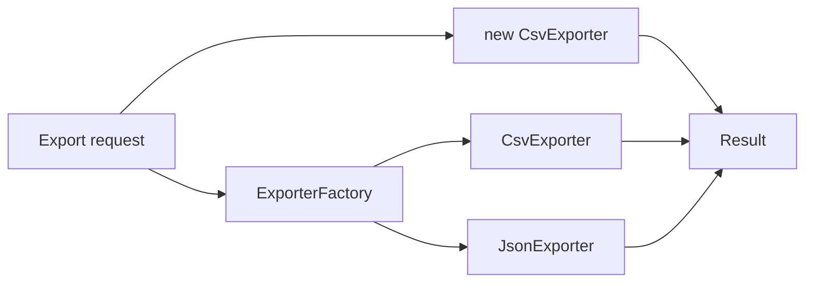

# Benchmark: Factory vs Direct New

## Mục đích

Đo overhead của factory khi tạo exporter. Factory hữu ích khi logic lựa chọn, cấu hình hoặc lifecycle đủ phức tạp; không nên dùng chỉ để bọc một lệnh `new`.

## Câu hỏi cần trả lời

- Factory đo creation logic hay chỉ thêm một method call?
- Object graph lớn, reflection/container và caching ảnh hưởng kết quả ra sao?
- Factory có mang lại invariant/configuration ownership đủ lớn để xứng đáng overhead không?

## Chạy

```bash
php benchmarks/factory-vs-direct-new/benchmark.php
```

## Không được kết luận

- Không so container build với `new` đơn giản rồi kết luận Factory luôn đắt.
- Không benchmark khi hai bên tạo object graph khác nhau.
- Không đánh đổi correctness của construction chỉ vì microseconds.

Đọc thêm [hướng dẫn benchmark](../README.md).

## Phương pháp mở rộng

Tách cost lookup, validation và object construction. Factory có giá trị ở ownership/variation, không phải tối ưu tốc độ.

Khi đo **Benchmark: Factory vs Direct New**, hãy ghi PHP version, OPcache/JIT, CPU, kích thước workload, warm-up, số sample và median/p95. Giữ cùng dữ liệu đầu vào và cùng môi trường; kết quả chỉ có giá trị cho giả thuyết của benchmark này, không phải kết luận kiến trúc tổng quát.

## Khi benchmark có giá trị

Benchmark có giá trị khi factory thực hiện lookup/validation rất thường xuyên trong batch lớn. Với request thông thường, ownership của creation và correctness quan trọng hơn chênh lệch method call.

## Mô hình phép đo



Tách phép đo cold creation khỏi steady-state export; constructor có dependency graph phải được đo riêng với object nhẹ.

## Ma trận workload khuyến nghị

| Biến số | Các mức nên đo | Lý do |
| --- | --- | --- |
| Constructor dependency | 0, 3, 10 | factory có thể che wiring cost |
| Object lifecycle | transient, cached | phân biệt creation và reuse |
| Product count | 2, 10, 50 | xem lookup/branch scale |
| Validation config | tắt, bật | tránh gộp validation vào creation overhead |

## Giả thuyết cần kiểm chứng

Đo creation path khi object nhẹ và khi constructor có dependency graph; tách cold-start khỏi steady-state.

## Báo cáo kết quả

Báo cáo phải tách thời gian tạo object, thời gian export và memory allocation. Không kết luận Factory “chậm” nếu production cần kiểm soát lifecycle hoặc family creation.
