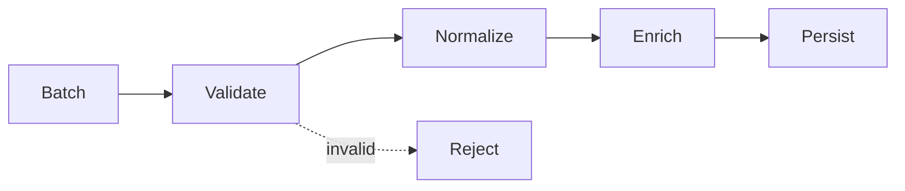

# Benchmark: Pipeline vs Loop

## Mục đích

So sánh ba bước xử lý bằng vòng lặp callable và middleware pipeline lồng closure. Pipeline đổi lấy composability và khả năng short-circuit.

## Câu hỏi cần trả lời

- Closure invocation, middleware object và short-circuit ảnh hưởng thế nào?
- Stage có I/O hay CPU work đủ lớn để overhead biến mất không?
- Pipeline có cải thiện ordering/test isolation hơn loop trực tiếp không?

## Chạy

```bash
php benchmarks/pipeline-vs-loop/benchmark.php
```

## Không được kết luận

- Không benchmark pipeline thiếu short-circuit nếu production có.
- Không kết luận loop tốt hơn khi stage ordering cần cấu hình/runtime composition.
- Không bỏ qua memory/allocation với chain rất dài.

Đọc thêm [hướng dẫn benchmark](../README.md).

## Phương pháp mở rộng

Đo số step, closure allocation, short-circuit và error propagation. So sánh behavior tương đương.

Khi đo **Benchmark: Pipeline vs Loop**, hãy ghi PHP version, OPcache/JIT, CPU, kích thước workload, warm-up, số sample và median/p95. Giữ cùng dữ liệu đầu vào và cùng môi trường; kết quả chỉ có giá trị cho giả thuyết của benchmark này, không phải kết luận kiến trúc tổng quát.

## Khi benchmark có giá trị

Benchmark có giá trị khi pipeline chạy hàng triệu item hoặc closure allocation xuất hiện trong profile. Với business workflow, ordering, short-circuit và observability thường quyết định thiết kế.

## Mô hình phép đo



Hai implementation phải giữ cùng stage order, payload mutation và short-circuit behavior.

## Ma trận workload khuyến nghị

| Biến số | Các mức nên đo | Lý do |
| --- | --- | --- |
| Stage count | 3, 10, 30 | closure/object dispatch scale |
| Batch size | 10, 1k, 100k | amortization theo payload |
| Short-circuit rate | 0%, 10%, 50% | invalid path có thể chi phối |
| Payload style | immutable, mutable | allocation khác nhau |

## Giả thuyết cần kiểm chứng

Đo closure/object dispatch theo số stage và kích thước payload; giữ cùng thứ tự và short-circuit semantics.

## Báo cáo kết quả

Ghi rõ stage count, batch size, rejection rate và payload style. Pipeline có thể đáng giá nhờ composability/observability dù loop nhanh hơn ở micro-benchmark.
