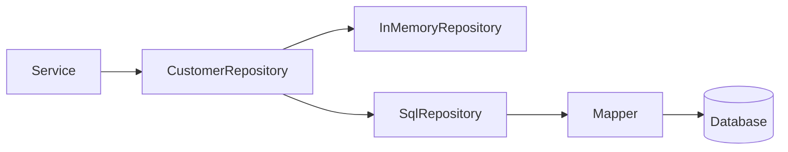

# Benchmark: Repository Overhead

## Mục đích

Đo indirection của repository in-memory so với truy cập array trực tiếp. Benchmark không đại diện cho database vì I/O sẽ áp đảo chi phí method call.

## Câu hỏi cần trả lời

- Overhead repository còn đáng kể khi truy vấn DB chiếm phần lớn latency không?
- Baseline direct collection có cùng semantics filter/order/pagination không?
- Repository có bảo vệ domain boundary hay chỉ forward method?

## Chạy

```bash
php benchmarks/repository-overhead/benchmark.php
```

## Không được kết luận

- Không dùng in-memory benchmark để suy luận database throughput.
- Không giữ generic repository chỉ vì overhead nhỏ.
- Không loại repository có semantics nghiệp vụ chỉ vì thêm một lời gọi method.

Đọc thêm [hướng dẫn benchmark](../README.md).

## Phương pháp mở rộng

Tách overhead abstraction khỏi database I/O. Với production, query plan/network thường lớn hơn method dispatch.

Khi đo **Benchmark: Repository Overhead**, hãy ghi PHP version, OPcache/JIT, CPU, kích thước workload, warm-up, số sample và median/p95. Giữ cùng dữ liệu đầu vào và cùng môi trường; kết quả chỉ có giá trị cho giả thuyết của benchmark này, không phải kết luận kiến trúc tổng quát.

## Khi benchmark có giá trị

Benchmark method dispatch chỉ có ý nghĩa với in-memory hot path. Khi có database, cần đo query plan, hydration và network; repository được đánh giá chủ yếu qua boundary và testability.

## Mô hình phép đo



Đo abstraction call và mapping riêng; không trộn network/database latency vào cùng một con số.

## Ma trận workload khuyến nghị

| Biến số | Các mức nên đo | Lý do |
| --- | --- | --- |
| Entity count | 1, 100, 10k | mapping/collection cost |
| Mapping | none, row→entity | tách repository và mapper |
| Query source | memory, local DB | xác định I/O dominance |
| Hydration | eager, partial | read model semantics khác nhau |

## Giả thuyết cần kiểm chứng

Đo lớp gọi bổ sung và mapping cost; tách abstraction overhead khỏi I/O database vốn lớn hơn nhiều.

## Báo cáo kết quả

Báo cáo tách call overhead, mapping time và I/O. Repository chỉ có ý nghĩa khi contract đại diện collection/aggregate semantics; benchmark không chứng minh cần hoặc không cần abstraction.
