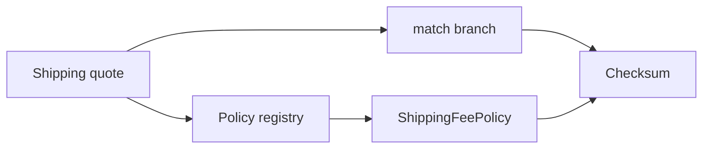

# Benchmark: Strategy vs Switch

## Mục đích

So sánh `match` với interface dispatch khi tính phí vận chuyển. Hai implementation trả cùng kết quả; benchmark chỉ đo chi phí lựa chọn thuật toán.

## Câu hỏi cần trả lời

- Dispatch overhead thay đổi thế nào khi mỗi strategy thực hiện calculation nặng hơn?
- Số strategy và khả năng hot path có làm branch prediction khác đi?
- Có thể dùng config/table thay class mà vẫn giữ testability không?

## Chạy

```bash
php benchmarks/strategy-vs-switch/benchmark.php
```

## Không được kết luận

- Không suy ra Strategy “chậm” từ workload chỉ gồm phép cộng nhỏ.
- Không bỏ qua cost tạo object nếu production không reuse strategy.
- Không dùng kết quả để biện minh abstraction khi chưa có variation thật.

Đọc thêm [hướng dẫn benchmark](../README.md).

## Phương pháp mở rộng

Đo thêm workload nhẹ/nặng, reuse object và số lượng strategy. Theo dõi allocation nếu implementation tạo object trong hot loop.

Khi đo **Benchmark: Strategy vs Switch**, hãy ghi PHP version, OPcache/JIT, CPU, kích thước workload, warm-up, số sample và median/p95. Giữ cùng dữ liệu đầu vào và cùng môi trường; kết quả chỉ có giá trị cho giả thuyết của benchmark này, không phải kết luận kiến trúc tổng quát.

## Khi benchmark có giá trị

Benchmark có giá trị khi policy selection nằm trong vòng lặp lớn và calculation rất nhỏ. Nếu strategy chứa I/O hoặc domain calculation nặng, dispatch overhead gần như không còn là yếu tố chính.

## Mô hình phép đo



Đo riêng chi phí chọn policy khi phép tính phí rất nhỏ. Thêm scenario với policy nặng để quan sát thời điểm dispatch overhead không còn đáng kể.

## Ma trận workload khuyến nghị

| Biến số | Các mức nên đo | Lý do |
| --- | --- | --- |
| Số policy | 2, 8, 32 | branch table và registry có scale khác nhau |
| Calculation | 1 phép toán, 20 phép toán | tìm ngưỡng overhead bị che khuất |
| Registry lifecycle | reuse, tạo mới mỗi request | tách lookup khỏi allocation |
| Tenant mix | cố định, ngẫu nhiên | kiểm tra branch prediction/cache locality |

## Giả thuyết cần kiểm chứng

Đo chi phí dispatch khi thuật toán rất nhỏ; bổ sung workload có 1, 5 và 20 phép tính để xem overhead bị che khuất ở đâu.

## Báo cáo kết quả

Ghi rõ cách chọn tenant/policy, tỷ lệ mỗi policy, object có được reuse hay không và checksum phí vận chuyển. Kết luận chỉ áp dụng cho hot path tính phí, không thay thế đánh giá OCP hoặc testability.
