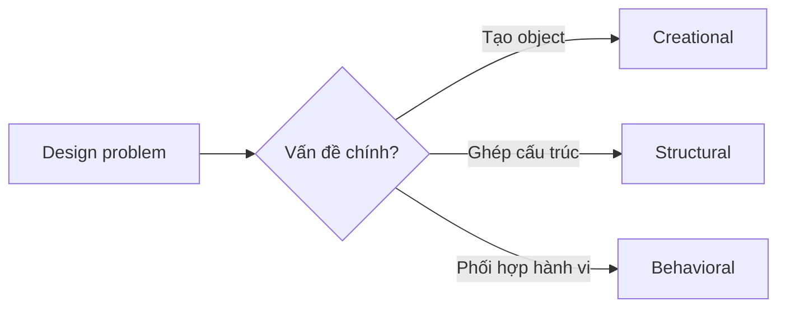

# Gang of four(GoF) Overview

GoF pattern là **từ vựng thiết kế**, không phải danh sách class bắt buộc. Hãy bắt đầu từ lực thay đổi, dependency và invariant; chỉ chọn pattern khi nó làm chi phí thay đổi thấp hơn so với thiết kế trực tiếp.

## Ba nhóm pattern

| Nhóm | Câu hỏi chính | Pattern học trước | Pattern nâng cao |
| --- | --- | --- | --- |
| Creational | Ai sở hữu việc tạo object và khi nào? | Factory Method, Builder | Abstract Factory, Prototype, Singleton |
| Structural | Làm sao ghép object mà vẫn giữ contract rõ? | Adapter, Decorator, Facade | Bridge, Composite, Proxy, Flyweight |
| Behavioral | Ai ra quyết định, ai phản ứng và flow thay đổi ra sao? | Strategy, Observer, Command | State, Chain, Mediator, Visitor, Memento, Interpreter |

## Ma trận chọn nhanh

| Tín hiệu | Pattern nên xem | Cảnh báo |
| --- | --- | --- |
| Nhiều thuật toán thay thế được | Strategy | Nếu chỉ có hai branch ổn định, `match` có thể đủ |
| Vòng đời có transition hợp lệ/bất hợp lệ | State | Không dùng State chỉ để thay enum đơn giản |
| SDK ngoài không khớp contract nội bộ | Adapter | Không để adapter chứa business rule |
| Muốn thêm behavior theo lớp | Decorator | Thứ tự wrapper phải được test |
| Cần API đơn giản cho subsystem | Facade | Facade không nên trở thành God Service |
| Tạo object phụ thuộc loại/config | Factory Method | Phân biệt với Simple Factory |
| Cây part-whole | Composite | Operation phải có nghĩa cho cả leaf/group |
| Side effect sau event | Observer | Quyết định delivery, retry và idempotency |

## Cặp pattern dễ nhầm

- **Strategy vs State**: Strategy được client chọn; State thường tự chuyển theo lifecycle.
- **Adapter vs Facade**: Adapter đổi contract; Facade đơn giản hóa nhiều subsystem.
- **Decorator vs Proxy**: Decorator thêm behavior; Proxy kiểm soát truy cập/lifecycle.
- **Factory Method vs Abstract Factory**: Factory Method chọn một product qua inheritance; Abstract Factory tạo cả product family.
- **Command vs Strategy**: Command đóng gói hành động có thể queue/audit; Strategy đóng gói thuật toán.

## Phương pháp học

1. Đọc code `before` và gọi tên pain point.
2. Vẽ dependency hiện tại.
3. Xác định trục thay đổi thật.
4. Đọc pattern và dự đoán trade-off.
5. Chạy example/test.
6. Viết một ADR ngắn: áp dụng hay không áp dụng.

## Liên kết

- [Creational Patterns](../docs/01-creational/README.md)
- [Structural Patterns](../docs/02-structural/README.md)
- [Behavioral Patterns](../docs/03-behavioral/README.md)
- [Pattern Comparison](pattern-comparison.md)
- [Pattern Selection by Change Axis](09-pattern-selection-by-change-axis.md)
