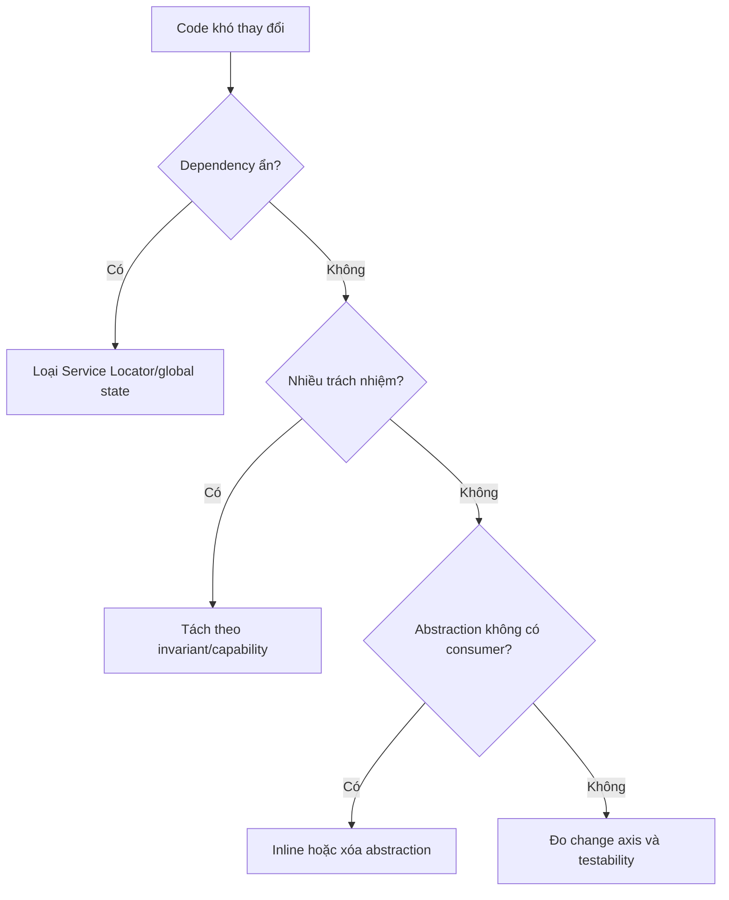

# Anti-patterns — Dấu hiệu, hậu quả và hướng xử lý

Anti-pattern không chỉ là “code xấu”. Đó là giải pháp có vẻ hợp lý lúc đầu nhưng lặp lại hậu quả tiêu cực trong bảo trì, kiểm thử hoặc vận hành.

## Ma trận nhận diện nhanh

| Anti-pattern | Dấu hiệu | Hậu quả | Hướng xử lý đầu tiên |
| --- | --- | --- | --- |
| God Object | class biết quá nhiều domain, dependency dài | blast radius lớn | tách theo capability và invariant |
| Service Locator | gọi container/static helper bên trong domain | dependency ẩn, test khó | constructor injection + composition root |
| Singleton global state | mutable state dùng toàn process | test phụ thuộc thứ tự | scope rõ ràng, immutable service hoặc DI |
| Repository wrapper | mỗi method chỉ gọi ORM 1–1 | abstraction không thêm semantics | dùng ORM trực tiếp hoặc Query Object |
| Interface explosion | interface chỉ có một impl, không có consumer boundary | nhiều file, ít giá trị | giữ concrete class đến khi change axis rõ |
| Event spaghetti | flow nghiệp vụ nằm rải ở listener | khó trace, ordering mơ hồ | application workflow rõ + event cho side effect |
| Retry without idempotency | timeout là retry ngay | duplicate side effect | idempotency key + deduplication |
| Inheritance hierarchy | override sâu, hành vi khó đoán | fragile base class | composition/strategy/decorator |
| DTO explosion | mỗi layer copy cùng dữ liệu | mapping noise | DTO tại trust/boundary thật sự |
| Generic Manager/Helper | tên không thể hiện trách nhiệm | cohesion thấp | đặt tên theo use case hoặc domain concept |

## Decision flow

## Review questions

- Class này bảo vệ invariant nào?
- Dependency nào bị ẩn hoặc lấy từ global state?
- Abstraction có consumer độc lập hay chỉ bọc API hiện tại?
- Event đang mô tả sự kiện đã xảy ra hay che giấu lệnh đồng bộ?
- Retry có thể tạo side effect trùng không?
- Một thiết kế trực tiếp hơn có đủ cho 6–12 tháng tới không?

## Lưu ý

Không refactor anti-pattern chỉ vì tên gọi. Hãy tạo safety net, đo blast radius và thay đổi theo bước nhỏ. Một `switch` nhỏ đôi khi tốt hơn hierarchy 15 class; một Active Record đơn giản đôi khi phù hợp hơn Repository nếu domain chủ yếu CRUD.
