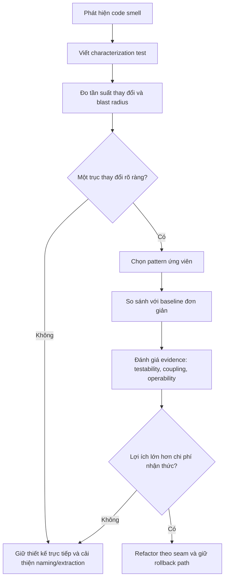

# Từ code smell đến pattern ứng viên

> **`Code smell`** là tín hiệu để điều tra, không phải bằng chứng bắt buộc phải dùng pattern. Luôn tìm **nguyên nhân**, **trục thay đổi** và **phương án trực tiếp đơn giản nhất** trước khi thêm abstraction.

## Quy trình chẩn đoán

## Ma trận smell → nguyên nhân → pattern ứng viên

| Code smell quan sát được | Nguyên nhân cần xác minh | Pattern ứng viên | Baseline đơn giản hơn | Test/evidence cần có |
|---|---|---|---|---|
| `if/switch` tăng theo loại thuật toán | Các nhánh cùng mục tiêu nhưng thay đổi độc lập | Strategy | `match`, lookup table, function map | Contract test chạy cùng bộ dữ liệu cho mọi strategy |
| Khởi tạo object rải rác | Quy tắc construction phụ thuộc môi trường, tenant hoặc product family | Factory Method / Abstract Factory | Named constructor, factory function | Test product selection và unsupported variant |
| Constructor có quá nhiều tham số tùy chọn | Object có nhiều bước tạo và invariant chỉ kiểm tra được khi hoàn tất | Builder | DTO + validation, named constructor | Test thiếu field bắt buộc và cấu hình không hợp lệ |
| Vendor SDK xuất hiện trong application/domain | Contract bên ngoài không ổn định hoặc semantics khác domain | Adapter | Wrapper function nhỏ | Contract test mapping request, response và error |
| Nhiều class lặp logging/cache/retry | Cross-cutting concern cần compose quanh cùng contract | Decorator | Helper tại composition root | Test wrapper order, exception propagation, duplicate side effect |
| Client cần API đơn giản hơn subsystem | Client đang biết thứ tự gọi và chi tiết nội bộ | Facade | Application service | Integration test orchestration và partial failure |
| Cần kiểm soát truy cập/lazy load/cache | Quyền truy cập object phải được điều phối mà không đổi client contract | Proxy | Explicit guard/service | Test authorization, cache miss/hit và transparent behavior |
| Nhiều `if` theo trạng thái | Mỗi trạng thái có hành vi và transition riêng | State | Transition table | Test mọi transition hợp lệ và bất hợp lệ |
| Nhiều bước xử lý tuần tự | Bước cần thêm/bỏ/đổi thứ tự hoặc short-circuit | Pipeline / Chain of Responsibility | Một service tuần tự rõ ràng | Test ordering, early exit, exception policy |
| Side effect được gọi trực tiếp ở nhiều nơi | Một fact cần nhiều phản ứng độc lập | Observer / Domain Event | Gọi service trực tiếp | Test delivery semantics, duplicate event và after-commit |
| Hành động cần queue/audit/undo | Request cần biểu diễn như object | Command | Method call trực tiếp | Test handler mapping, idempotency và retry safety |
| Query dài trong controller/service | Read use case có filter, projection và pagination riêng | Query Object | Local query method | Test filter combinations, stable ordering và execution plan |
| Business rule lặp lại | Rule cần reuse, compose hoặc giải thích lý do fail | Specification | Predicate/function | Truth table, reason codes và composition tests |
| Persistence logic nằm trong domain | Domain cần collection semantics nhưng không nên biết ORM | Repository / Data Mapper | ORM trực tiếp tại application layer | Contract test repository và mapping round-trip |
| Nhiều thay đổi phải commit cùng nhau | Transaction boundary trải qua nhiều repository | Unit of Work | Một transaction closure | Test commit, rollback, nested call và exception path |

## Các trường hợp dễ chẩn đoán sai

### `switch` không tự động đồng nghĩa với Strategy

Giữ `switch` khi số nhánh nhỏ, ổn định, cùng nằm trong một module và không cần lifecycle riêng. Strategy có giá trị khi các thuật toán cần test/triển khai độc lập hoặc được chọn theo runtime policy.

### Repository không phải thuốc chữa cho mọi lời gọi ORM

Nếu use case CRUD đơn giản và không có domain collection semantics, gọi ORM trong application service có thể rõ hơn một repository chỉ bọc `find()`/`save()`.

### Observer không thay thế transaction

Observer giảm coupling giữa phản ứng, nhưng không đảm bảo atomicity. Khi side effect vượt process boundary, cần after-commit, outbox, idempotency và reconciliation.

## Checklist trước khi áp dụng pattern

1. Smell gây lỗi hoặc chi phí thay đổi cụ thể nào?
2. Trục thay đổi nào được tách ra?
3. Baseline ít abstraction nhất là gì?
4. Pattern làm giảm dependency nào và tạo dependency nào mới?
5. Happy path, failure path và migration path được kiểm thử ra sao?
6. Có metric hoặc evidence để biết abstraction đang mang lại giá trị không?
7. Khi assumption không còn đúng, có thể xóa hoặc thu gọn pattern như thế nào?

## Bài tập thực hành

Chọn một service có ít nhất ba nhánh xử lý. Viết characterization test, xác định trục thay đổi, so sánh ba phương án: giữ conditional, dùng lookup table và dùng pattern. Kết luận bằng ADR ngắn nêu rõ vì sao phương án được chọn tốt hơn trong **bối cảnh hiện tại**, không phải vì pattern “chuẩn hơn”.

## Tài liệu liên quan

- [Pattern Selection by Change Axis](09-pattern-selection-by-change-axis.md)
- [Refactoring Workflow](refactoring-workflow.md)
- [Reviewing Abstractions](17-reviewing-abstractions.md)
- [Pattern Comparison](pattern-comparison.md)
- [Pattern Adoption Threshold ADR](../decisions/examples/008-pattern-adoption-threshold.md)
