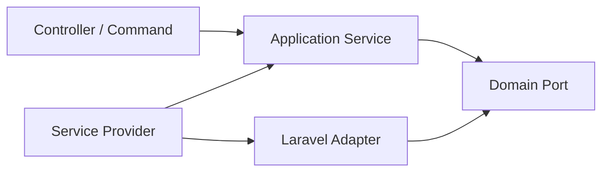

# Bản đồ Design Pattern trong Laravel

`Laravel` cung cấp nhiều pattern dưới dạng framework capability. Điều quan trọng là hiểu **boundary** và **lifecycle**, không phải gắn nhãn pattern cho mọi class.

## Bản đồ capability

| Laravel capability | Pattern/ý tưởng | Dùng tốt khi | Rủi ro thường gặp |
| --- | --- | --- | --- |
| Service Container | DI, Factory, Composition Root | Bind interface, contextual binding, test replacement | Gọi `app()` rải rác tạo Service Locator |
| Service Provider | Bootstrap/Module Configuration | Wiring, package bootstrapping | Đưa business logic vào `boot()` |
| Facade | Proxy đến container binding | API tiện dụng ở boundary/framework code | Khó thấy dependency trong domain/application service |
| Events/Listeners | Observer | Side effect tách khỏi use case | Event sync chậm; listener không idempotent |
| Jobs/Queue | Command | Retry, defer, isolate workload | Serialize model lớn, duplicate side effect |
| Middleware | Chain of Responsibility | Cross-cutting request concern | Phụ thuộc thứ tự nhưng không test order |
| Pipeline | Pipeline/Chain | Workflow có step cấu hình được | Pipe biết quá nhiều về nhau |
| Eloquent | Active Record | CRUD và domain đơn giản | Model phình to, coupling persistence |
| Query Builder | Query Object nền tảng | Read model/report phức tạp | Query logic rải ở controller |
| Notifications | Strategy + Channel | Multi-channel delivery | Channel config và idempotency không rõ |
| Policies/Gates | Specification/Policy | Authorization rule | Trộn authorization với business eligibility |

## Dependency flow khuyến nghị

- Controller chỉ chuyển input thành request/command.
- Application service điều phối use case.
- Domain không gọi Facade hoặc helper framework.
- Service Provider là composition root.

## Checklist production theo capability

### Jobs/Queue

- Payload nhỏ và versionable.
- Handler idempotent.
- Timeout, retry, backoff và dead-letter rõ.
- Không dispatch trước khi transaction commit nếu job cần dữ liệu vừa ghi.

### Events

- Xác định sync hay async.
- Event name ở thì quá khứ và có business meaning.
- Listener failure có làm fail use case không?
- External integration cân nhắc Outbox.

### Repository/Query Object

- Repository phục vụ aggregate write semantics.
- Query Object phục vụ projection/read model.
- Không tạo generic CRUD repository chỉ để bọc Eloquent.

## Dấu hiệu framework leakage

- Domain entity gọi `DB`, `Cache`, `Log`, `Http` hoặc `app()`.
- Application service nhận `Request` trực tiếp.
- Job chứa toàn bộ business rule thay vì gọi use case.
- Listener tạo chuỗi side effect khó quan sát và không có idempotency.

## Liên kết

- [Laravel Patterns](../docs/05-laravel-patterns/README.md)
- [Laravel Framework Integration](../framework-integration/laravel/README.md)
- [Clean Architecture Boundaries](16-clean-architecture-boundary-map.md)
