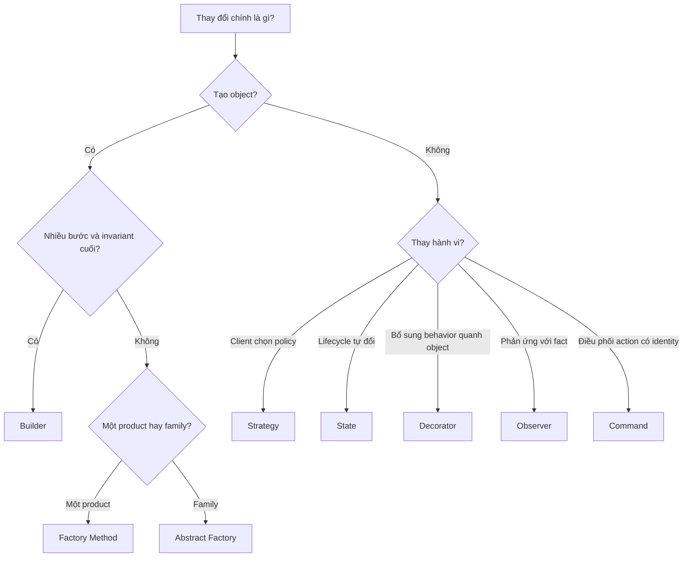
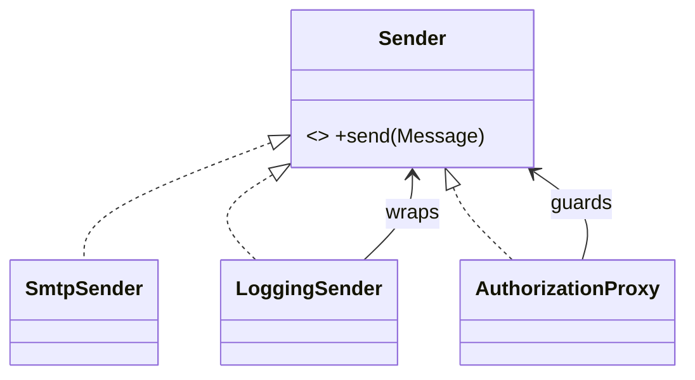

# So sánh các Design Pattern dễ nhầm

Tài liệu này dùng khi hai hoặc nhiều pattern đều có vẻ phù hợp. Không chọn pattern theo tên; hãy xác định **lực thay đổi**, **quyền sở hữu quyết định**, **vòng đời**, **failure model** và **chi phí vận hành**.

## Ma trận so sánh nhanh

| Cặp pattern | Câu hỏi quyết định | Chọn vế thứ nhất khi | Chọn vế thứ hai khi |
| --- | --- | --- | --- |
| Strategy / State | Ai quyết định đổi hành vi? | Client hoặc composition root chọn policy | Object tự đổi hành vi theo lifecycle |
| Factory Method / Abstract Factory | Tạo một product hay một family? | Creator cần thay loại product | Các product phải tương thích theo family |
| Factory / Builder | Vấn đề nằm ở loại object hay quy trình dựng? | Chọn concrete type | Dựng object nhiều bước, có invariant cuối |
| Adapter / Facade | Cần dịch contract hay đơn giản hóa subsystem? | Hai interface không tương thích | Client cần API cấp cao, ổn định hơn |
| Decorator / Proxy | Thêm behavior hay kiểm soát truy cập? | Bọc nhiều behavior cùng contract | Đại diện cho object thật, lazy/security/remote |
| Strategy / Template Method | Composition hay inheritance? | Thuật toán thay runtime, test độc lập | Skeleton ổn định, subclass thay một số bước |
| Observer / Mediator | Broadcast sự kiện hay điều phối collaboration? | Nhiều subscriber phản ứng với fact | Nhiều component cần coordinator trung tâm |
| Chain / Pipeline | Một handler có thể kết thúc hay mọi bước đều chạy? | Handler có thể handle/short-circuit | Dữ liệu đi qua chuỗi transformation rõ ràng |
| Command / Strategy | Đóng gói hành động hay thuật toán? | Cần queue, audit, retry, undo | Cần thay policy tính toán/xử lý |
| Repository / Query Object | Write model hay read model? | Bảo vệ aggregate và collection semantics | Query/projection phức tạp, tối ưu đọc |
| Active Record / Data Mapper | Domain có chấp nhận phụ thuộc persistence? | CRUD đơn giản, model gần bảng | Domain phức tạp, cần persistence ignorance |
| Unit of Work / Transaction Script | Theo dõi nhiều entity hay use case tuyến tính? | Nhiều thay đổi cần commit như một unit | Workflow đơn giản, transaction rõ trong một hàm |

## Decision flow

## Các cặp thường bị dùng sai

### Strategy và State

Cả hai đều dùng composition và interface. Khác biệt nằm ở quyền sở hữu transition:

- **Strategy:** `CheckoutService` được inject một `DiscountPolicy`; policy không tự đổi policy khác.
- **State:** `Order` chuyển từ `Pending` sang `Paid`; state hiện tại kiểm soát transition hợp lệ.

**Test cần có:** Strategy cần contract test cho mọi policy. State cần transition table, illegal transition và terminal state.

### Adapter và Facade

Adapter bảo vệ application khỏi contract bên ngoài: đổi field, unit, error code và retry semantics. Facade gom nhiều subsystem thành một use case cấp cao nhưng không nhất thiết dịch contract.

**Dấu hiệu chọn Adapter:** SDK trả `amount` dạng decimal string nhưng domain dùng integer minor unit.
**Dấu hiệu chọn Facade:** Video conversion cần decoder, encoder, storage và metadata nhưng client chỉ cần `convert()`.

### Decorator và Proxy

Cả hai giữ cùng interface và bọc object khác. Decorator thường cho phép xếp chồng behavior; Proxy đại diện cho object thật và kiểm soát truy cập/lifecycle.

### Repository và Query Object

Không dùng Repository như lớp bọc `Model::find()` máy móc.

- Repository trả aggregate hoặc collection có nghĩa trong domain; write operation bảo vệ invariant và version.
- Query Object trả DTO/read model, chấp nhận join, aggregate, pagination và database-specific optimization.

**Câu hỏi review:** Client cần chỉnh sửa aggregate hay chỉ hiển thị dữ liệu? Nếu chỉ đọc, Query Object thường rõ hơn.

## Pattern không phải mặc định

Giải pháp trực tiếp vẫn tốt hơn khi:

- chỉ có một implementation và change axis chưa được chứng minh;
- abstraction làm tăng số file nhưng không giảm knowledge của client;
- failure model vẫn bị rò rỉ qua interface;
- test phải mock quá nhiều collaborator mới chạy được;
- team không thể giải thích pattern bằng một sơ đồ dependency đơn giản.

## Checklist trước khi chọn pattern

1. Viết một câu mô tả lực thay đổi.
2. Chỉ ra source of truth và invariant.
3. Liệt kê ít nhất một baseline đơn giản hơn.
4. Vẽ dependency trước và sau.
5. Xác định failure, retry, duplicate và concurrency nếu có I/O.
6. Viết test chứng minh abstraction thực sự tách được biến thể.
7. Ghi điều kiện xóa abstraction nếu giả định không còn đúng.

## Tài liệu liên quan

- [Pattern Selection by Change Axis](09-pattern-selection-by-change-axis.md)
- [Code Smell to Refactoring Map](10-code-smell-to-refactoring-map.md)
- [Pattern Composition](24-pattern-composition-guide.md)
- [Overview](../OVERVIEW.md)
