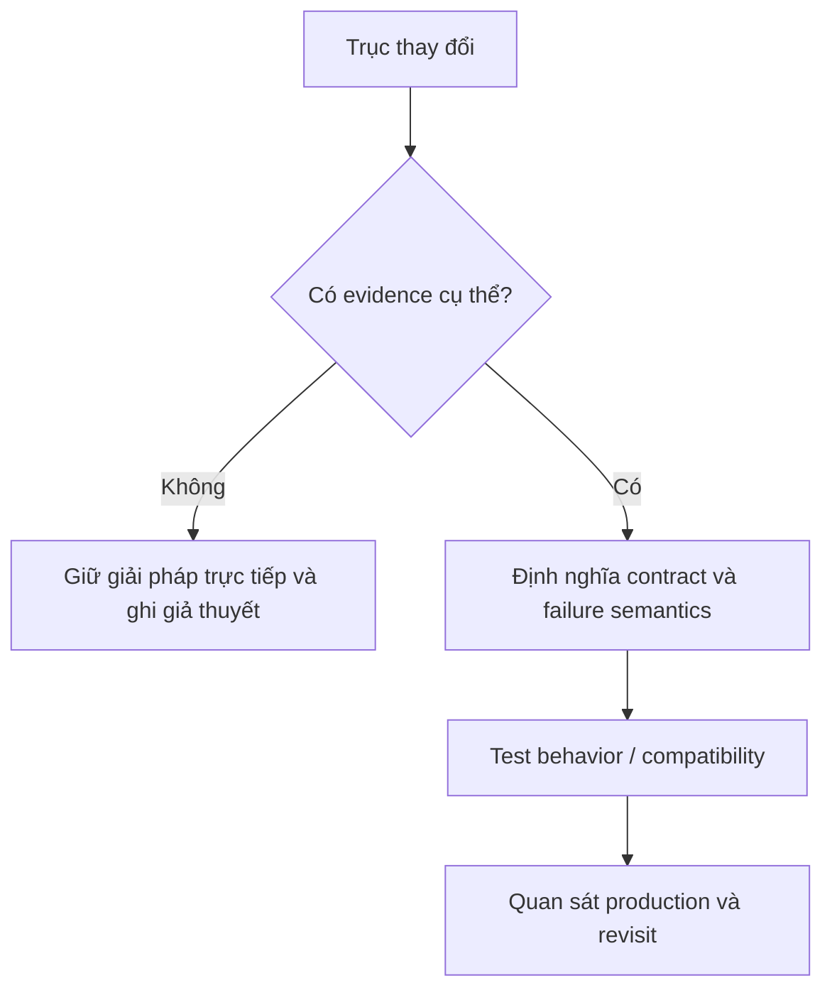

# Pattern Selection Guide

| Dấu hiệu | Pattern cân nhắc |
| --- | --- |
| Nhiều thuật toán thay thế | Strategy |
| Tạo object phụ thuộc loại | Factory Method |
| Tích hợp vendor interface khác | Adapter |
| Thêm logging/cache/retry | Decorator |
| Trạng thái chi phối hành vi | State |
| Chuỗi bước xử lý độc lập | Chain/Pipeline |
| Hệ thống con quá phức tạp | Facade |
| Rule có thể kết hợp | Specification/Composite |
| Tác vụ cần queue/audit/undo | Command |

Luôn hỏi: không dùng pattern thì chi phí thay đổi là gì?

## Decision flow thực dụng

1. Có thật sự tồn tại biến thể hoặc lực thay đổi không? Nếu không, giữ code đơn giản.
2. Biến đổi nằm ở creation, structure hay behavior?
3. Có thể giải quyết bằng function nhỏ hoặc composition đơn giản trước không?
4. Pattern có làm dependency rõ hơn và test dễ hơn không?
5. Team có hiểu và bảo trì được abstraction này không?

## Cờ đỏ

- Interface chỉ có đúng một implementation và không có boundary test/vendor.
- Factory chỉ gọi `new` một class cố định.
- Repository chỉ forward toàn bộ method của ORM.
- Pattern được chọn vì “best practice” nhưng không có scenario thay đổi.

## Bản đồ quyết định

## Tín hiệu cần rà soát

- Thay thuật toán, tạo object, dịch contract, thêm behavior, điều khiển lifecycle.
- Xác định điều gì thay đổi độc lập trước khi chọn pattern.
- Luôn ghi một phương án đơn giản hơn và điều kiện khiến phương án đó không còn đủ.

## Câu hỏi enterprise

1. Trục thay đổi nào đã xuất hiện ít nhất hai lần?
2. Pattern có giảm số nơi phải sửa hay chỉ di chuyển conditional?
3. Test nào chứng minh variant mới không phá behavior cũ?
4. Khi variation biến mất, abstraction có thể xóa trong một pull request không?
