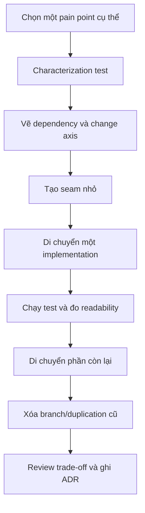

# Quy trình refactor sang Design Pattern

`Refactor` sang `pattern` là thay đổi cấu trúc **mà không đổi hành vi quan sát được**. Nếu chưa có safety net, chưa hiểu lực thay đổi hoặc chưa có rollback path, hãy dừng trước khi tạo abstraction mới.

## Quy trình 9 bước

1. **Khoanh phạm vi**: một use case, một pain point, một lý do thay đổi.
2. **Khóa hành vi** bằng characterization test.
3. **Xác định change axis**: algorithm, provider, lifecycle, format hay policy.
4. **Tạo seam tối thiểu**: interface, callable, wrapper hoặc factory method.
5. **Di chuyển một implementation** để kiểm chứng contract.
6. **So sánh trước/sau**: dependency, số branch, khả năng test, cognitive load.
7. **Di chuyển phần còn lại** bằng commit nhỏ.
8. **Xóa code cũ** và test thừa.
9. **Ghi quyết định** nếu ảnh hưởng nhiều module hoặc public API.

## Chọn refactoring theo code smell

| Code smell | Refactoring đầu tiên | Pattern có thể xuất hiện |
| --- | --- | --- |
| `if/elseif` theo policy | Extract Method + Extract Interface | Strategy |
| `new` rải rác | Encapsulate Construction | Factory Method |
| SDK ngoài lan vào domain | Introduce Boundary | Adapter |
| Class phình vì optional behavior | Extract Wrapper | Decorator |
| Lifecycle đầy guard | Explicit Transition Table | State |
| Side effect nối tiếp trong service | Extract Event/Command | Observer/Command |

## Điều kiện dừng

Dừng hoặc quay lại thiết kế đơn giản khi:

- Chưa có implementation thứ hai hoặc lực thay đổi đáng tin cậy.
- Contract phải chứa method không liên quan.
- Flow đọc khó hơn đáng kể.
- Test phải mock quá nhiều để chạy.
- Pattern chỉ chuyển `switch` sang nhiều file nhưng không giảm coupling.

## Review sau refactor

- Client biết ít concrete detail hơn chưa?
- Failure semantics rõ hơn chưa?
- Thêm implementation mới có sửa code ổn định không?
- Có giữ transaction và invariant đúng boundary không?
- Có cách rollback dễ không?
