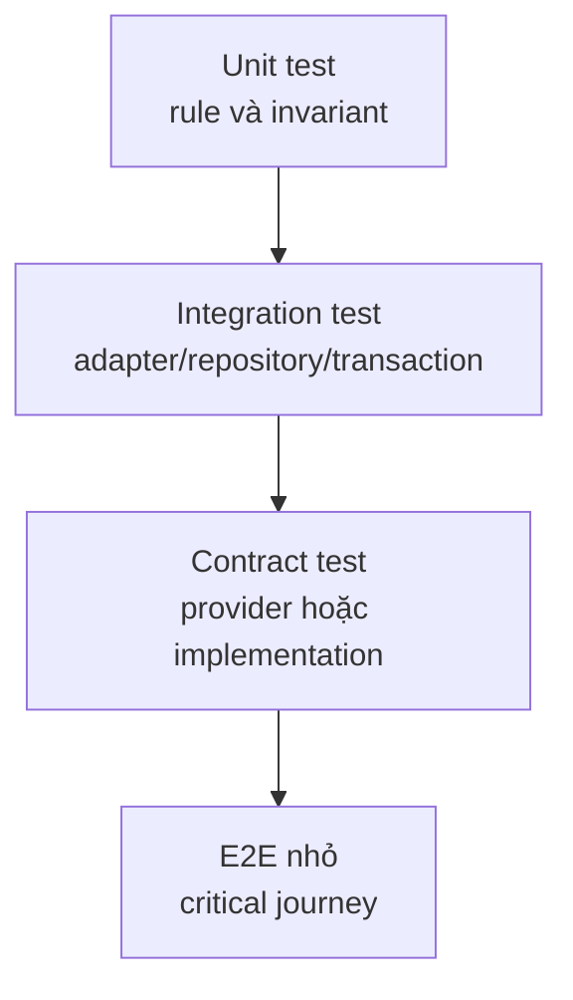

# Cheatsheet kiểm thử Design Pattern

`Cheatsheet` này giúp chọn đúng loại test theo **điểm biến đổi** mà pattern đang bảo vệ. Mục tiêu không phải chứng minh class được tổ chức đẹp, mà chứng minh các implementation tuân thủ cùng contract, failure được chuyển đổi đúng và orchestration không tạo side effect ngoài dự kiến.

## Ma trận kiểm thử nhanh

| Pattern | Test trọng tâm | Không nên test |
| --- | --- | --- |
| Strategy | Mỗi policy với cùng tập contract case; context delegate đúng | Tên concrete class hoặc private method |
| Factory Method | Creator trả đúng product và workflow dùng product qua interface | `new` xuất hiện ở dòng nào |
| Adapter | Mapping request/response/error, timeout và contract test với fake SDK | Implementation detail của SDK |
| Decorator | Bảo toàn contract, thứ tự wrapper, failure propagation | Số lượng method nội bộ |
| Observer | Event phát đúng thời điểm, listener idempotent, duplicate delivery | Thứ tự listener nếu không được cam kết |
| State | Transition table, guard, illegal transition, side effect sau transition | So sánh tên state bằng string rải rác |
| Repository | Collection semantics, not-found policy, transaction boundary | ORM method cụ thể nếu repository che ORM |
| Unit of Work | Commit/rollback, nested transaction policy, partial failure | SQL statement chi tiết trong unit test |

## Test pyramid đề xuất



- **Unit test**: nhanh, xác định rule và invariant.
- **Integration test**: xác minh boundary thật như database, filesystem hoặc HTTP client giả lập.
- **Contract test**: mọi implementation phải vượt cùng một bộ case.
- **E2E**: chỉ giữ cho luồng có giá trị kinh doanh cao.

## Mẫu contract test cho Strategy

```php
/** @dataProvider shippingPolicies */
public function test_policy_never_returns_negative_fee(ShippingFeePolicy $policy): void
{
    $fee = $policy->calculate(new Shipment(weightGrams: 2_000));

    self::assertGreaterThanOrEqual(0, $fee->amount());
}
```

## Mẫu test Adapter

```php
$legacy = new FakeLegacyGateway(responseCode: '00');
$adapter = new LegacyGatewayAdapter($legacy);

$result = $adapter->charge(new ChargeRequest('order-1', 150_000));

self::assertTrue($result->isSuccessful());
self::assertSame('order-1', $legacy->lastReference);
```

## Failure matrix cần có

- Input không hợp lệ.
- Dependency timeout.
- Dependency trả dữ liệu thiếu hoặc sai schema.
- Duplicate command/event.
- Partial success.
- Illegal state transition.
- Currency/timezone/version mismatch.

## Anti-pattern trong test

- Mock mọi object, kể cả value object thuần.
- Assert private property hoặc số lượng method.
- Test framework wiring thay vì business behavior.
- Chỉ test happy path.
- Một test khổng lồ xác minh nhiều trách nhiệm.
- Dùng snapshot để che việc chưa hiểu output quan trọng nào cần bảo vệ.

## Definition of Done

- Contract test chạy cho mọi implementation có thể thay thế nhau.
- Failure path quan trọng có test.
- Test name mô tả hành vi nghiệp vụ.
- Không có test phụ thuộc thứ tự chạy.
- Test data thể hiện boundary value, không chỉ ví dụ “đẹp”.
