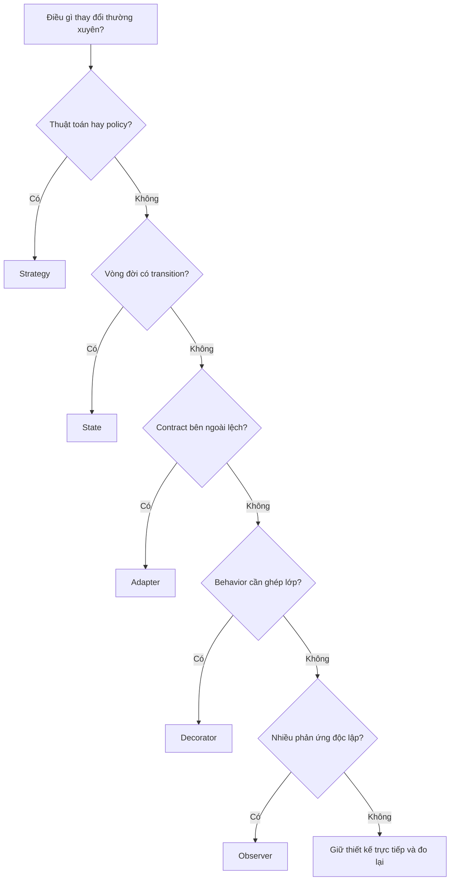

# Chọn Design Pattern theo trục thay đổi

`Pattern` nên được chọn từ **thứ có khả năng thay đổi độc lập**, không phải từ tên domain. Cùng là `Payment`, một hệ thống có thể cần Strategy cho cách tính phí, Adapter cho cổng thanh toán, State cho vòng đời giao dịch và Observer cho hậu xử lý.

## Ma trận quyết định

| Trục thay đổi | Dấu hiệu trong code | Câu hỏi xác nhận | Pattern ưu tiên | Phương án đơn giản hơn | Cảnh báo |
| --- | --- | --- | --- | --- | --- |
| Thuật toán/policy | nhiều nhánh cùng input/output | policy có thay độc lập và cần test riêng không? | Strategy | function map, `match` | đừng tạo class cho hai nhánh ổn định |
| Vòng đời | hành vi phụ thuộc state hiện tại | có illegal transition và side effect theo transition không? | State | enum + transition table | State object có thể quá nặng cho workflow nhỏ |
| Tạo object | client biết constructor/concrete class | creation có variation hoặc invariant phức tạp không? | Factory Method, Builder | `new`, named constructor | factory không nên trở thành service locator |
| Contract bên ngoài | SDK/vendor type lọt vào core | có boundary cần translate dữ liệu/lỗi không? | Adapter | wrapper function | adapter không được che giấu lỗi mất dữ liệu |
| Bổ sung hành vi | logging/cache/retry ghép theo lớp | behavior có cần bật/tắt và compose không? | Decorator | explicit orchestration | thứ tự wrapper có thể đổi semantics |
| Phát phản ứng | nhiều side effect độc lập | subscriber có thể thất bại/scale độc lập không? | Observer | gọi service trực tiếp | cần định nghĩa delivery và ordering |
| Chuỗi xử lý | request đi qua nhiều bước | bước có short-circuit hoặc reorder không? | Chain, Pipeline | loop tuần tự | đừng trộn business workflow với HTTP middleware |
| Cấu trúc cây | leaf và group dùng cùng operation | client có cần xử lý đồng nhất không? | Composite | recursion trực tiếp | operation phải có nghĩa cho cả leaf/group |
| Quyền truy cập | cần lazy load/cache/auth | cần giữ nguyên contract của object gốc không? | Proxy | decorator/service | proxy có thể che network cost |
| Read model | query phức tạp, projection riêng | write model có bị kéo méo vì reporting không? | Query Object | scoped query method | query object không thay domain repository |

## Flow chọn nhanh

## Ví dụ phân tích

**Yêu cầu:** hệ thống gửi thông báo hỗ trợ Email, Slack và Chatwork; mỗi tenant chọn channel khác nhau; lỗi vendor phải được chuẩn hóa.

- Trục chọn channel: Strategy.
- Contract vendor: Adapter.
- Retry/logging: Decorator hoặc application orchestration.
- Phát sự kiện sau khi đơn hàng hoàn tất: Observer.

Không nên dùng một `NotificationManager` khổng lồ chứa tất cả các vai trò trên.

## Evidence cần có trước khi áp dụng

1. Ít nhất hai variation thật hoặc một variation sắp được triển khai có deadline rõ.
2. Characterization test bảo vệ behavior hiện tại.
3. Boundary và ownership được mô tả bằng diagram hoặc ADR.
4. Có tiêu chí xóa abstraction nếu variation không còn.

## Cách dùng trong design review

- Chỉ ra trục thay đổi bằng một câu cụ thể.
- So sánh với baseline trực tiếp.
- Nêu chi phí thêm type, wiring, test và observability.
- Chọn pattern nhỏ nhất giải quyết đúng lực thay đổi.
