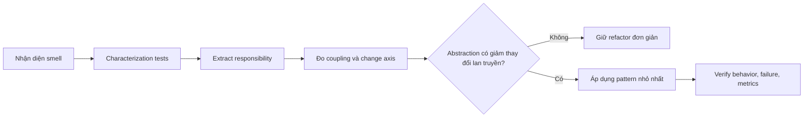

# Từ Code Smell đến Refactoring và Design Pattern

`Code smell` chỉ là **tín hiệu điều tra**, không phải bằng chứng bắt buộc phải dùng pattern. Luôn refactor cơ bản và bảo vệ behavior trước khi thêm abstraction.

## Bản đồ chẩn đoán

| Code smell | Câu hỏi chẩn đoán | Refactor an toàn đầu tiên | Pattern có thể phù hợp | Test cần có |
| --- | --- | --- | --- | --- |
| `if/switch` tăng liên tục | nhánh là algorithm, state hay creation? | Extract Method, characterization test | Strategy, State, Factory | contract test cho mọi nhánh |
| Constructor có quá nhiều dependency | class đang điều phối nhiều use case? | Extract Class, split command/query | Facade, Application Service | orchestration test |
| SDK/vendor xuất hiện trong domain | kiểu dữ liệu/lỗi vendor có lan rộng? | Introduce Interface | Adapter, ACL | mapping + contract test |
| Side effect nối dài | side effect có transaction/lifecycle riêng? | Extract service/listener | Observer, Command | retry/idempotency test |
| Query lặp và khó đọc | query có tên nghiệp vụ và reuse không? | Extract Query Method | Query Object, Specification | fixture + pagination test |
| Nhiều subclass chỉ để đổi một bước | algorithm khung ổn định không? | Extract method/hook | Template Method, Strategy | base workflow test |
| Wrapper logging/cache/retry lặp | có cần compose và thay thứ tự? | Extract wrapper | Decorator | ordering/failure test |
| Object thay behavior theo enum | có illegal transition không? | transition table | State | transition matrix test |
| Client dựng object phức tạp | invariant có thể bị tạo sai không? | named constructor | Builder, Factory | invalid construction test |
| Service gọi service theo chuỗi | bước có thể reorder/short-circuit? | explicit step objects | Pipeline, Chain | order + stop test |

## Quy trình refactor

## Ví dụ: switch xử lý trạng thái đơn hàng

Không nên kết luận ngay là Strategy. Nếu nhánh phụ thuộc **state hiện tại và transition hợp lệ**, State hoặc transition table phù hợp hơn. Nếu nhánh chọn **cách tính phí độc lập**, Strategy hợp lý hơn. Nếu nhánh chỉ chọn concrete exporter, Factory có thể đúng hơn.

## Các refactor không cần pattern

- Đổi tên để làm rõ intent.
- Tách method dài.
- Gom validation thành Value Object.
- Dùng collection operation thay loop phức tạp.
- Đưa side effect ra khỏi pure calculation.
- Xóa abstraction không còn variation.

## Checklist review

- Smell nào đã được chứng minh bằng change history hoặc requirement?
- Test có bảo vệ success, failure và edge case không?
- Pattern giảm coupling hay chỉ chuyển complexity sang nhiều file?
- Có phương án rollback/refactor từng bước không?
- Team có thể giải thích thiết kế mà không dùng từ khóa pattern không?
