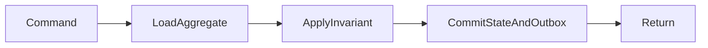

# Transaction Boundary — Cheatsheet

Xác định dữ liệu nào phải nhất quán tức thời và đặt transaction quanh một application use case.

## Bảng tra nhanh

| Chủ đề | Hướng dẫn |
| --- | --- |
| **Trong transaction** | Đọc/ghi aggregate liên quan trực tiếp, kiểm tra invariant, ghi outbox. |
| **Ngoài transaction** | HTTP call, gửi email, publish broker trực tiếp, xử lý file lớn. |
| **Dấu hiệu transaction quá rộng** | Giữ lock lâu, timeout, deadlock, gọi network bên trong. |
| **Dấu hiệu quá hẹp** | Business data commit nhưng audit/outbox mất; partial state. |

## Quy trình áp dụng

1. Xác định quyết định liên quan đến **Transaction Boundary — Cheatsheet** và viết một ví dụ cụ thể đang gây khó khăn.
2. Dùng mục **Trong transaction** để kiểm tra trường hợp chính; đối chiếu **Ngoài transaction** cho boundary hoặc phương án thay thế.
3. Chuyển lựa chọn thành một test, metric hoặc review question có thể xác minh.
4. Ghi rõ giới hạn của checklist `Transaction Boundary — Cheatsheet` để tránh áp dụng như quy tắc tuyệt đối.

## Lưu ý thực chiến

- Bắt đầu từ invariant, không bắt đầu từ danh sách repository.
- Giữ transaction ngắn và deterministic.
- Retry transaction chỉ khi operation an toàn và lỗi transient.

## Câu hỏi review

- Trong bối cảnh hiện tại, mục nào của **Transaction Boundary — Cheatsheet** ảnh hưởng trực tiếp đến invariant hoặc user outcome?
- Failure nào trở nên dễ chẩn đoán hơn khi áp dụng hướng dẫn **Trong transaction**?
- Có thể bỏ bớt abstraction hoặc bước vận hành nào mà vẫn giữ đúng contract không?

## Mô hình quyết định: Transaction boundary

**Điểm kiểm soát thực tiễn:** Đặt transaction quanh một use case nhất quán; không kéo HTTP call vào DB transaction.

## Evidence tối thiểu

- Integration test chứng minh state và outbox cùng commit hoặc cùng rollback.
- Metric transaction duration và deadlock/rollback rate.
- Diagram chỉ rõ operation nào nằm ngoài transaction vì có network I/O.
- Runbook cho stuck transaction hoặc retry sau deadlock.
