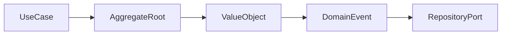

# DDD Tactical Patterns Map

Bản đồ nhanh để đặt business rule đúng nơi.

## Bảng tra nhanh

| Chủ đề | Hướng dẫn |
| --- | --- |
| **Entity** | Có identity và lifecycle. |
| **Value Object** | Định nghĩa bởi giá trị; immutable; bảo vệ invariant cục bộ. |
| **Aggregate** | Consistency boundary; chỉ root được tham chiếu từ ngoài. |
| **Domain Service** | Business operation không thuộc tự nhiên về một entity/value object. |
| **Repository** | Collection abstraction cho aggregate root. |
| **Domain Event** | Sự kiện domain có ý nghĩa nghiệp vụ. |

## Quy trình áp dụng

1. Xác định quyết định liên quan đến **DDD Tactical Patterns Map** và viết một ví dụ cụ thể đang gây khó khăn.
2. Dùng mục **Entity** để kiểm tra trường hợp chính; đối chiếu **Value Object** cho boundary hoặc phương án thay thế.
3. Chuyển lựa chọn thành một test, metric hoặc review question có thể xác minh.
4. Ghi rõ giới hạn của checklist `DDD Tactical Patterns Map` để tránh áp dụng như quy tắc tuyệt đối.

## Lưu ý thực chiến

- Không biến mọi bảng thành aggregate.
- Aggregate nhỏ theo invariant, không theo object graph.
- Đừng dùng Domain Service như nơi chứa mọi logic.

## Câu hỏi review

- Trong bối cảnh hiện tại, mục nào của **DDD Tactical Patterns Map** ảnh hưởng trực tiếp đến invariant hoặc user outcome?
- Failure nào trở nên dễ chẩn đoán hơn khi áp dụng hướng dẫn **Entity**?
- Có thể bỏ bớt abstraction hoặc bước vận hành nào mà vẫn giữ đúng contract không?

## Mô hình quyết định: DDD tactical map

**Điểm kiểm soát thực tiễn:** Aggregate nhỏ bảo vệ invariant; không biến toàn bộ object graph thành một transaction.

## Evidence tối thiểu

- Ví dụ invariant chỉ aggregate root được phép thay đổi.
- Test Value Object cho equality, validation và immutability.
- Context map chỉ rõ upstream/downstream và translation ownership.
- Một use case chứng minh domain language giảm nhầm lẫn giữa hai team.
