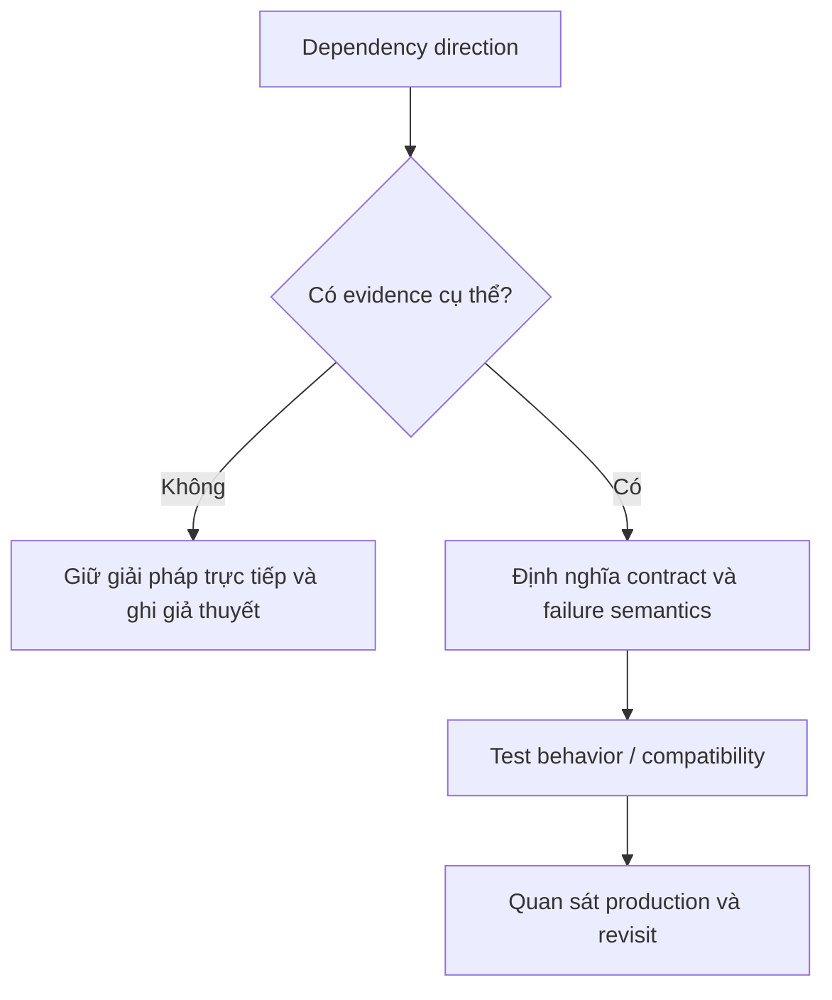

# Clean Architecture Boundary Map

Giữ dependency hướng vào policy ổn định và cô lập framework/I/O.

## Bảng tra nhanh

| Chủ đề | Hướng dẫn |
| --- | --- |
| **Domain** | Entity, value object, invariant; không biết framework. |
| **Application** | Use case, port, transaction orchestration. |
| **Adapters** | Controller, presenter, repository implementation, API client. |
| **Frameworks** | Laravel/Symfony, ORM, queue, database, broker. |

## Quy trình áp dụng

1. Xác định quyết định liên quan đến **Clean Architecture Boundary Map** và viết một ví dụ cụ thể đang gây khó khăn.
2. Dùng mục **Domain** để kiểm tra trường hợp chính; đối chiếu **Application** cho boundary hoặc phương án thay thế.
3. Chuyển lựa chọn thành một test, metric hoặc review question có thể xác minh.
4. Ghi rõ giới hạn của checklist `Clean Architecture Boundary Map` để tránh áp dụng như quy tắc tuyệt đối.

## Lưu ý thực chiến

- DTO qua boundary thay vì framework request/model.
- Composition root là nơi duy nhất biết concrete implementation.
- Không tạo layer nếu chỉ chuyển tiếp dữ liệu không có lý do thay đổi riêng.

## Câu hỏi review

- Trong bối cảnh hiện tại, mục nào của **Clean Architecture Boundary Map** ảnh hưởng trực tiếp đến invariant hoặc user outcome?
- Failure nào trở nên dễ chẩn đoán hơn khi áp dụng hướng dẫn **Domain**?
- Có thể bỏ bớt abstraction hoặc bước vận hành nào mà vẫn giữ đúng contract không?

## Bản đồ quyết định

## Tín hiệu cần rà soát

- use case, port, adapter, framework.
- Dependency phải hướng vào policy; adapter được thay mà use case không đổi.
- Luôn ghi một phương án đơn giản hơn và điều kiện khiến phương án đó không còn đủ.

## Câu hỏi enterprise

1. Use case có import framework/ORM không?
2. Port biểu đạt capability hay phản chiếu API vendor?
3. Adapter failure được map thành error ổn định ở đâu?
4. Có thể test policy mà không boot delivery mechanism không?
