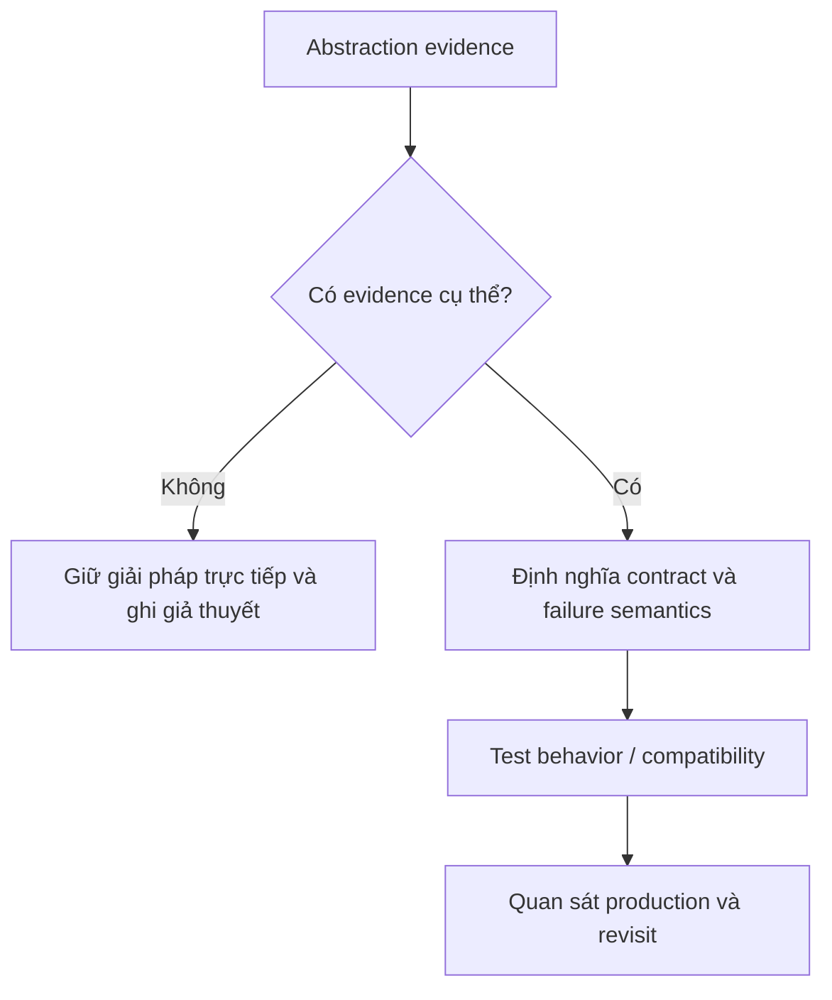

# Reviewing Abstractions

Đánh giá abstraction bằng lực thay đổi và chi phí bảo trì.

## Bảng tra nhanh

| Chủ đề | Hướng dẫn |
| --- | --- |
| **Problem** | Abstraction đang cô lập thay đổi nào? |
| **Clients** | Bao nhiêu client thực sự được đơn giản hóa? |
| **Contract** | Semantics có rõ hay chỉ là tên generic? |
| **Implementations** | Có biến thể thật hay dự đoán mơ hồ? |
| **Operational cost** | Có che timeout, retry, transaction hoặc observability không? |

## Quy trình áp dụng

1. Xác định quyết định liên quan đến **Reviewing Abstractions** và viết một ví dụ cụ thể đang gây khó khăn.
2. Dùng mục **Problem** để kiểm tra trường hợp chính; đối chiếu **Clients** cho boundary hoặc phương án thay thế.
3. Chuyển lựa chọn thành một test, metric hoặc review question có thể xác minh.
4. Ghi rõ giới hạn của checklist `Reviewing Abstractions` để tránh áp dụng như quy tắc tuyệt đối.

## Lưu ý thực chiến

- Yêu cầu ví dụ trước/sau cụ thể.
- Ưu tiên abstraction có vocabulary domain.
- Nếu xóa abstraction làm code rõ hơn mà không tăng coupling, hãy xóa.

## Câu hỏi review

- Trong bối cảnh hiện tại, mục nào của **Reviewing Abstractions** ảnh hưởng trực tiếp đến invariant hoặc user outcome?
- Failure nào trở nên dễ chẩn đoán hơn khi áp dụng hướng dẫn **Problem**?
- Có thể bỏ bớt abstraction hoặc bước vận hành nào mà vẫn giữ đúng contract không?

## Bản đồ quyết định

## Tín hiệu cần rà soát

- variation, consumer, contract, migration cost.
- Không tạo interface chỉ vì “có thể thay đổi trong tương lai”.
- Luôn ghi một phương án đơn giản hơn và điều kiện khiến phương án đó không còn đủ.

## Câu hỏi enterprise

1. Có ít nhất hai consumer/variant với semantics thật không?
2. Contract ổn định hơn implementation ở điểm nào?
3. Fake có giữ transaction/error semantics không?
4. Chi phí navigation, mapping và migration có được ghi lại không?
