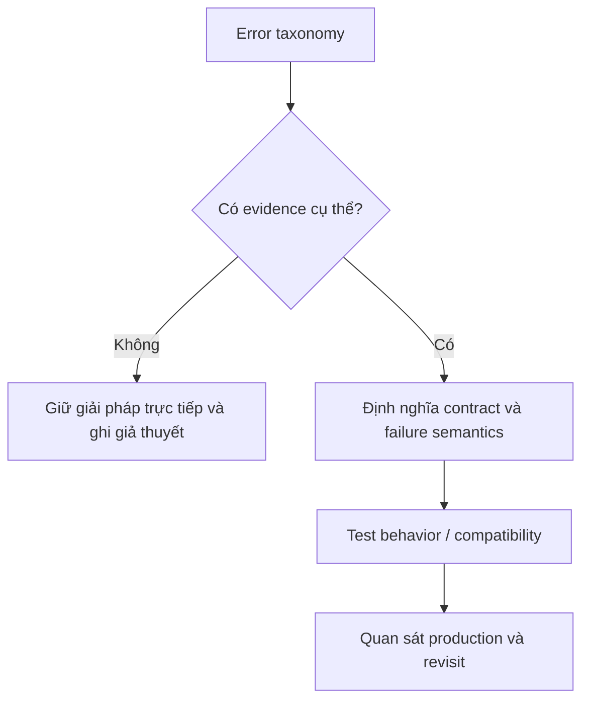

# Error Modeling — Cheatsheet

Phân loại lỗi để caller biết retry, sửa input hay dừng workflow.

## Bảng tra nhanh

| Chủ đề | Hướng dẫn |
| --- | --- |
| **Validation error** | Input sai; trả field/reason; không retry. |
| **Domain rejection** | Business rule không cho phép; reason code ổn định. |
| **Not found/conflict** | Resource state; map đúng HTTP/message semantics. |
| **Transient infrastructure** | Timeout, unavailable; retry có budget. |
| **Permanent integration** | Unsupported payload/auth; dead-letter hoặc manual action. |

## Quy trình áp dụng

1. Xác định quyết định liên quan đến **Error Modeling — Cheatsheet** và viết một ví dụ cụ thể đang gây khó khăn.
2. Dùng mục **Validation error** để kiểm tra trường hợp chính; đối chiếu **Domain rejection** cho boundary hoặc phương án thay thế.
3. Chuyển lựa chọn thành một test, metric hoặc review question có thể xác minh.
4. Ghi rõ giới hạn của checklist `Error Modeling — Cheatsheet` để tránh áp dụng như quy tắc tuyệt đối.

## Lưu ý thực chiến

- Không catch `Throwable` rồi trả false.
- Adapter map lỗi vendor sang taxonomy nội bộ.
- Log context, không log secret/PII.

## Câu hỏi review

- Trong bối cảnh hiện tại, mục nào của **Error Modeling — Cheatsheet** ảnh hưởng trực tiếp đến invariant hoặc user outcome?
- Failure nào trở nên dễ chẩn đoán hơn khi áp dụng hướng dẫn **Validation error**?
- Có thể bỏ bớt abstraction hoặc bước vận hành nào mà vẫn giữ đúng contract không?

## Bản đồ quyết định

## Tín hiệu cần rà soát

- domain, validation, conflict, transient, permanent.
- Error contract phải hướng dẫn retry, sửa input hoặc escalation.
- Luôn ghi một phương án đơn giản hơn và điều kiện khiến phương án đó không còn đủ.

## Câu hỏi enterprise

1. Caller cần retry, sửa input hay escalation?
2. Error nào được expose và error nào chỉ log nội bộ?
3. Conflict/stale version biểu đạt khác validation thế nào?
4. Contract có giữ ổn định khi đổi provider không?
