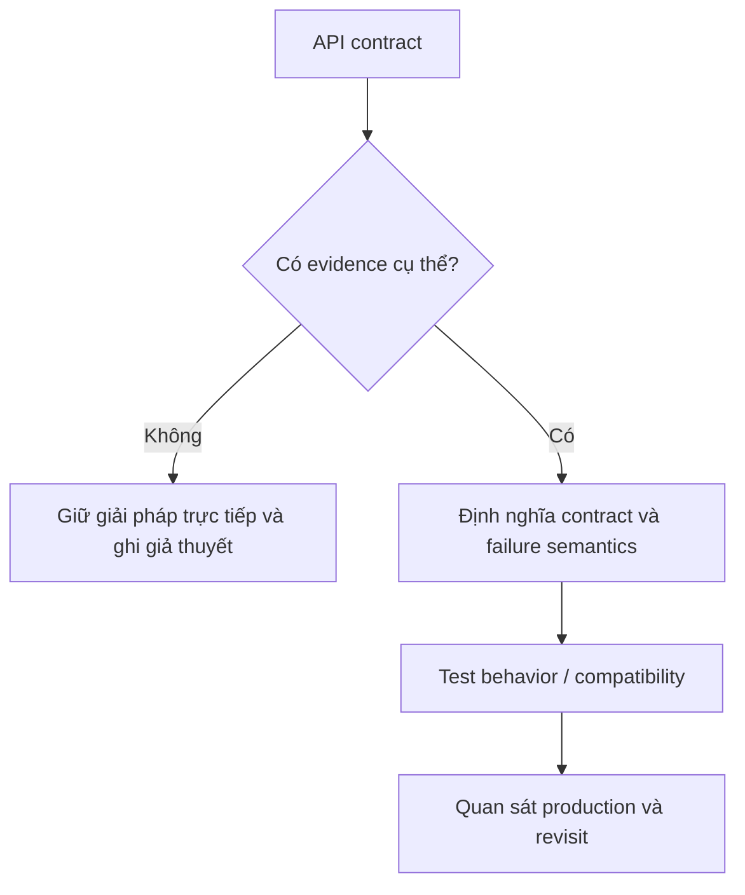
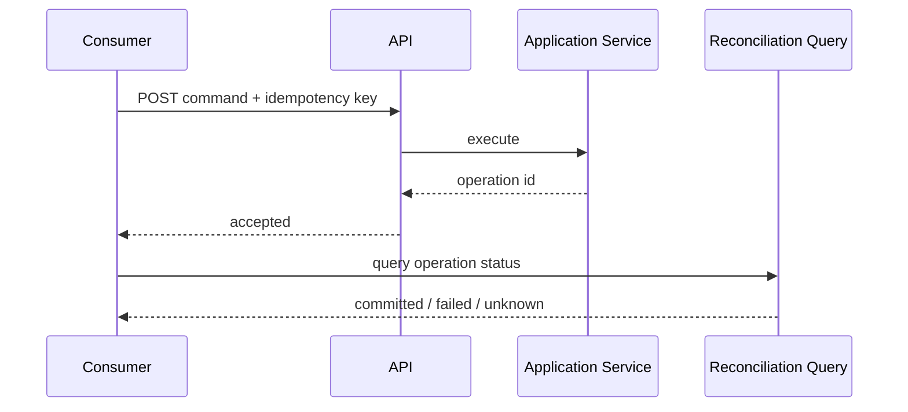

# API Design Review

Checklist review API theo contract, compatibility và operability.

## Bảng tra nhanh

| Chủ đề | Hướng dẫn |
| --- | --- |
| **Resource/command** | Tên phản ánh domain hay transport detail? |
| **Semantics** | Idempotency, pagination, filtering, sorting rõ chưa? |
| **Errors** | Stable code, field detail, retryability? |
| **Compatibility** | Additive change, versioning, deprecation window? |
| **Operations** | Timeout, rate limit, tracing, audit, PII? |

## Quy trình áp dụng

1. Xác định quyết định liên quan đến **API Design Review** và viết một ví dụ cụ thể đang gây khó khăn.
2. Dùng mục **Resource/command** để kiểm tra trường hợp chính; đối chiếu **Semantics** cho boundary hoặc phương án thay thế.
3. Chuyển lựa chọn thành một test, metric hoặc review question có thể xác minh.
4. Ghi rõ giới hạn của checklist `API Design Review` để tránh áp dụng như quy tắc tuyệt đối.

## Lưu ý thực chiến

- Có ví dụ request/response và failure.
- Không trả ORM entity trực tiếp.
- Dùng cursor pagination khi dataset thay đổi liên tục.

## Câu hỏi review

- Trong bối cảnh hiện tại, mục nào của **API Design Review** ảnh hưởng trực tiếp đến invariant hoặc user outcome?
- Failure nào trở nên dễ chẩn đoán hơn khi áp dụng hướng dẫn **Resource/command**?
- Có thể bỏ bớt abstraction hoặc bước vận hành nào mà vẫn giữ đúng contract không?

## Bản đồ quyết định

## Tín hiệu cần rà soát

- compatibility, idempotency, pagination, error model.
- Review consumer impact và migration path trước implementation.
- Luôn ghi một phương án đơn giản hơn và điều kiện khiến phương án đó không còn đủ.

## Câu hỏi enterprise

1. Consumer nào không thể nâng cấp đồng thời?
2. Thay đổi có backward compatible ở request, response và error không?
3. Idempotency/pagination/versioning được test bằng contract nào?
4. Migration và sunset được quan sát bằng metric nào?

## Review API theo vòng đời thay đổi

Một API enterprise cần được review từ consumer contract đến migration. Hãy kiểm tra tính idempotent của command, pagination stability của query, error taxonomy, compatibility của schema và khả năng deprecate field. Với endpoint có side effect, response timeout không đồng nghĩa operation thất bại; cần operation ID, status endpoint hoặc reconciliation path.

Evidence tối thiểu gồm contract tests, compatibility tests, rate-limit behavior, timeout semantics và migration plan cho consumer cũ.
