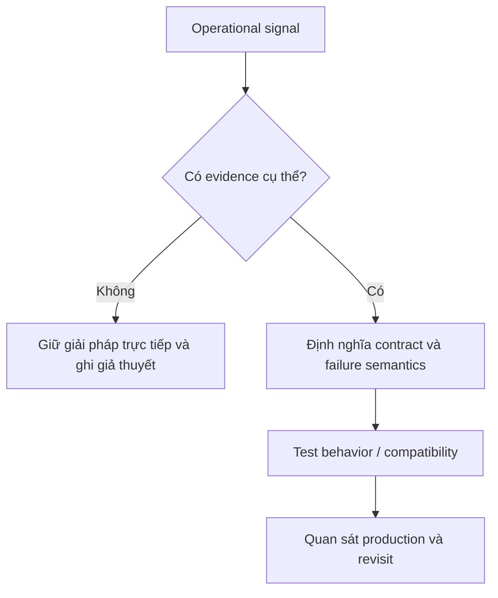
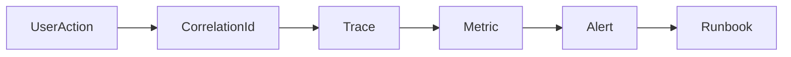

# Observability — Cheatsheet

Quan sát hệ thống từ tín hiệu kỹ thuật đến tác động người dùng.

## Bảng tra nhanh

| Chủ đề | Hướng dẫn |
| --- | --- |
| **Logs** | Sự kiện có cấu trúc, correlation ID, reason code. |
| **Metrics** | Rate, error, duration, saturation và business outcome. |
| **Traces** | Luồng qua service/queue; span cho dependency chậm. |
| **Alerts** | Dựa trên SLO/user impact, có runbook. |
| **Audit** | Ai làm gì, khi nào; immutable theo yêu cầu compliance. |

## Quy trình áp dụng

1. Xác định quyết định liên quan đến **Observability — Cheatsheet** và viết một ví dụ cụ thể đang gây khó khăn.
2. Dùng mục **Logs** để kiểm tra trường hợp chính; đối chiếu **Metrics** cho boundary hoặc phương án thay thế.
3. Chuyển lựa chọn thành một test, metric hoặc review question có thể xác minh.
4. Ghi rõ giới hạn của checklist `Observability — Cheatsheet` để tránh áp dụng như quy tắc tuyệt đối.

## Lưu ý thực chiến

- Không log payload chứa secret/PII.
- Metric label phải bounded cardinality.
- Dashboard cần so sánh baseline và release marker.

## Câu hỏi review

- Trong bối cảnh hiện tại, mục nào của **Observability — Cheatsheet** ảnh hưởng trực tiếp đến invariant hoặc user outcome?
- Failure nào trở nên dễ chẩn đoán hơn khi áp dụng hướng dẫn **Logs**?
- Có thể bỏ bớt abstraction hoặc bước vận hành nào mà vẫn giữ đúng contract không?

## Bản đồ quyết định

## Tín hiệu cần rà soát

- event, metric, trace, log, SLO.
- Bắt đầu từ câu hỏi vận hành, không bắt đầu từ công cụ logging.
- Luôn ghi một phương án đơn giản hơn và điều kiện khiến phương án đó không còn đủ.

## Câu hỏi enterprise

1. Câu hỏi vận hành nào dashboard phải trả lời?
2. Signal nào phân biệt backlog, provider failure và business rejection?
3. Correlation ID đi qua boundary nào?
4. Alert nào có runbook và hành động cụ thể?

## Mô hình quyết định: Observability

**Điểm kiểm soát thực tiễn:** Log không thay thế metric; metric không thay thế trace. Mỗi signal trả lời một câu hỏi vận hành khác nhau.

## Evidence tối thiểu

- Một user journey có correlation ID xuyên log, trace và async message.
- Metric gắn với SLO thay vì chỉ infrastructure utilization.
- Alert có owner, threshold, burn window và link tới runbook.
- Drill chứng minh operator phân biệt dependency failure với domain rejection.
