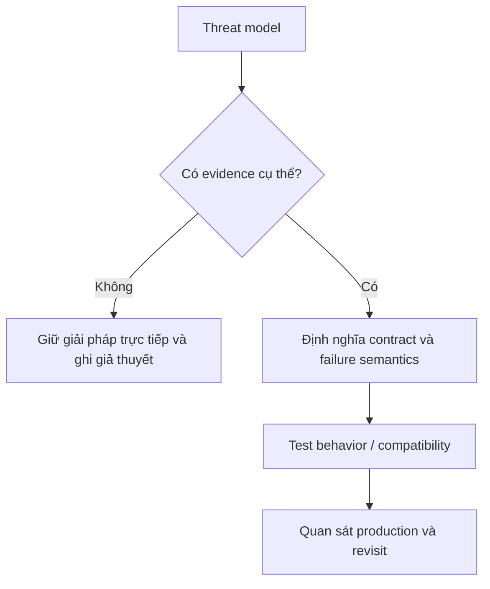
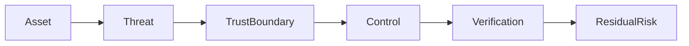

# Security Design Review

Review trust boundary, dữ liệu nhạy cảm và abuse case trước khi code.

## Bảng tra nhanh

| Chủ đề | Hướng dẫn |
| --- | --- |
| **Authentication** | Ai là caller? Token/session lifecycle? |
| **Authorization** | Kiểm tra theo resource và action ở server. |
| **Input/output** | Validation, encoding, file/path handling. |
| **Secrets** | Không hard-code; rotation và least privilege. |
| **Data** | Classification, encryption, retention, deletion. |
| **Abuse** | Rate limit, replay, enumeration, SSRF, injection. |

## Quy trình áp dụng

1. Xác định quyết định liên quan đến **Security Design Review** và viết một ví dụ cụ thể đang gây khó khăn.
2. Dùng mục **Authentication** để kiểm tra trường hợp chính; đối chiếu **Authorization** cho boundary hoặc phương án thay thế.
3. Chuyển lựa chọn thành một test, metric hoặc review question có thể xác minh.
4. Ghi rõ giới hạn của checklist `Security Design Review` để tránh áp dụng như quy tắc tuyệt đối.

## Lưu ý thực chiến

- Vẽ data flow và trust boundary.
- Fail closed cho authorization.
- Threat model tập trung asset và attacker goal.

## Câu hỏi review

- Trong bối cảnh hiện tại, mục nào của **Security Design Review** ảnh hưởng trực tiếp đến invariant hoặc user outcome?
- Failure nào trở nên dễ chẩn đoán hơn khi áp dụng hướng dẫn **Authentication**?
- Có thể bỏ bớt abstraction hoặc bước vận hành nào mà vẫn giữ đúng contract không?

## Bản đồ quyết định

## Tín hiệu cần rà soát

- asset, actor, trust boundary, abuse case.
- Mỗi control phải map tới threat cụ thể và có verification.
- Luôn ghi một phương án đơn giản hơn và điều kiện khiến phương án đó không còn đủ.

## Câu hỏi enterprise

1. Asset nào bị đe dọa và actor có capability gì?
2. Trust boundary nào bị băng qua?
3. Control nào prevent, detect hoặc recover?
4. Abuse case được tái hiện trong test hoặc tabletop thế nào?

## Mô hình quyết định: Security review

**Điểm kiểm soát thực tiễn:** Không chọn control trước khi xác định asset, attacker capability và trust boundary.

## Evidence tối thiểu

- Threat model nêu asset, attacker capability và trust boundary.
- Test authorization ở use-case boundary, không chỉ controller.
- Secret/PII redaction được kiểm tra trong log và error payload.
- Abuse case chứng minh rate limit, replay protection hoặc tenant isolation.
