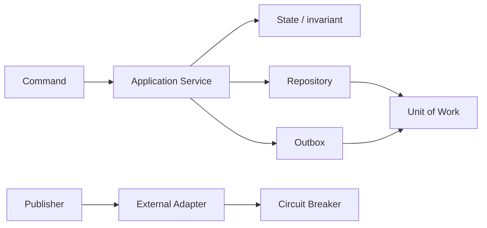

# Pattern Composition Guide

Kết hợp pattern theo trách nhiệm, không tạo “pattern soup”.

## Bảng tra nhanh

| Chủ đề | Hướng dẫn |
| --- | --- |
| **Strategy + Factory** | Factory chọn policy; Strategy thực thi behavior. |
| **Adapter + Decorator** | Adapter chuẩn hóa vendor; Decorator thêm retry/logging. |
| **Repository + Unit of Work** | Repository truy cập aggregate; UoW quản transaction. |
| **Command + Outbox** | Command đổi state; outbox phát event bền vững. |
| **State + Observer** | State kiểm soát transition; Observer phản ứng sau transition. |

## Quy trình áp dụng

1. Xác định quyết định liên quan đến **Pattern Composition Guide** và viết một ví dụ cụ thể đang gây khó khăn.
2. Dùng mục **Strategy + Factory** để kiểm tra trường hợp chính; đối chiếu **Adapter + Decorator** cho boundary hoặc phương án thay thế.
3. Chuyển lựa chọn thành một test, metric hoặc review question có thể xác minh.
4. Ghi rõ giới hạn của checklist `Pattern Composition Guide` để tránh áp dụng như quy tắc tuyệt đối.

## Lưu ý thực chiến

- Mỗi pattern phải có intent riêng.
- Vẽ dependency để phát hiện cycle.
- Đo complexity trước/sau, không coi nhiều pattern là trưởng thành hơn.

## Câu hỏi review

- Trong bối cảnh hiện tại, mục nào của **Pattern Composition Guide** ảnh hưởng trực tiếp đến invariant hoặc user outcome?
- Failure nào trở nên dễ chẩn đoán hơn khi áp dụng hướng dẫn **Strategy + Factory**?
- Có thể bỏ bớt abstraction hoặc bước vận hành nào mà vẫn giữ đúng contract không?

## Quy tắc ghép pattern theo trách nhiệm

- **Factory + Strategy**: Factory chọn policy, Strategy thực thi policy. Factory không chứa thuật toán nghiệp vụ.
- **Repository + Unit of Work**: Repository truy cập aggregate, Unit of Work sở hữu commit/rollback. Không để từng repository tự commit.
- **Outbox + Observer**: Domain event ghi cùng transaction; subscriber bất đồng bộ phải idempotent.
- **Adapter + Circuit Breaker**: Adapter dịch contract; breaker kiểm soát availability. Không để domain hiểu trạng thái breaker.
- **State + Command**: Command diễn đạt intent; State quyết định intent có hợp lệ ở lifecycle hiện tại hay không.

Chỉ ghép pattern khi mỗi pattern có ownership và failure semantics rõ. Nếu hai abstraction cùng trả lời một câu hỏi, hãy xóa hoặc hợp nhất một abstraction.
