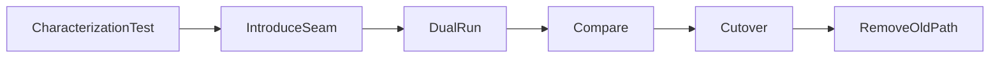

# Legacy Refactoring Safety Net

Tạo khả năng thay đổi an toàn trước khi cải thiện cấu trúc.

## Bảng tra nhanh

| Chủ đề | Hướng dẫn |
| --- | --- |
| **Characterization tests** | Khóa behavior hiện tại. |
| **Golden master** | So sánh output lớn/khó phân rã; kiểm soát nondeterminism. |
| **Seam** | Điểm thay dependency mà không sửa toàn hệ thống. |
| **Parallel change** | API cũ/mới cùng tồn tại qua migration. |
| **Feature flag** | Giảm blast radius; cần cleanup. |

## Quy trình áp dụng

1. Xác định quyết định liên quan đến **Legacy Refactoring Safety Net** và viết một ví dụ cụ thể đang gây khó khăn.
2. Dùng mục **Characterization tests** để kiểm tra trường hợp chính; đối chiếu **Golden master** cho boundary hoặc phương án thay thế.
3. Chuyển lựa chọn thành một test, metric hoặc review question có thể xác minh.
4. Ghi rõ giới hạn của checklist `Legacy Refactoring Safety Net` để tránh áp dụng như quy tắc tuyệt đối.

## Lưu ý thực chiến

- Không refactor và đổi requirement trong cùng commit.
- Capture production sample đã ẩn dữ liệu nhạy cảm.
- Mỗi bước có rollback path.

## Câu hỏi review

- Trong bối cảnh hiện tại, mục nào của **Legacy Refactoring Safety Net** ảnh hưởng trực tiếp đến invariant hoặc user outcome?
- Failure nào trở nên dễ chẩn đoán hơn khi áp dụng hướng dẫn **Characterization tests**?
- Có thể bỏ bớt abstraction hoặc bước vận hành nào mà vẫn giữ đúng contract không?

## Mô hình quyết định: Legacy safety net

**Điểm kiểm soát thực tiễn:** Không refactor behavior chưa được quan sát; hãy đóng băng semantics trước khi thay cấu trúc.

## Evidence tối thiểu

- Characterization tests khóa behavior đang được production sử dụng.
- Dual-run hoặc shadow comparison báo mismatch với input fingerprint.
- Rollout theo cohort cùng kill switch và rollback trigger.
- Cleanup plan xóa old path, flag và compatibility shim sau cửa sổ ổn định.
