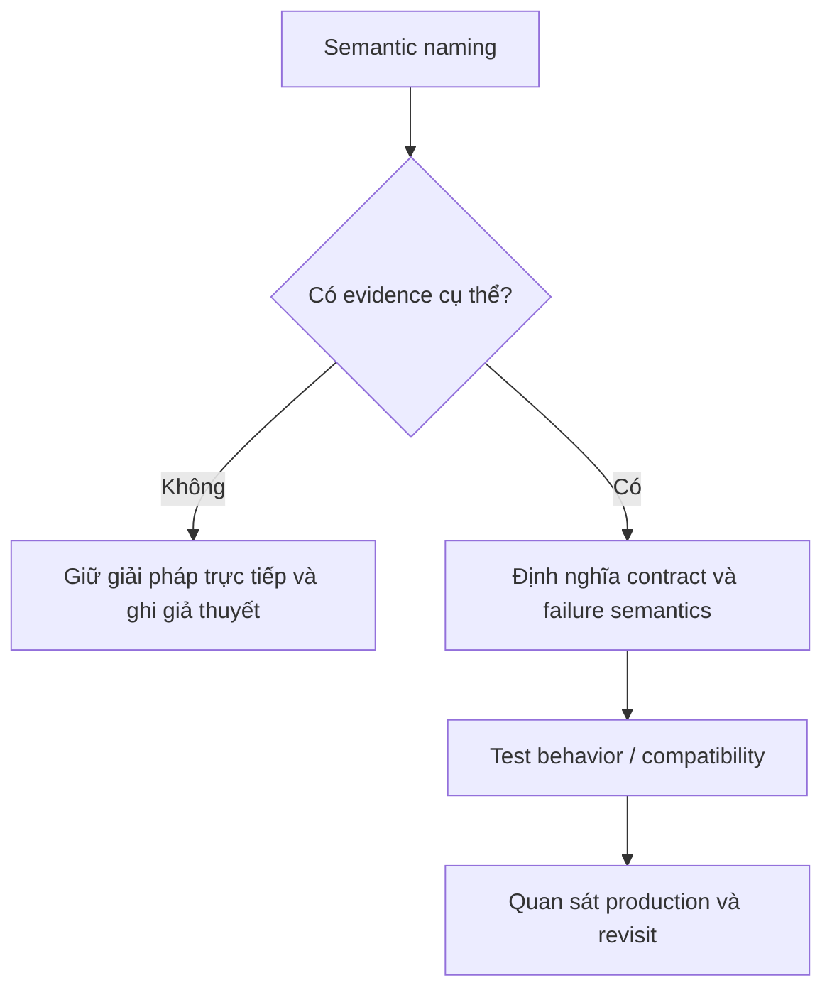

# Naming Guide

Tên tốt truyền tải role, domain và semantics thay vì loại kỹ thuật chung chung.

## Bảng tra nhanh

| Chủ đề | Hướng dẫn |
| --- | --- |
| **Domain object** | `Money`, `Reservation`, `EligibilityDecision`. |
| **Use case** | Động từ + outcome: `PlaceOrder`, `ApproveRefund`. |
| **Policy/Strategy** | Nêu quyết định: `ShippingFeePolicy`. |
| **Adapter** | Nêu vendor/target: `StripePaymentGateway`. |
| **Event** | Thì quá khứ: `OrderPaid`. |
| **Avoid** | `Manager`, `Helper`, `Utils`, `Data`, `Processor` khi không rõ trách nhiệm. |

## Quy trình áp dụng

1. Xác định quyết định liên quan đến **Naming Guide** và viết một ví dụ cụ thể đang gây khó khăn.
2. Dùng mục **Domain object** để kiểm tra trường hợp chính; đối chiếu **Use case** cho boundary hoặc phương án thay thế.
3. Chuyển lựa chọn thành một test, metric hoặc review question có thể xác minh.
4. Ghi rõ giới hạn của checklist `Naming Guide` để tránh áp dụng như quy tắc tuyệt đối.

## Lưu ý thực chiến

- Tên method mô tả outcome, không mô tả implementation.
- Boolean dùng `is/has/can` với semantics rõ.
- Không thêm Interface/Impl vào tên nếu domain role đã đủ.

## Câu hỏi review

- Trong bối cảnh hiện tại, mục nào của **Naming Guide** ảnh hưởng trực tiếp đến invariant hoặc user outcome?
- Failure nào trở nên dễ chẩn đoán hơn khi áp dụng hướng dẫn **Domain object**?
- Có thể bỏ bớt abstraction hoặc bước vận hành nào mà vẫn giữ đúng contract không?

## Bản đồ quyết định

## Tín hiệu cần rà soát

- role, lifetime, side effect, boundary.
- Tên phải tiết lộ trách nhiệm và tránh Manager/Helper chung chung.
- Luôn ghi một phương án đơn giản hơn và điều kiện khiến phương án đó không còn đủ.

## Câu hỏi enterprise

1. Tên có tiết lộ role và side effect không?
2. `Manager`, `Service`, `Helper` có thể thay bằng capability cụ thể nào?
3. Command/event/value object có dùng động từ hoặc thì phù hợp không?
4. Rename có làm lộ boundary đang sai không?
