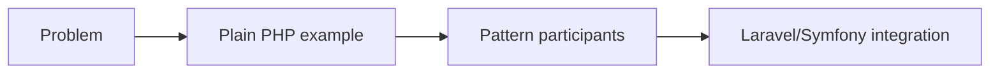

# ADR: Ví dụ GoF không phụ thuộc framework

- Trạng thái: Accepted
- Ngày: 2026-08-01

## Bối cảnh

Các ví dụ GoF cần tập trung vào cơ chế pattern. Nếu phụ thuộc Laravel, người học dễ nhầm pattern với API của framework.

## Quyết định

Tất cả ví dụ GoF trong `src/` chỉ dùng PHP thuần. Ví dụ Laravel được đặt riêng trong `docs/05-laravel-patterns` và `examples/laravel`.

## Các lựa chọn đã cân nhắc

1. Cho phép ví dụ GoF dùng framework tùy tác giả: nhanh nhưng làm intent bị che bởi container, facade và ORM.
2. Cấm framework tuyệt đối trong toàn repository: nhất quán nhưng làm mất cầu nối tới dự án thật.
3. Giữ core GoF bằng PHP thuần, tách ví dụ tích hợp sang khu vực framework: bảo toàn cơ chế pattern và vẫn có đường áp dụng.

## Hậu quả

Ưu điểm là code dễ chạy và dễ chuyển framework. Nhược điểm là cần thêm ví dụ tích hợp để người học liên hệ thực tế.

## Cách kiểm chứng

- CI quét namespace framework trong `src/Creational`, `src/Structural` và `src/Behavioral`.
- Mỗi bài GoF liên kết ít nhất một ví dụ framework hoặc production khi phù hợp.
- Ngoại lệ phải ghi rõ mục đích học tập và được review như một thay đổi kiến trúc.

## Decision drivers

- Người học cần thấy participant của pattern trước khi học container/ORM.
- Quyết định phải giảm coupling hoặc làm rõ ownership, không chỉ tăng số class.
- Team phải có test/evidence để phân biệt lợi ích thật với preference cá nhân.

## Decision

**Giữ ví dụ GoF độc lập framework.**

## Alternative được giữ lại

Framework-specific example vẫn tồn tại ở khu vực integration.

## Rollout và verification

Đo khả năng chạy độc lập, số import framework và mức rõ của participant.

## Điều kiện xem xét lại

- Ví dụ core bắt đầu cần container/framework để chạy.
- Người học không thể nhận ra participant nếu bỏ framework API.
- Hai khu vực core/integration không còn khác mục tiêu.
