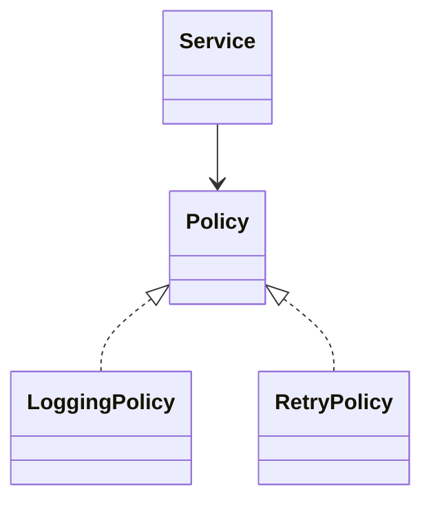

# ADR: Ưu tiên composition thay vì inheritance

- Trạng thái: Accepted
- Ngày: 2026-08-01

## Bối cảnh

Inheritance tạo coupling chặt và khiến thay đổi class cha lan đến nhiều class con.

## Quyết định

Mặc định dùng interface và constructor injection. Chỉ dùng inheritance khi quan hệ “is-a” ổn định và class cha thực sự cung cấp invariant chung.

## Các lựa chọn đã cân nhắc

1. Dùng inheritance làm mặc định để tái sử dụng code: ít class ban đầu nhưng coupling vào lifecycle của base class.
2. Cấm inheritance: loại bỏ một công cụ hợp lệ cho quan hệ subtype ổn định.
3. Ưu tiên composition cho behavior thay đổi; chỉ dùng inheritance khi quan hệ “is-a” và substitutability được chứng minh bằng test.

## Hậu quả

Số class có thể tăng nhưng boundary rõ hơn, dễ test và thay thế hành vi.

## Cách kiểm chứng

- Review subclass có override method chỉ để vô hiệu hóa behavior hay không.
- Contract test xác nhận mọi subtype tuân thủ Liskov Substitution Principle.
- Theo dõi số tầng inheritance và số protected member như tín hiệu cảnh báo.

## Decision drivers

- Inheritance tạo coupling theo hierarchy và khó kết hợp behavior runtime.
- Quyết định phải giảm coupling hoặc làm rõ ownership, không chỉ tăng số class.
- Team phải có test/evidence để phân biệt lợi ích thật với preference cá nhân.

## Decision

**Ưu tiên composition cho behavior thay đổi.**

## Alternative được giữ lại

Inheritance vẫn hợp lý cho quan hệ is-a ổn định và invariant chung.

## Rollout và verification

Theo dõi độ sâu hierarchy, số override, test matrix và số subclass chỉ để đổi behavior.

## Điều kiện xem xét lại

- Domain hình thành hierarchy is-a ổn định với invariant chung.
- Composition tạo quá nhiều object/config mà không có runtime variation.
- Performance/profile chứng minh indirection là hot bottleneck thật.
