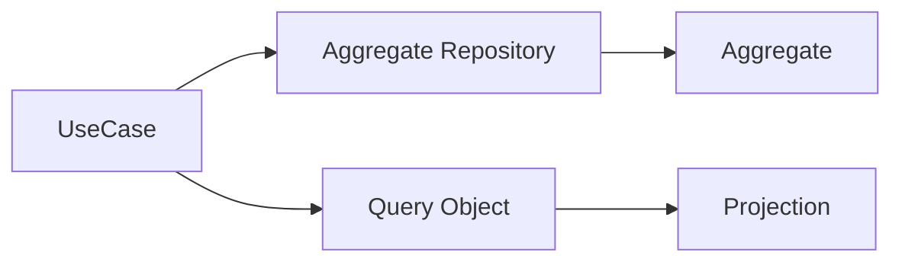

# ADR: Chính sách sử dụng Repository

- Trạng thái: Accepted
- Ngày: 2026-08-01

## Bối cảnh

Repository thường bị biến thành lớp bọc mỏng quanh ORM, làm tăng ceremony mà không giảm coupling.

## Quyết định

Chỉ tạo Repository khi domain cần abstraction persistence, có nhiều nguồn dữ liệu, hoặc truy vấn có ngôn ngữ nghiệp vụ rõ ràng. CRUD đơn giản dùng ORM/query builder trực tiếp.

## Các lựa chọn đã cân nhắc

1. Bọc mọi Eloquent model bằng generic repository: đồng nhất bề ngoài nhưng thêm lớp chuyển tiếp không có semantics.
2. Truy cập ORM trực tiếp ở mọi nơi: đơn giản cho CRUD nhưng làm domain/use case phụ thuộc persistence.
3. Chỉ tạo repository cho aggregate/collection có ngôn ngữ nghiệp vụ; dùng Query Object cho read model phức tạp.

## Hậu quả

Giảm boilerplate nhưng yêu cầu reviewer đánh giá kỹ lý do abstraction.

## Cách kiểm chứng

- Repository method phải diễn đạt intent nghiệp vụ, không chỉ mirror CRUD.
- Test application/domain không cần boot database khi kiểm tra rule.
- Báo cáo truy vấn phức tạp được đo bằng query plan thay vì ép vào repository.

## Decision drivers

- Repository bọc CRUD một-một không tạo giá trị và che mất ORM.
- Quyết định phải giảm coupling hoặc làm rõ ownership, không chỉ tăng số class.
- Team phải có test/evidence để phân biệt lợi ích thật với preference cá nhân.

## Decision

**Chỉ dùng Repository khi có domain collection semantics.**

## Alternative được giữ lại

Query Object hoặc ORM trực tiếp phù hợp read model/CRUD đơn giản.

## Rollout và verification

Review aggregate boundary, transaction semantics, fake parity và query performance.

## Điều kiện xem xét lại

- Repository chỉ còn forward `find/save` không có aggregate semantics.
- Read use case bị ép hydrate aggregate gây cost lớn.
- Fake và production implementation không thể giữ cùng transaction behavior.
