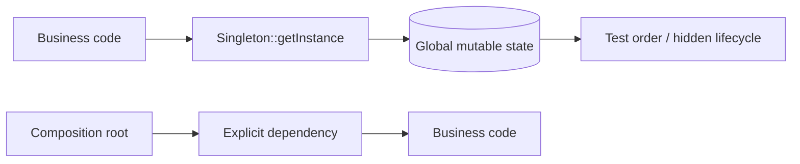

# ADR: Không dùng Singleton tự quản lý lifecycle làm Service Locator

- Trạng thái: Accepted
- Phạm vi: Application và Domain code
- Ngày quyết định: 2026-08-01
- Chủ sở hữu: Architecture Working Group

## Bối cảnh

Một số service được truy cập qua `Service::getInstance()` để tránh truyền dependency. Cách này làm dependency biến mất khỏi constructor, tạo global mutable state, khiến test phụ thuộc thứ tự và buộc business code biết cách khởi tạo infrastructure.

## Decision drivers

- Dependency phải nhìn thấy trong API của class.
- Test phải chạy độc lập và song song được.
- Lifecycle phải được quản lý tại composition root/container.
- Shared immutable resource vẫn cần được reuse hợp lý.

## Quyết định

Không cho phép Singleton tự tạo và giữ instance trong application/domain source. Shared service được đăng ký với lifecycle rõ ràng (`singleton`, `scoped`, `transient`) tại composition root hoặc DI container và luôn được inject qua constructor/port.

## Các lựa chọn đã cân nhắc

1. **Cho phép Singleton để tiện truy cập.** Nhanh ban đầu nhưng tạo hidden dependency và global state.
2. **Cấm mọi shared instance.** Quá cực đoan với immutable configuration, logger hoặc connection pool do container quản lý.
3. **Chọn:** cấm self-managed Singleton; cho phép shared lifecycle do composition root quản lý.

## Hậu quả

### Tích cực

- Dependency graph có thể đọc và kiểm tra tự động.
- Test không cần reset static state.
- Lifecycle theo request/worker được kiểm soát rõ.

### Tiêu cực

- Constructor có thể dài hơn và cần composition root có tổ chức.
- Legacy code cần migration theo seam thay vì thay toàn bộ một lần.

## Kế hoạch áp dụng

1. Tìm `getInstance()`/static service access bằng static analysis.
2. Tạo interface chỉ tại boundary cần test/thay implementation.
3. Inject dependency vào entrypoint mới; legacy path dùng adapter tạm thời.
4. Xóa static state sau khi call site cuối cùng được migrate.

## Cách kiểm chứng

- Architecture test cấm `getInstance()` trong `src/Domain` và `src/Application`.
- Test suite chạy random order và parallel không cần reset global state.
- Container registration ghi lifecycle và owner của resource.

## Khi xem xét lại

Xem xét lại nếu runtime không có composition root thực tế hoặc một immutable flyweight cần cache toàn process. Dù vậy, call site vẫn phải phụ thuộc contract rõ ràng thay vì tự gọi global accessor.
