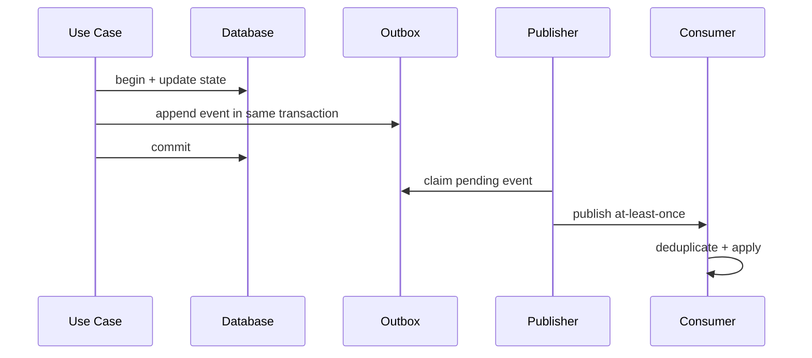

# ADR: Domain Event không thay thế Transaction Boundary

- Trạng thái: Accepted
- Phạm vi: Use case có state change và side effect
- Ngày quyết định: 2026-08-01

## Bối cảnh

Dispatch event trước khi database commit có thể gửi email, gọi provider hoặc publish message dù transaction sau đó rollback. Ngược lại, commit thành công nhưng process crash trước publish sẽ làm mất event.

## Decision drivers

- State mutation phải atomic trong local transaction.
- Cross-process delivery chấp nhận at-least-once, không giả định exactly-once.
- Consumer phải chịu được duplicate và out-of-order khi có thể.
- Có cơ chế phát hiện event bị kẹt hoặc side effect chưa hoàn tất.

## Quyết định

Domain entity ghi nhận fact; application service commit state và outbox record trong cùng transaction. In-process reaction không quan trọng có thể chạy after-commit. Cross-process side effect dùng transactional outbox, idempotent consumer và reconciliation.

## Alternatives

1. Dispatch đồng bộ trong transaction: giữ flow đơn giản nhưng side effect không rollback được.
2. Publish sau commit không outbox: có cửa sổ mất event khi process crash.
3. Không dùng event: giảm failure mode nhưng tăng coupling và không phù hợp nhiều independent reaction.
4. Chọn outbox cho integration event; after-commit cho local reaction phù hợp.

## Hậu quả

- Tăng storage, worker và operational monitoring.
- Delivery có thể trễ; read model/side effect eventual consistent.
- Consumer contract phải có idempotency key và schema version.

## Verification

- Integration test: rollback không tạo outbox event.
- Crash test: commit xong trước publish vẫn được worker gửi lại.
- Duplicate test: consumer xử lý cùng event ID hai lần nhưng effect chỉ một lần.
- Dashboard: outbox age, retry count, dead-letter và reconciliation mismatch.

## Revisit condition

Nếu use case hoàn toàn in-process, side effect có thể rollback và không cần delivery guarantee, after-commit callback đơn giản có thể đủ. Nếu throughput tăng mạnh, xem xét partitioning và ordering key thay vì thay semantic delivery.
