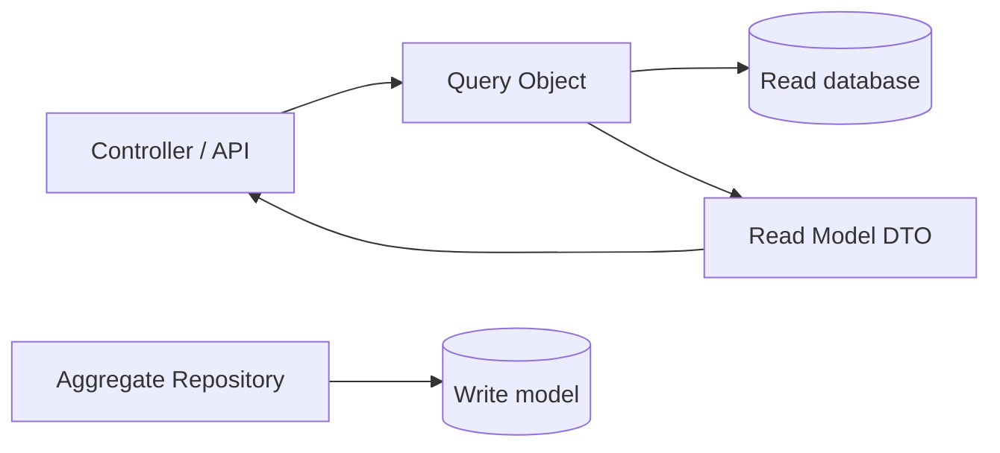

# ADR: Dùng Query Object cho Read Model phức tạp

- Trạng thái: Accepted
- Phạm vi: Reporting/search/listing use case
- Ngày quyết định: 2026-08-01

## Bối cảnh

Controller và application service phình to vì filter, join, projection, sort và pagination. Đưa tất cả vào aggregate repository làm write boundary bị pha trộn với reporting concern.

## Decision drivers

- Read use case có projection và performance profile riêng.
- Ordering/pagination phải ổn định và test được.
- Domain entity không nên bị dùng làm DTO cho bảng/list/report.
- SQL/execution plan cần tối ưu độc lập với write model.

## Quyết định

Dùng Query Object stateless hoặc immutable cho read use case có nhiều filter/projection. Query trả về read model DTO/page, không trả aggregate dùng để ghi. Truy vấn đơn giản, dùng một lần vẫn có thể nằm cục bộ trong application layer.

## Alternatives

1. Mọi query trong Repository: API repository phình to và mất collection semantics.
2. Query trực tiếp trong controller: nhanh nhưng khó test/reuse và dễ trộn HTTP concern.
3. Generic filter engine: linh hoạt nhưng khó kiểm soát SQL, authorization và index.
4. Chọn Query Object theo từng read use case quan trọng.

## Consequences

- Tăng số class nhưng boundary đọc rõ và dễ benchmark.
- Có thể duplicate một ít mapping giữa các projection; chấp nhận để tránh mega-query abstraction.
- Authorization/filter tenant phải được áp dụng nhất quán trong query boundary.

## Verification

- Test tổ hợp filter, empty result, stable ordering và cursor/page boundary.
- Explain plan với dữ liệu đại diện; ghi index assumption.
- Contract test đảm bảo query không trả domain aggregate mutable.
- Metric theo dõi latency, rows scanned và timeout rate.

## Revisit condition

Gộp lại thành local query khi use case biến mất hoặc chỉ còn một filter đơn giản. Tách read database/CQRS chỉ khi scale/availability force được chứng minh, không vì Query Object tồn tại.
