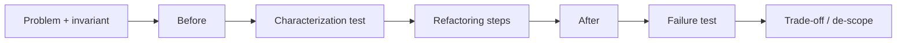

# ADR: Ví dụ đào tạo phải có Before, After, Test và Giới hạn áp dụng

- Trạng thái: Accepted
- Phạm vi: `examples/`, bài pattern trọng yếu và training demo
- Ngày quyết định: 2026-08-01

## Bối cảnh

Chỉ nhìn code “đẹp” sau refactor khiến người học không thấy lực thay đổi, behavior baseline và chi phí abstraction. Ví dụ quá production-grade lại che mất intent bằng framework/configuration.

## Quyết định

Một ví dụ trọng yếu phải có:

1. problem statement và invariant;
2. `before.php` thể hiện smell nhưng vẫn chạy được;
3. characterization test hoặc expected behavior;
4. `after.php` thể hiện pattern đúng intent;
5. failure path;
6. trade-off và khi không nên dùng;
7. bài tập mở rộng.

## Alternatives

- Chỉ yêu cầu code chạy: rẻ nhưng không dạy reasoning.
- Mọi ví dụ phải production-grade: quá nặng, khó đọc.
- Chọn learning-grade executable example, ghi rõ limitation và link production chapter khi cần.

## Quality criteria

- `before` và `after` tạo behavior đối chiếu được.
- Tên class phản ánh domain, không dùng `ConcreteA/B` nếu không phải bài UML thuần túy.
- README giải thích trục thay đổi và dependency direction.
- Test có ít nhất happy path và failure path.
- Không tuyên bố benchmark/production guarantee từ micro example.

## Verification

- `scripts/run-examples.sh` chạy toàn bộ example.
- Editorial audit kiểm tra section bắt buộc và near-duplicate.
- Reviewer đối chiếu diagram với class/function thật.
- Mỗi example có link đến pattern article và bài production liên quan nếu có.

## Revisit condition

Ví dụ rất nhỏ dùng để minh họa syntax có thể không cần full before/after, nhưng phải được đánh dấu “snippet” và không được dùng làm bằng chứng kiến trúc.

## Ví dụ thất bại cần chặn

Một Pull Request thêm pattern nhưng không có behavior test, chỉ chụp UML và assert tên class, phải bị từ chối. Gate cũng cần chặn tài liệu không nêu baseline đơn giản hơn hoặc không chỉ ra failure path; nếu không, repository dễ tối ưu số lượng abstraction thay vì giá trị học tập.
