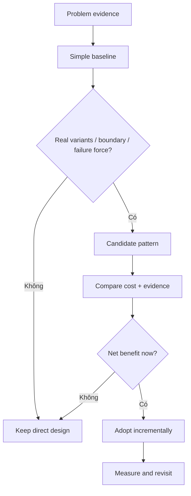

# ADR: Chỉ áp dụng Pattern khi có Evidence về Lực thay đổi

- Trạng thái: Accepted
- Phạm vi: Application design và refactoring proposal
- Ngày quyết định: 2026-08-01

## Bối cảnh

Pattern có thể giảm coupling nhưng cũng tạo thêm class, indirection, wiring và cognitive load. Áp dụng theo “best practice” khi chưa có lực thay đổi thường tạo speculative abstraction.

## Quyết định

Pattern chỉ được đưa vào khi proposal chứng minh ít nhất một trong các điều kiện:

- có từ hai biến thể thực tế với lifecycle/behavior độc lập;
- cùng một thay đổi đang chạm nhiều module và gây blast radius;
- boundary bên ngoài cần contract/error translation;
- testability hoặc failure isolation không đạt với thiết kế trực tiếp;
- yêu cầu production như idempotency, retry, audit hoặc migration tạo seam rõ ràng.

## Alternatives

- Áp dụng ngay khi thấy smell: nhanh nhưng dễ over-engineering.
- Chỉ refactor khi incident xảy ra: trì hoãn quá lâu có thể tăng migration risk.
- Chọn evidence threshold và review định kỳ.

## Evidence packet tối thiểu

- Change history hoặc concrete upcoming requirement.
- Baseline đơn giản và lý do không đủ.
- Dependency/sequence diagram trước–sau.
- Test chứng minh behavior/failure semantics.
- Migration và rollback path.
- Metric hoặc review date để đánh giá abstraction có được sử dụng.

## Consequences

- Ít abstraction speculative hơn.
- Proposal cần đầu tư reasoning/evidence.
- Có thể refactor muộn hơn, nhưng seam được tạo khi thông tin đủ chính xác.

## Verification và revisit

Sau một hoặc hai release, kiểm tra:

- variant mới có thực sự xuất hiện không;
- số call site/change blast radius có giảm không;
- test/incident resolution có tốt hơn không;
- abstraction có bị bypass hoặc chỉ có một implementation giả tạo không.

Nếu evidence không còn, thu gọn hoặc xóa pattern thay vì duy trì vì sunk cost.
