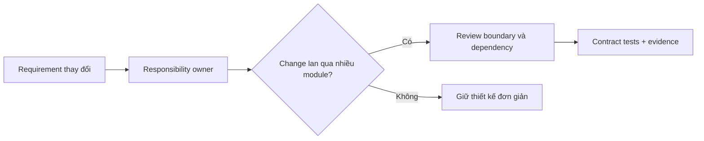

# SOLID trong thực tế

## Mục tiêu học tập

Hiểu SOLID như các **heuristic quản lý thay đổi**, không phải luật bắt buộc tạo nhiều class và interface.

## SRP — Single Responsibility Principle

Một module nên có một lý do thay đổi chính. “Một việc” không đồng nghĩa “một method”; hãy hỏi nhóm stakeholder nào có thể yêu cầu module thay đổi.

## OCP — Open/Closed Principle

Code ổn định nên có thể mở rộng bằng cách thêm implementation hoặc policy mới. OCP không yêu cầu mọi `if` phải biến thành Strategy; chỉ áp dụng khi trục biến đổi đã xuất hiện thật.

## LSP — Liskov Substitution Principle

Subtype không được siết precondition, nới postcondition theo hướng gây bất ngờ hoặc thay đổi semantics của base type.

## ISP — Interface Segregation Principle

Client không nên phụ thuộc method nó không dùng. Interface nên được thiết kế theo nhu cầu của consumer, không theo toàn bộ khả năng của provider.

## DIP — Dependency Inversion Principle

Policy cấp cao phụ thuộc abstraction do phía policy sở hữu; infrastructure triển khai contract đó.

## Ví dụ: OCP và DIP

```php
interface TaxPolicy
{
    public function taxFor(int $subtotalInCents): int;
}

final class VietnamVat implements TaxPolicy
{
    public function taxFor(int $subtotalInCents): int
    {
        return intdiv($subtotalInCents * 10, 100);
    }
}

final class InvoiceCalculator
{
    public function __construct(private TaxPolicy $taxPolicy) {}

    public function total(int $subtotalInCents): int
    {
        return $subtotalInCents + $this->taxPolicy->taxFor($subtotalInCents);
    }
}
```

## Câu hỏi phân tích

1. Nếu `InvoiceCalculator` gửi email và lưu DB, nguyên tắc nào bị ảnh hưởng và vì sao?
2. Một interface chỉ có một implementation có luôn vi phạm YAGNI không?
3. LSP bị phá như thế nào nếu implementation ném thêm exception mà contract không mô tả?
4. DIP khác Dependency Injection ở điểm nào?

## Bài tập

Cho `UserRegistrationService` đang validate input, hash password, lưu DB, gửi email và ghi audit. Hãy tách boundary nhỏ nhất để class còn một workflow rõ ràng mà không tạo “interface cho mọi thứ”.

### Gợi ý cách làm

1. Liệt kê các lý do thay đổi: policy mật khẩu, persistence, email provider, audit requirement.
2. Giữ orchestration trong application service; tách side effect qua contract ở boundary thực sự thay đổi.
3. Không tạo abstraction cho value calculation thuần nếu không có nhu cầu thay thế.
4. Viết unit test cho workflow và integration test cho adapter persistence.

## Sai lầm thường gặp

- Dùng SRP để tách mỗi method thành một class.
- Dùng OCP để loại bỏ mọi conditional.
- Tạo interface chỉ để mock, trong khi test double cho concrete collaborator vẫn đủ.
- Gọi constructor injection là DIP dù policy vẫn phụ thuộc type infrastructure.

## Cách dùng SOLID trong review thực tế

SOLID hữu ích nhất khi được dùng như bộ câu hỏi về **lý do thay đổi**. SRP không có nghĩa mỗi class chỉ một method; nó yêu cầu class có một nhóm trách nhiệm thay đổi cùng nhau. OCP không yêu cầu mọi thứ đều có interface; chỉ mở extension point ở trục variation đã có evidence. LSP cần được kiểm tra bằng contract test, không chỉ nhìn inheritance tree. ISP giúp client không phụ thuộc operation không dùng. DIP đặt policy phụ thuộc abstraction ổn định, nhưng composition root vẫn phải biết concrete implementation.



### Ví dụ phản chứng

Tạo `UserRepositoryInterface` chỉ vì “DIP” trong khi chỉ có một Eloquent implementation và không có boundary domain không tự động cải thiện thiết kế. Ngược lại, tách `ExchangeRateProvider` khỏi pricing policy có giá trị khi vendor, timeout và test determinism là lực thay đổi thật.

### Checklist

- Responsibility có được đặt tên bằng business capability không?
- Subtype có giữ postcondition và failure semantics không?
- Interface có được thiết kế từ nhu cầu client không?
- Dependency direction có thể nhìn thấy trong namespace/import không?
