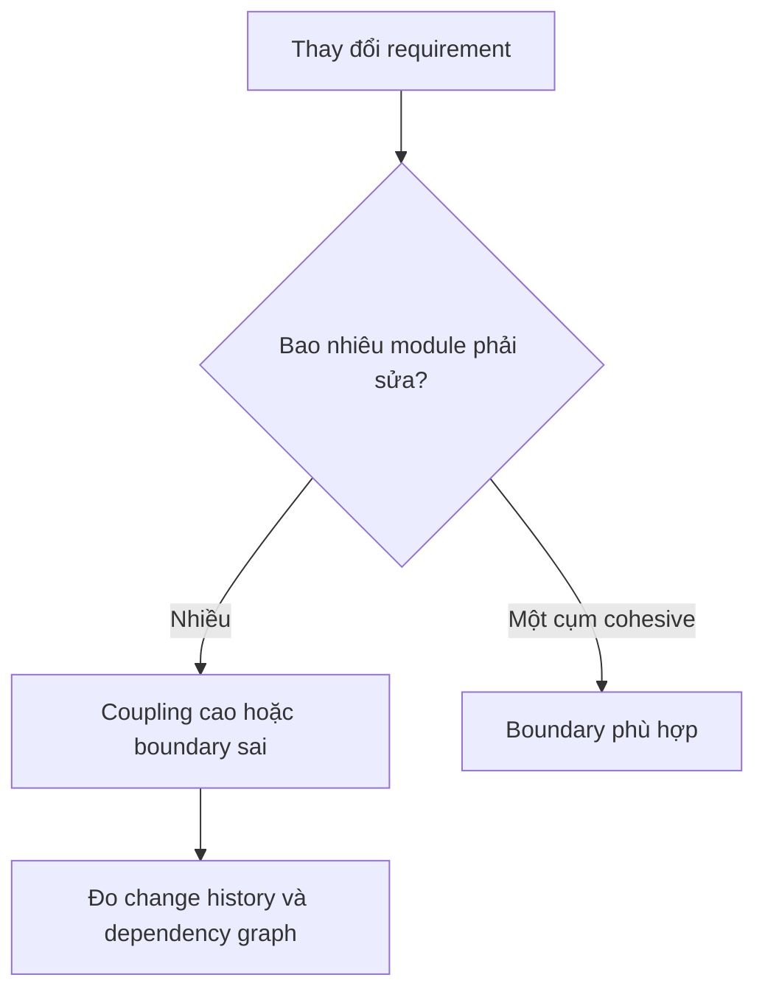

# Coupling và Cohesion

## Mục tiêu học tập

Đánh giá thiết kế bằng hướng phụ thuộc, mức độ lan truyền thay đổi và sự tập trung trách nhiệm thay vì chỉ đếm số class.

## Cohesion

Cohesion cao khi các dữ liệu và hành vi trong module cùng phục vụ một mục tiêu. Class `Invoice` chứa line item và logic tính tổng thường cohesive; class `InvoiceManager` vừa tính thuế, upload PDF, gửi mail và chạy report thì không.

## Coupling

Coupling không thể bằng 0. Điều cần tối ưu là:

- phụ thuộc có rõ ràng hay bị giấu;
- phụ thuộc hướng vào policy ổn định hay chi tiết dễ đổi;
- thay đổi một module có buộc sửa nhiều module khác hay không;
- coupling là compile-time, runtime, dữ liệu hay temporal coupling.

## Ví dụ: loại bỏ dependency thời gian bị giấu

```php
interface Clock
{
    public function now(): DateTimeImmutable;
}

final class SubscriptionPolicy
{
    public function __construct(private Clock $clock) {}

    public function isExpired(DateTimeImmutable $expiresAt): bool
    {
        return $expiresAt <= $this->clock->now();
    }
}
```

## Câu hỏi phân tích

1. Vì sao gọi trực tiếp `new DateTimeImmutable()` tạo coupling khó thấy?
2. Một class có 12 dependency constructor nói gì về cohesion?
3. Shared database giữa hai service tạo loại coupling nào?
4. Event-driven có luôn làm giảm coupling không, hay chỉ chuyển coupling sang schema và thời gian?

## Bài tập

Phân tích một `ReportService` phụ thuộc DB, filesystem, HTTP client, clock, logger và mailer. Vẽ dependency graph, nhóm dependency theo trách nhiệm và đề xuất boundary phù hợp.

### Gợi ý cách làm

1. Đánh dấu dependency nào phục vụ truy vấn, render, lưu trữ và phát hành.
2. Tách use case khỏi formatter và delivery channel trước; không nhất thiết tạo sáu interface.
3. Kiểm tra temporal coupling: bước nào buộc chạy trước bước nào?
4. Viết test chứng minh thay formatter không ảnh hưởng truy vấn dữ liệu.

## Chỉ số tham khảo, không phải luật

- Constructor quá nhiều dependency là tín hiệu review, không phải lỗi tự động.
- Một module thay đổi vì nhiều nhóm stakeholder thường cohesion thấp.
- “Low coupling” nhưng flow khó lần theo cũng là thiết kế kém.

## Các dạng coupling thường gặp

- **Temporal coupling:** phải gọi `initialize()` trước `execute()`.
- **Data coupling:** nhiều module cùng biết schema hoặc array shape.
- **Control coupling:** caller truyền flag để điều khiển nhánh nội bộ.
- **Platform coupling:** domain phụ thuộc trực tiếp SDK/framework.
- **Operational coupling:** hai service phải deploy hoặc recover cùng lúc.

Cohesion cao nghĩa một module gom các rule cần thay đổi cùng nhau. Một `OrderService` có create, payment, export và notification thường cohesion thấp dù tên nghe hợp lý.



## Cách đo thực dụng

Dùng lịch sử commit để xem file nào thường thay cùng nhau, graph import để tìm dependency cycle, và incident review để tìm blast radius. Metric không thay thế judgment nhưng giúp tránh tranh luận cảm tính.

## Bài tập mở rộng

Vẽ dependency graph cho một use case checkout. Đánh dấu domain policy, persistence, payment SDK và notification. Đề xuất một thay đổi làm giảm coupling mà không tạo thêm layer không cần thiết.
