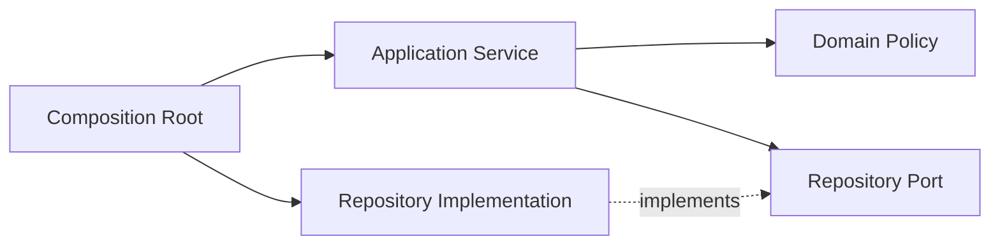

# Dependency Injection

## Mục tiêu học tập

Biết chọn constructor injection, method injection hoặc composition root; tránh Service Locator và injection không cần thiết.

## Dependency là gì?

Dependency là collaborator mà object cần để hoàn thành trách nhiệm: repository, gateway, clock, policy hoặc logger. Value input của từng lời gọi thường là parameter, không phải dependency dài hạn.

## Các hình thức injection

- **Constructor injection**: dành cho dependency bắt buộc và bất biến trong vòng đời object.
- **Method injection**: dành cho collaborator chỉ cần trong một operation hoặc context cụ thể.
- **Property/setter injection**: dễ tạo object ở trạng thái chưa hoàn chỉnh; chỉ dùng khi framework/lifecycle bắt buộc.

## Ví dụ

```php
interface Mailer
{
    public function send(string $recipient, string $body): void;
}

final class SendWelcomeEmail
{
    public function __construct(private Mailer $mailer) {}

    public function execute(string $email): void
    {
        $this->mailer->send($email, 'Chào mừng bạn!');
    }
}
```

## Composition Root

Việc chọn concrete implementation nên tập trung tại entry point hoặc container configuration. Domain/application code không nên tự hỏi container để lấy dependency.

## Câu hỏi phân tích

1. Vì sao `Container::get(Mailer::class)` bên trong service làm dependency bị giấu?
2. Khi nào method injection hợp lý hơn constructor injection?
3. Inject logger vào mọi entity có tạo coupling không cần thiết không?
4. DI container giải quyết wiring; nó có tự động tạo ra DIP không?

## Bài tập

Refactor `CheckoutService` đang tự tạo `PDO`, `StripeClient` và `SystemClock` trong constructor để có thể test payment timeout mà không gọi mạng.

### Gợi ý cách làm

1. Xác định contract tại boundary: `OrderRepository`, `PaymentGateway`, `Clock`.
2. Truyền chúng qua constructor vì đều bắt buộc cho use case.
3. Tạo fake gateway mô phỏng timeout và kiểm tra trạng thái order sau lỗi.
4. Wiring concrete implementation ở `bootstrap.php` hoặc service container, không trong use case.

## Sai lầm thường gặp

- Inject scalar không có ý nghĩa thay vì dùng configuration object có tên.
- Inject container thay vì dependency thật.
- Tạo interface cho mọi helper thuần.
- Dùng setter injection cho dependency bắt buộc.

## Composition Root và lifecycle

Dependency Injection chỉ có giá trị khi việc lắp ghép object tập trung ở composition root. Domain object không nên gọi container hoặc tự resolve dependency. Lifecycle phải rõ: transient cho object nhẹ/stateless, scoped cho request/tenant context, singleton cho service immutable và thread-safe.



## Constructor, method và ambient context

Constructor injection phù hợp dependency bắt buộc. Method injection phù hợp collaborator chỉ cần cho một operation. Clock, current actor và tenant nên là dependency/context rõ ràng thay vì global static state.

## Failure cần tránh

- Circular dependency cho thấy boundary hoặc orchestration chưa rõ.
- Container singleton giữ request state gây leak dữ liệu.
- Service locator làm dependency ẩn và test khó.
- Mock quá nhiều dependency là tín hiệu class có quá nhiều trách nhiệm.

## Kiểm thử

Test application service bằng fake clock, fake repository và stub gateway; giữ contract test cho implementation hạ tầng. Không mock Value Object hoặc entity thuần.
