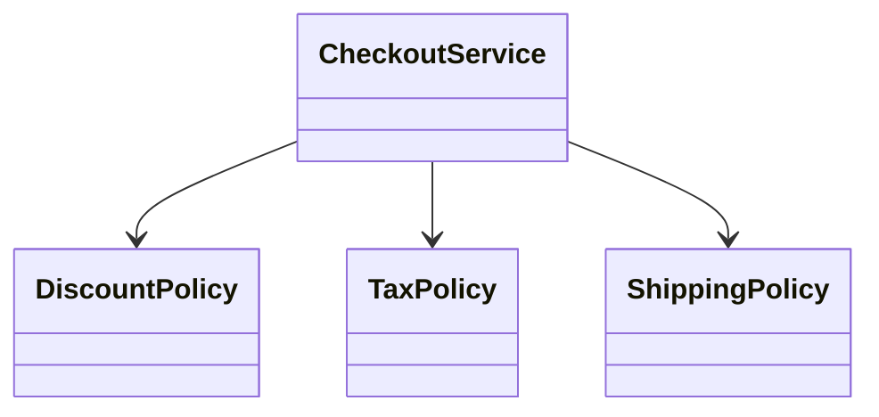

# Ưu tiên Composition hơn Inheritance

## Mục tiêu học tập

Nhận biết subclass explosion, fragile base class và khi nào inheritance vẫn là lựa chọn đúng.

## Vì sao composition linh hoạt hơn?

Composition ghép các object độc lập theo vai trò. Hành vi có thể thay thế tại runtime, test riêng và kết hợp mà không tạo cây lớp theo mọi tổ hợp.

## Ví dụ

```php
interface PriceRule
{
    public function apply(int $priceInCents): int;
}

final class PercentageDiscount implements PriceRule
{
    public function __construct(private int $percent) {}

    public function apply(int $priceInCents): int
    {
        return $priceInCents - intdiv($priceInCents * $this->percent, 100);
    }
}

final class ProductPricing
{
    public function __construct(private PriceRule $rule) {}

    public function priceFor(int $basePriceInCents): int
    {
        return $this->rule->apply($basePriceInCents);
    }
}
```

## Khi inheritance vẫn phù hợp

- Quan hệ is-a ổn định và có ý nghĩa domain.
- Base class định nghĩa contract đầy đủ, subtype không phá LSP.
- Template Method cần giữ skeleton algorithm và các hook được kiểm soát.

## Câu hỏi phân tích

1. Vì sao `PremiumCachedLoggingProductService` là dấu hiệu subclass explosion?
2. Composition có nhược điểm gì về số object và flow điều hướng?
3. Khi nào một abstract base class tốt hơn interface + delegation?
4. Decorator và Strategy đều dùng composition nhưng giải quyết lực thay đổi khác nhau thế nào?

## Bài tập

Một hệ thống notification có class con theo mọi tổ hợp `Email`, `Sms`, `Logged`, `Retried`, `Encrypted`. Hãy thiết kế lại để channel, retry và logging thay đổi độc lập.

### Gợi ý cách làm

1. Đặt contract `NotificationChannel` cho hành vi gửi.
2. Dùng Decorator cho logging/retry vì chúng bọc cùng contract.
3. Dùng Strategy hoặc factory để chọn channel theo recipient/context.
4. Viết test chứng minh có thể kết hợp `Retrying(Logging(Sms))` mà không thêm subclass.

## Cảnh báo

Composition không đồng nghĩa “mọi thứ là interface”. Concrete collaborator nhỏ và ổn định vẫn có thể được compose trực tiếp.

## Khi composition tạo giá trị

Composition phù hợp khi behavior cần kết hợp độc lập, thay tại runtime hoặc test riêng. Inheritance phù hợp khi có quan hệ subtype bền vững và contract LSP rõ. “Ưu tiên composition” không có nghĩa cấm inheritance; mục tiêu là tránh cây kế thừa mã hóa nhiều trục variation.



## Dấu hiệu inheritance đang sai

- subclass override method chỉ để tắt behavior;
- base class có nhiều protected hook và flag;
- thêm một variation làm tăng tổ hợp subclass;
- client cần kiểm tra concrete subtype;
- test subclass phải hiểu nhiều state ẩn của base class.

## Migration an toàn

1. Viết characterization test cho base/subclass.
2. Extract behavior thay đổi thành collaborator.
3. Delegate từ base class trong giai đoạn chuyển tiếp.
4. Migrate từng subclass và xóa hook không còn dùng.

## Trade-off

Composition tăng số object và wiring. Nếu behavior không thay đổi và inheritance tree nông, stable, một base class nhỏ có thể đơn giản hơn.

## Câu hỏi review bổ sung

Behavior nào cần thay độc lập? Cây kế thừa có encode nhiều trục variation không? Client có thể dùng contract mà không biết subtype hay vẫn phải `instanceof`? Nếu composition được chọn, composition root nào chịu trách nhiệm lắp ghép?
