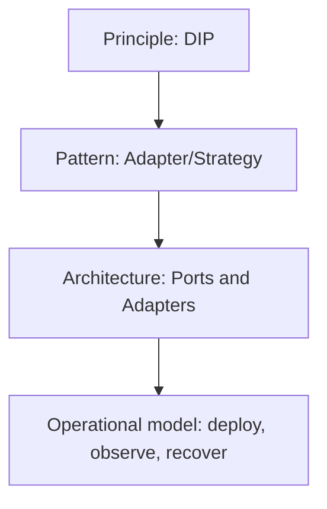

# Phân biệt Pattern, Principle và Architecture

## Mục tiêu học tập

Chọn đúng cấp độ giải pháp và tránh dùng từ “architecture” cho một class hoặc “pattern” cho mọi convention.

## Principle

Principle là định hướng đánh giá quyết định, ví dụ KISS, YAGNI, SOLID. Principle không cung cấp cấu trúc class hoàn chỉnh.

## Design Pattern

Design Pattern mô tả cấu trúc cộng tác lặp lại giữa object/class trong một bối cảnh, cùng lực tác động và trade-off.

## Architectural Pattern

Architectural Pattern tổ chức boundary lớn của hệ thống: Layered, Hexagonal, CQRS, Event-Driven. Nó ảnh hưởng dependency, deployment, data ownership và operational model.

## Framework

Framework là công cụ và runtime convention. Laravel có container, events và queue; việc dùng Laravel không tự động biến hệ thống thành Clean Architecture.

## Ví dụ ba cấp độ

```php
// Principle: Dependency Inversion.
interface OrderRepository { public function save(Order $order): void; }

// Design pattern: Repository làm persistence boundary.
final class PdoOrderRepository implements OrderRepository { /* ... */ }

// Architecture: application layer phụ thuộc port; infrastructure phụ thuộc ngược vào port.
final class PlaceOrder
{
    public function __construct(private OrderRepository $orders) {}
}
```

## Câu hỏi phân tích

1. Strategy là pattern; OCP là principle. Chúng liên quan nhưng không đồng nhất như thế nào?
2. Repository có thể tồn tại trong layered và hexagonal architecture ra sao?
3. Vì sao dùng folder `Domain/Application/Infrastructure` chưa chứng minh hệ thống có boundary tốt?
4. Khi nào một quyết định cục bộ phải được nâng thành ADR kiến trúc?

## Bài tập

Phân loại các quyết định sau: “dùng immutable Money”, “dùng Strategy cho shipping”, “tách read/write model”, “dùng Laravel”, “mọi dependency hướng vào domain”. Giải thích cấp độ và phạm vi ảnh hưởng.

### Gợi ý cách làm

1. Hỏi quyết định là heuristic, cấu trúc object, cấu trúc hệ thống hay công cụ.
2. Xác định phạm vi thay đổi: một method, một module, toàn hệ thống hay vận hành.
3. Nêu trade-off và cách kiểm chứng cho từng quyết định.
4. Không gán nhãn “architecture” chỉ vì có nhiều folder.

## Bảng tóm tắt

| Cấp độ | Câu hỏi chính | Ví dụ |
|---|---|---|
| Principle | Quyết định có hướng tới thiết kế tốt không? | DIP, KISS |
| Pattern | Các object cộng tác thế nào? | Strategy, Adapter |
| Architecture | Boundary và dependency toàn hệ thống ra sao? | Hexagonal, CQRS |
| Framework | Công cụ nào hỗ trợ hiện thực? | Laravel, Symfony |

## Ba cấp độ không thể thay thế nhau

- **Principle** là heuristic đánh giá, ví dụ DIP hoặc information hiding.
- **Pattern** là cấu trúc cộng tác giải quyết lực thay đổi lặp lại.
- **Architecture** quyết định boundary, dependency direction, deployment và ownership ở quy mô hệ thống.



Dùng Strategy không tự động tạo Clean Architecture; dùng Repository không tự động tạo DDD. Architecture còn phụ thuộc transaction, consistency, team ownership và operational boundary.

## Cách trình bày quyết định

Một quyết định tốt nêu context, forces, options, choice, consequence, evidence và revisit trigger. Tên pattern chỉ là shorthand ở phần choice.

## Sai lầm thường gặp

- Nâng một coding convention thành architecture rule.
- Gọi mọi service là “DDD”.
- Chọn microservice để giải quyết class lớn.
- Dùng pattern catalog thay cho phân tích requirement.
