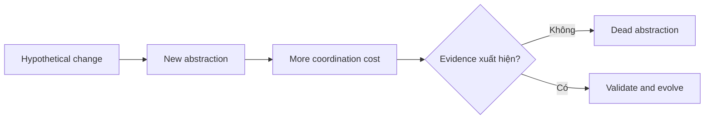

# Anti-pattern và Over-engineering

## Mục tiêu học tập

Nhận biết giải pháp có vẻ “kiến trúc” nhưng tăng chi phí điều hướng, coupling hoặc vận hành mà chưa giải quyết rủi ro thật.

## Anti-pattern phổ biến

- **God Object**: một class biết và làm quá nhiều.
- **Service Locator**: dependency bị giấu sau global/container access.
- **Generic Repository**: CRUD abstraction xóa mất ngôn ngữ nghiệp vụ nhưng không giảm coupling ORM.
- **Premature Abstraction**: tổng quát hóa trước khi hiểu các biến thể.
- **Cargo-cult DDD**: thêm Entity/Repository/Factory nhưng không có invariant hoặc bounded context.
- **Distributed Monolith**: nhiều service nhưng deploy và schema vẫn coupling chặt.

## Over-engineering được nhận biết thế nào?

Không dựa vào số class tuyệt đối. Hãy so chi phí abstraction với thay đổi thực tế, testability, ownership và failure isolation mà nó mang lại.

## Ví dụ abstraction quá sớm

```php
final class Slugger
{
    public function slug(string $text): string
    {
        return strtolower(str_replace(' ', '-', trim($text)));
    }
}
```

Một function/class đơn giản có thể đủ. Thêm `SluggerInterface`, `SluggerFactory`, `SluggerManager` không tạo giá trị nếu chưa có boundary hoặc biến thể thật.

## Câu hỏi phân tích

1. Khi nào “chỉ có một implementation” vẫn đáng có interface?
2. Generic Repository làm mất use-case vocabulary như thế nào?
3. Microservice có thể là over-engineering khi team và traffic nhỏ ra sao?
4. Làm thế nào phân biệt abstraction có chủ đích với abstraction phòng xa?

## Bài tập

Review một pull request thêm Controller → Service → Manager → Repository → DAO cho CRUD bảng cấu hình. Hãy đề xuất phiên bản đơn giản hơn và nêu điều kiện nào trong tương lai mới biện minh cho từng layer.

### Gợi ý cách làm

1. Vẽ call flow và đánh dấu nơi có policy thật.
2. Xóa wrapper chỉ forward tham số và return nguyên kết quả.
3. Giữ boundary ở nơi có transaction, external system hoặc business rule.
4. Ghi “trigger để revisit” thay vì thiết kế trước cho mọi giả định.

## Checklist chống over-engineering

- Có ít nhất một failure mode hoặc change axis cụ thể không?
- Abstraction có vocabulary nghiệp vụ không?
- Test có đơn giản hơn rõ ràng không?
- Người mới có lần theo flow trong vài phút không?
- Có thể trì hoãn quyết định mà không tăng rủi ro không?

## Over-engineering xuất hiện như thế nào?

Over-engineering thường bắt đầu từ requirement giả định: tạo interface cho mọi class, generic repository cho mọi entity, event cho mọi method call hoặc microservice cho module chưa có boundary. Chi phí nằm ở navigation, wiring, debugging, onboarding và migration—not chỉ số dòng code.



## Heuristic phát hiện

- Abstraction chỉ có một implementation và không che boundary/failure.
- Type name chung chung như Manager, Engine, Processor nhưng không có invariant.
- Thêm feature đơn giản cần sửa nhiều layer ceremony.
- Team không giải thích được failure path hoặc ownership.
- Test chủ yếu xác minh mock call thay vì behavior.

## Cách giảm complexity

Xóa layer pass-through, inline abstraction không có variation, dùng named constructor/Value Object thay builder quá mức, và giữ ADR cho quyết định lớn. Đặt “revisit date” cho abstraction dựa trên giả định tương lai.

## Bài tập mở rộng

Chọn một module có Controller → Service → Manager → Repository chỉ chuyển tiếp dữ liệu. Đề xuất phiên bản tối giản và nêu điều kiện nào sẽ khiến bạn thêm lại một boundary.
