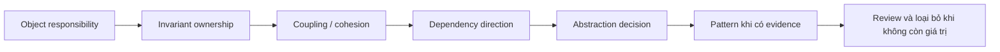

# Nền tảng thiết kế phần mềm

Phần này chuẩn bị mental model trước khi học Design Pattern. Mục tiêu là hiểu **object collaboration, dependency direction, change axis và chi phí abstraction**, không phải ghi nhớ tên mẫu thiết kế.

## Thứ tự học

1. [OOP Review](01-oop-review.md) — object, responsibility và invariant.
2. [SOLID](02-solid.md) — nguyên tắc đánh giá hướng thay đổi.
3. [Coupling và Cohesion](03-coupling-cohesion.md) — blast radius và ownership.
4. [Dependency Injection](04-dependency-injection.md) — explicit dependency và composition root.
5. [Composition over Inheritance](05-composition-over-inheritance.md) — thay behavior mà không khóa hierarchy.
6. [Pattern, Principle và Architecture](06-pattern-principle-architecture.md) — phân biệt scope của từng công cụ.
7. [Anti-pattern và Over-engineering](07-antipattern-overengineering.md) — nhận diện abstraction không tạo giá trị.

## Phương pháp học

Với mỗi bài, chọn một class hoặc workflow thật trong dự án và tạo bốn artifact:

- dependency graph hiện tại;
- invariant và failure path;
- một thay đổi nghiệp vụ giả định;
- test bảo vệ behavior trước khi refactor.

Sau khi đọc, hãy thử giải quyết vấn đề bằng function/composition đơn giản trước. Chỉ đưa pattern vào khi có variant, boundary hoặc failure semantics đủ rõ.

## Câu hỏi xuyên suốt

- Object nào sở hữu invariant?
- Dependency nào ổn định và dependency nào dễ đổi?
- Một thay đổi nghiệp vụ chạm bao nhiêu file/module?
- Abstraction có giảm blast radius hay chỉ chuyển conditional sang class khác?
- Test nào chứng minh thiết kế mới đúng hơn?
- Khi requirement biến mất, abstraction có thể xóa an toàn không?

## Definition of Done

Người học hoàn thành phần Foundation khi có thể:

- giải thích responsibility và invariant của một object bằng ngôn ngữ nghiệp vụ;
- vẽ dependency graph và chỉ ra dependency direction sai;
- viết characterization test trước refactor;
- so sánh composition, inheritance và direct conditional bằng trade-off;
- đề xuất baseline đơn giản hơn pattern;
- ghi một decision note có evidence và revisit condition.

Tiếp tục với [Learning Path](../../learning-path/README.md) hoặc chọn pattern theo [Pattern Selection Guide](../../cheatsheets/pattern-selection-guide.md).
