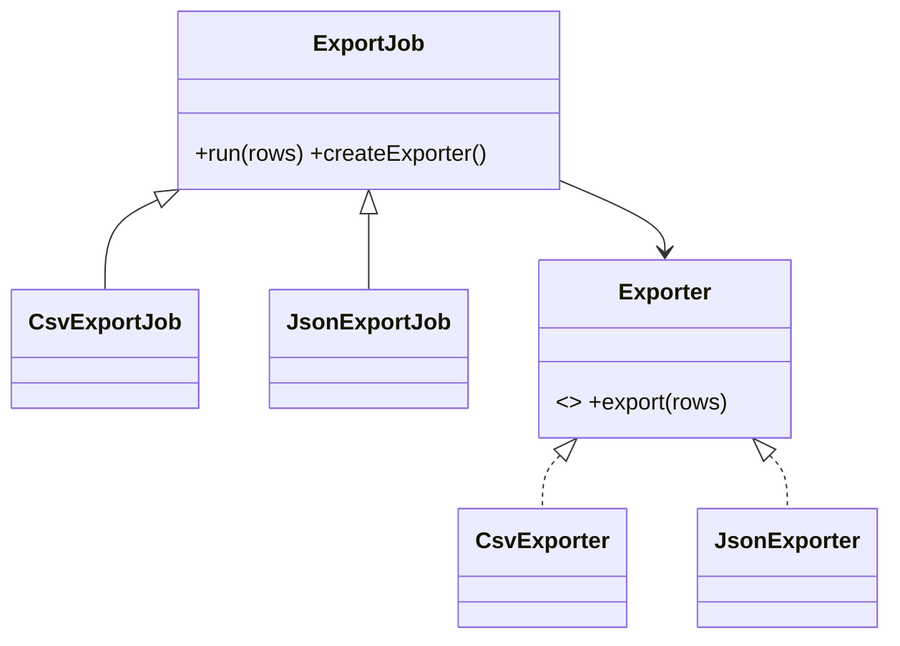

# Factory Method Pattern

## Mục tiêu

Ủy quyền việc tạo object qua factory method hoặc creator.

## Vấn đề thực tế

Hệ thống cần tạo exporter theo định dạng mà client không biết concrete class. Hiện tại client chứa `match` để khởi tạo CSV/JSON exporter, khiến thay đổi lan sang code nghiệp vụ và test.

## Dấu hiệu nhận biết

- Client chứa `match` để khởi tạo csv/json exporter.
- Test phải dựng chi tiết không liên quan đến behavior cần kiểm chứng.
- Yêu cầu mới buộc sửa class đang ổn định thay vì thêm collaborator độc lập.

## Ý tưởng giải pháp

Dùng Factory Method để đặt boundary quanh phần thay đổi. Policy chính phụ thuộc contract nhỏ; chi tiết triển khai được đưa vào object có trách nhiệm rõ ràng.

## Khi nên dùng

- Khi client không nên biết concrete class.

## Khi không nên dùng

- Không dùng khi việc tạo object đơn giản và không có biến đổi.

## Ưu điểm

- Cô lập thay đổi liên quan đến tạo exporter theo định dạng mà client không biết concrete class.
- Test policy và implementation độc lập.
- Thể hiện rõ quyết định dùng Factory Method trong vocabulary của code.

## Nhược điểm

- Tăng số lượng type và bước điều hướng.
- Không có lợi nếu tạo exporter theo định dạng mà client không biết concrete class chỉ có một biến thể ổn định.
- Cần composition root rõ để tránh giấu call flow.

## Bài tập

Thực hiện yêu cầu: **thêm `XmlExporterCreator` mà không sửa client**. Trước khi refactor, viết characterization test khóa behavior hiện tại; sau đó thêm implementation mới mà không sửa policy đã ổn định.

### Gợi ý cách làm

1. Khoanh vùng lực thay đổi: tạo object theo family/format.
2. Đặt contract nhỏ dùng vocabulary của use case, không dùng tên chung như `Behavior` hoặc `Manager`.
3. Di chuyển concrete detail ra sau contract; wiring tại composition root.
4. Viết test cho happy path, failure path và trường hợp implementation mới.
5. Hoàn thành khi: Creator quyết định concrete product; client chỉ dùng `Exporter`.

### Tiêu chí tự review

- Invariant chính có được nói rõ: **creator quyết định product mà workflow không đổi**?
- Client đã ngừng phụ thuộc concrete detail nào, và dependency được wire ở đâu?
- Test có kiểm chứng **thêm concrete creator và giữ `run()` ổn định** thay vì chỉ assert class được gọi?
- Failure/return semantics giữa các implementation có nhất quán không?
- Factory Method không cần thiết nếu chỉ có một constructor rõ và không có creator workflow.

### Câu 1: Factory Method giải quyết vấn đề gì?

**Trả lời:** Pattern này cô lập nhu cầu **tạo object theo family/format** sau một contract rõ ràng. Giá trị chính không phải giảm số dòng code mà là giảm phạm vi thay đổi và cho phép test policy tách khỏi concrete detail.

### Câu 2: Trade-off quan trọng nhất là gì?

**Trả lời:** Thiết kế thêm type, indirection và wiring. Nếu chỉ có một biến thể ổn định hoặc logic rất nhỏ, giải pháp trực tiếp thường dễ đọc hơn. Hãy chứng minh bằng change axis, testability hoặc ownership boundary thay vì áp dụng theo thói quen.  
> **Ngữ cảnh áp dụng:** Áp dụng riêng cho **Factory Method Pattern**: liên hệ checklist với sơ đồ và code trước/sau trong bài, rồi nêu change axis mà pattern bảo vệ.

### Câu 3: So sánh với Simple Factory hoặc Abstract Factory

**Trả lời:** Factory Method thường dùng inheritance hoặc hook tạo product; Simple Factory là một object/function tập trung lựa chọn.

### Câu 4: Bạn kiểm thử pattern này thế nào?

**Trả lời:** Bắt đầu bằng behavior contract của factory method: thêm concrete creator và giữ `run()` ổn định. Sau đó thêm failure-path test cho exception/side effect, wiring test tại composition root và regression test để bảo đảm client không cần biết concrete implementation. Tránh mock từng method nội bộ vì điều đó khóa cấu trúc thay vì semantics.

## UML cộng tác



Hãy đọc sơ đồ theo quyền sở hữu: creator giữ workflow, còn factory method là điểm mở rộng duy nhất cho việc tạo product.

## Minh họa trước và sau refactor

### Trước khi áp dụng

```php
$exporter = match ($format) {
    'csv' => new CsvExporter(),
    'json' => new JsonExporter(),
    default => throw new InvalidArgumentException('Unsupported format'),
};
return $exporter->export($rows);
```

### Sau khi áp dụng

```php
interface Exporter { public function export(array $rows): string; }

abstract class ExportJob
{
    final public function run(array $rows): string
    {
        return $this->createExporter()->export($rows);
    }

    abstract protected function createExporter(): Exporter;
}

final class CsvExportJob extends ExportJob
{
    protected function createExporter(): Exporter { return new CsvExporter(); }
}
```

> Ý tưởng trọng tâm: `ExportJob` định nghĩa workflow, còn từng subclass override `createExporter()` để quyết định concrete product. Đây là Factory Method, không phải Simple Factory.

## Ví dụ chạy được

Xem [`examples/creational/factory-exporter`](../../examples/creational/factory-exporter/README.md) để chạy bản `before.php` và `after.php`.

## Bài tập thực hành

1. Khóa behavior hiện tại bằng characterization test.
2. Thực hiện yêu cầu: thêm XML exporter mà không sửa use case.
3. Viết một test cho failure path đặc trưng của Factory Method.
4. Ghi rõ khi nào giải pháp trực tiếp sẽ dễ hiểu hơn.

### Gợi ý thực hiện bài tập thực hành

1. Viết characterization test tái hiện pain point của factory method.
2. Đánh dấu chính xác nơi invariant “creator quyết định product mà workflow không đổi” đang bị đe dọa.
3. Refactor một dependency hoặc branch mỗi lần; giữ output/public API trong bước đầu.
4. Chứng minh thiết kế bằng phép thử: **thêm concrete creator và giữ `run()` ổn định**.
5. Ghi lại trường hợp không áp dụng: Factory Method không cần thiết nếu chỉ có một constructor rõ và không có creator workflow.

### Câu hỏi quan sát

- Trong ví dụ này, lực thay đổi nào được Factory Method cô lập?
- Client còn biết concrete class hoặc lifecycle detail nào không?
- Test nào chứng minh có thể thay implementation mà không sửa policy?

## Hướng refactor an toàn

1. Viết characterization test cho behavior hiện tại, đặc biệt quanh **quyền tạo product thuộc về creator/subclass**.
2. Đánh dấu đúng change axis và dependency cần đảo chiều; chưa tạo interface cho phần ổn định.
3. Tách một bước nhỏ, giữ public behavior và chạy test sau mỗi commit.
4. Thêm một concrete creator mới mà workflow export không đổi.
5. So sánh độ đọc hiểu, số type và chi phí wiring với phiên bản trực tiếp trước khi chấp nhận refactor.

## Kiểm thử nên tập trung vào đâu?

- **Behavior/contract:** thêm một concrete creator mới mà workflow export không đổi.
- **Failure semantics:** exception, kết quả rỗng và side effect phải nhất quán giữa các implementation.
- **Wiring:** composition root chọn đúng collaborator mà không để client phụ thuộc concrete type.
- **Regression:** test bảo vệ behavior cũ, không khóa private method hoặc cấu trúc class.

Factory Method phù hợp khi workflow ổn định nhưng product cần được quyết định bởi subclass; nếu chỉ có một điểm tạo object đơn giản, một hàm factory rõ ràng thường rẻ hơn.

## Câu hỏi tự review

1. Pattern này đang bảo vệ **quyền tạo product thuộc về creator/subclass** hay chỉ tăng số lớp?
2. Test nào thất bại nếu một implementation vi phạm contract nhưng vẫn trả đúng kiểu dữ liệu?
3. Concrete detail nào đã biến mất khỏi client sau refactor?
4. Factory Method phù hợp khi workflow ổn định nhưng product cần được quyết định bởi subclass; nếu chỉ có một điểm tạo object đơn giản, một hàm factory rõ ràng thường rẻ hơn.

