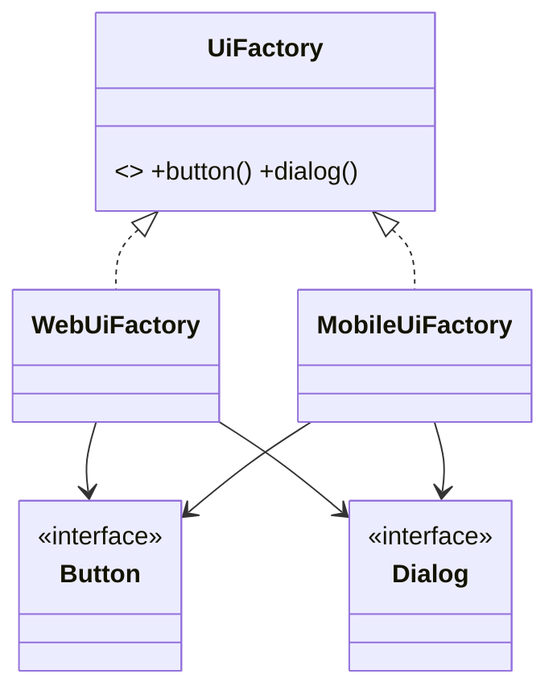

# Abstract Factory Pattern

## Mục tiêu

Tạo họ object tương thích với nhau.

## Vấn đề thực tế

Hệ thống cần tạo một họ component đồng bộ theo theme. Hiện tại màn hình tự ghép button và dialog thuộc nhiều theme, khiến thay đổi lan sang code nghiệp vụ và test.

## Dấu hiệu nhận biết

- Màn hình tự ghép button và dialog thuộc nhiều theme.
- Test phải dựng chi tiết không liên quan đến behavior cần kiểm chứng.
- Yêu cầu mới buộc sửa class đang ổn định thay vì thêm collaborator độc lập.

## Ý tưởng giải pháp

Dùng Abstract Factory để đặt boundary quanh phần thay đổi. Policy chính phụ thuộc contract nhỏ; chi tiết triển khai được đưa vào object có trách nhiệm rõ ràng.

## Khi nên dùng

- Khi cần chuyển cả bộ implementation theo môi trường/vendor.

## Khi không nên dùng

- Không dùng cho một sản phẩm đơn lẻ.

## Ưu điểm

- Cô lập thay đổi liên quan đến tạo một họ component đồng bộ theo theme.
- Test policy và implementation độc lập.
- Thể hiện rõ quyết định dùng Abstract Factory trong vocabulary của code.

## Nhược điểm

- Tăng số lượng type và bước điều hướng.
- Không có lợi nếu tạo một họ component đồng bộ theo theme chỉ có một biến thể ổn định.
- Cần composition root rõ để tránh giấu call flow.

## Bài tập

Thực hiện yêu cầu: **thêm theme mới gồm Button và Dialog đồng bộ**. Trước khi refactor, viết characterization test khóa behavior hiện tại; sau đó thêm implementation mới mà không sửa policy đã ổn định.

### Gợi ý cách làm

1. Khoanh vùng lực thay đổi: tạo một họ object tương thích.
2. Đặt contract nhỏ dùng vocabulary của use case, không dùng tên chung như `Behavior` hoặc `Manager`.
3. Di chuyển concrete detail ra sau contract; wiring tại composition root.
4. Viết test cho happy path, failure path và trường hợp implementation mới.
5. Hoàn thành khi: Mỗi factory tạo trọn family; không trộn product khác family.

### Tiêu chí tự review

- Invariant chính có được nói rõ: **mọi product trong một family tương thích**?
- Client đã ngừng phụ thuộc concrete detail nào, và dependency được wire ở đâu?
- Test có kiểm chứng **đổi family và không trộn component khác họ** thay vì chỉ assert class được gọi?
- Failure/return semantics giữa các implementation có nhất quán không?
- Abstract Factory khó mở rộng theo chiều thêm product type vì mọi family đều phải đổi.

### Câu 1: Abstract Factory giải quyết vấn đề gì?

**Trả lời:** Pattern này cô lập nhu cầu **tạo một họ object tương thích** sau một contract rõ ràng. Giá trị chính không phải giảm số dòng code mà là giảm phạm vi thay đổi và cho phép test policy tách khỏi concrete detail.

### Câu 2: Trade-off quan trọng nhất là gì?

**Trả lời:** Thiết kế thêm type, indirection và wiring. Nếu chỉ có một biến thể ổn định hoặc logic rất nhỏ, giải pháp trực tiếp thường dễ đọc hơn. Hãy chứng minh bằng change axis, testability hoặc ownership boundary thay vì áp dụng theo thói quen.  
> **Ngữ cảnh áp dụng:** Áp dụng riêng cho **Abstract Factory Pattern**: liên hệ checklist với sơ đồ và code trước/sau trong bài, rồi nêu change axis mà pattern bảo vệ.

### Câu 3: So sánh với Factory Method

**Trả lời:** Đổi cả family là lợi thế; chi phí là khó thêm loại product mới vào mọi family.

### Câu 4: Bạn kiểm thử pattern này thế nào?

**Trả lời:** Bắt đầu bằng behavior contract của abstract factory: đổi family và không trộn component khác họ. Sau đó thêm failure-path test cho exception/side effect, wiring test tại composition root và regression test để bảo đảm client không cần biết concrete implementation. Tránh mock từng method nội bộ vì điều đó khóa cấu trúc thay vì semantics.

## UML product family



Hãy kiểm tra tính đồng bộ của product family: client không được trộn các concrete product thuộc hai family khác nhau.

## Minh họa trước và sau refactor

### Trước khi áp dụng

```php
$button = $theme === 'dark' ? new DarkButton() : new LightButton();
$dialog = $theme === 'dark' ? new DarkDialog() : new LightDialog();
```

### Sau khi áp dụng

```php
interface UiFactory
{
    public function createButton(): Button;
    public function createDialog(): Dialog;
}

final class DarkUiFactory implements UiFactory
{
    public function createButton(): Button { return new DarkButton(); }
    public function createDialog(): Dialog { return new DarkDialog(); }
}
```

> Ý tưởng trọng tâm: Mỗi factory tạo một family component tương thích.

## Ví dụ chạy được

Xem [`examples/creational/factory-exporter`](../../examples/creational/factory-exporter/README.md) để chạy bản `before.php` và `after.php`.

## Bài tập thực hành

1. Khóa behavior hiện tại bằng characterization test.
2. Thực hiện yêu cầu: thêm theme mới mà không sửa screen composition.
3. Viết một test cho failure path đặc trưng của Abstract Factory.
4. Ghi rõ khi nào giải pháp trực tiếp sẽ dễ hiểu hơn.

### Gợi ý thực hiện bài tập thực hành

1. Viết characterization test tái hiện pain point của abstract factory.
2. Đánh dấu chính xác nơi invariant “mọi product trong một family tương thích” đang bị đe dọa.
3. Refactor một dependency hoặc branch mỗi lần; giữ output/public API trong bước đầu.
4. Chứng minh thiết kế bằng phép thử: **đổi family và không trộn component khác họ**.
5. Ghi lại trường hợp không áp dụng: Abstract Factory khó mở rộng theo chiều thêm product type vì mọi family đều phải đổi.

### Câu hỏi quan sát

- Trong ví dụ này, lực thay đổi nào được Abstract Factory cô lập?
- Client còn biết concrete class hoặc lifecycle detail nào không?
- Test nào chứng minh có thể thay implementation mà không sửa policy?

## Hướng refactor an toàn

1. Viết characterization test cho behavior hiện tại, đặc biệt quanh **tính nhất quán của cả product family**.
2. Đánh dấu đúng change axis và dependency cần đảo chiều; chưa tạo interface cho phần ổn định.
3. Tách một bước nhỏ, giữ public behavior và chạy test sau mỗi commit.
4. Đổi toàn bộ family mà client không trộn sản phẩm khác họ.
5. So sánh độ đọc hiểu, số type và chi phí wiring với phiên bản trực tiếp trước khi chấp nhận refactor.

## Kiểm thử nên tập trung vào đâu?

- **Behavior/contract:** đổi toàn bộ family mà client không trộn sản phẩm khác họ.
- **Failure semantics:** exception, kết quả rỗng và side effect phải nhất quán giữa các implementation.
- **Wiring:** composition root chọn đúng collaborator mà không để client phụ thuộc concrete type.
- **Regression:** test bảo vệ behavior cũ, không khóa private method hoặc cấu trúc class.

Abstract Factory hữu ích khi các product phải đi cùng nhau; chi phí là số type tăng nhanh khi bổ sung loại product mới vào mọi family.

## Câu hỏi tự review

1. Pattern này đang bảo vệ **tính nhất quán của cả product family** hay chỉ tăng số lớp?
2. Test nào thất bại nếu một implementation vi phạm contract nhưng vẫn trả đúng kiểu dữ liệu?
3. Concrete detail nào đã biến mất khỏi client sau refactor?
4. Abstract Factory hữu ích khi các product phải đi cùng nhau; chi phí là số type tăng nhanh khi bổ sung loại product mới vào mọi family.

