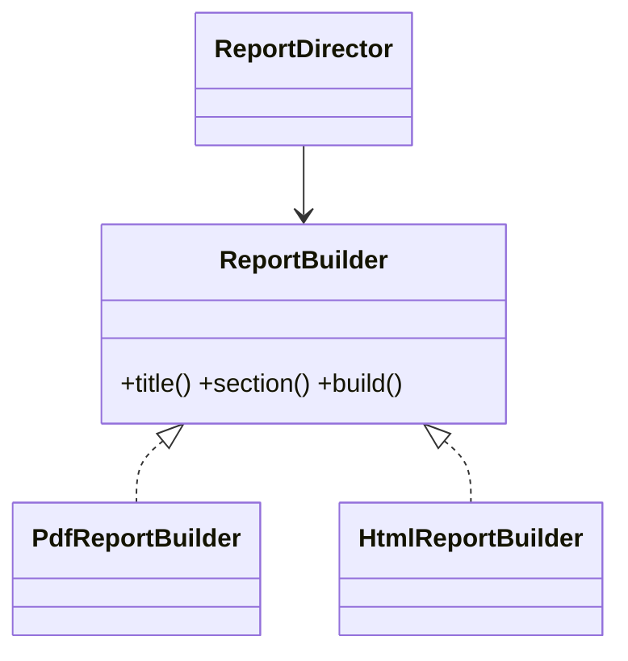

# Builder Pattern

## Mục tiêu

Xây dựng object phức tạp theo từng bước.

## Vấn đề thực tế

Hệ thống cần tạo báo cáo có nhiều tùy chọn và invariant. Hiện tại constructor dài, nhiều `null` và object có thể thiếu dữ liệu bắt buộc, khiến thay đổi lan sang code nghiệp vụ và test.

## Dấu hiệu nhận biết

- Constructor dài, nhiều `null` và object có thể thiếu dữ liệu bắt buộc.
- Test phải dựng chi tiết không liên quan đến behavior cần kiểm chứng.
- Yêu cầu mới buộc sửa class đang ổn định thay vì thêm collaborator độc lập.

## Ý tưởng giải pháp

Dùng Builder để đặt boundary quanh phần thay đổi. Policy chính phụ thuộc contract nhỏ; chi tiết triển khai được đưa vào object có trách nhiệm rõ ràng.

## Khi nên dùng

- Khi constructor có nhiều tham số hoặc nhiều cấu hình tùy chọn.

## Khi không nên dùng

- Không dùng cho DTO đơn giản.

## Ưu điểm

- Cô lập thay đổi liên quan đến tạo báo cáo có nhiều tùy chọn và invariant.
- Test policy và implementation độc lập.
- Thể hiện rõ quyết định dùng Builder trong vocabulary của code.

## Nhược điểm

- Tăng số lượng type và bước điều hướng.
- Không có lợi nếu tạo báo cáo có nhiều tùy chọn và invariant chỉ có một biến thể ổn định.
- Cần composition root rõ để tránh giấu call flow.

## Bài tập

Thực hiện yêu cầu: **thêm tùy chọn report mà không có constructor dài**. Trước khi refactor, viết characterization test khóa behavior hiện tại; sau đó thêm implementation mới mà không sửa policy đã ổn định.

### Gợi ý cách làm

1. Khoanh vùng lực thay đổi: xây object phức tạp theo từng bước.
2. Đặt contract nhỏ dùng vocabulary của use case, không dùng tên chung như `Behavior` hoặc `Manager`.
3. Di chuyển concrete detail ra sau contract; wiring tại composition root.
4. Viết test cho happy path, failure path và trường hợp implementation mới.
5. Hoàn thành khi: Builder kiểm tra invariant tại `build()`.

### Tiêu chí tự review

- Invariant chính có được nói rõ: **object chỉ xuất hiện khi đủ invariant**?
- Client đã ngừng phụ thuộc concrete detail nào, và dependency được wire ở đâu?
- Test có kiểm chứng **build thiếu field, build lặp và reset builder** thay vì chỉ assert class được gọi?
- Failure/return semantics giữa các implementation có nhất quán không?
- Builder không nên chứa side effect hoặc quyết định nghiệp vụ ngoài construction.

### Câu 1: Builder giải quyết vấn đề gì?

**Trả lời:** Pattern này cô lập nhu cầu **xây object phức tạp theo từng bước** sau một contract rõ ràng. Giá trị chính không phải giảm số dòng code mà là giảm phạm vi thay đổi và cho phép test policy tách khỏi concrete detail.

### Câu 2: Trade-off quan trọng nhất là gì?

**Trả lời:** Thiết kế thêm type, indirection và wiring. Nếu chỉ có một biến thể ổn định hoặc logic rất nhỏ, giải pháp trực tiếp thường dễ đọc hơn. Hãy chứng minh bằng change axis, testability hoặc ownership boundary thay vì áp dụng theo thói quen.  
> **Ngữ cảnh áp dụng:** Áp dụng riêng cho **Builder Pattern**: liên hệ checklist với sơ đồ và code trước/sau trong bài, rồi nêu change axis mà pattern bảo vệ.

### Câu 3: So sánh với Factory Method

**Trả lời:** Factory chọn loại object; Builder điều khiển quá trình lắp ráp một object phức tạp.

### Câu 4: Bạn kiểm thử pattern này thế nào?

**Trả lời:** Bắt đầu bằng behavior contract của builder: build thiếu field, build lặp và reset builder. Sau đó thêm failure-path test cho exception/side effect, wiring test tại composition root và regression test để bảo đảm client không cần biết concrete implementation. Tránh mock từng method nội bộ vì điều đó khóa cấu trúc thay vì semantics.

## UML quá trình build



Sơ đồ nhấn mạnh vòng đời xây dựng tạm thời và thời điểm product trở nên hợp lệ, không chỉ số lượng setter.

## Minh họa trước và sau refactor

### Trước khi áp dụng

```php
$report = new Report($title, $columns, $filters, $sort, $timezone, $format);
```

### Sau khi áp dụng

```php
$report = (new ReportBuilder())
    ->withTitle('Doanh thu tháng')
    ->withColumns(['date', 'revenue'])
    ->withFilter('status', 'paid')
    ->sortedBy('date')
    ->build();
```

> Ý tưởng trọng tâm: Builder diễn đạt từng bước tạo object.

## Ví dụ chạy được

Xem [`examples/creational/builder-report`](../../examples/creational/builder-report/README.md) để chạy bản `before.php` và `after.php`.

## Bài tập thực hành

1. Khóa behavior hiện tại bằng characterization test.
2. Thực hiện yêu cầu: thêm bước build kiểm tra invariant.
3. Viết một test cho failure path đặc trưng của Builder.
4. Ghi rõ khi nào giải pháp trực tiếp sẽ dễ hiểu hơn.

### Gợi ý thực hiện bài tập thực hành

1. Viết characterization test tái hiện pain point của builder.
2. Đánh dấu chính xác nơi invariant “object chỉ xuất hiện khi đủ invariant” đang bị đe dọa.
3. Refactor một dependency hoặc branch mỗi lần; giữ output/public API trong bước đầu.
4. Chứng minh thiết kế bằng phép thử: **build thiếu field, build lặp và reset builder**.
5. Ghi lại trường hợp không áp dụng: Builder không nên chứa side effect hoặc quyết định nghiệp vụ ngoài construction.

### Câu hỏi quan sát

- Trong ví dụ này, lực thay đổi nào được Builder cô lập?
- Client còn biết concrete class hoặc lifecycle detail nào không?
- Test nào chứng minh có thể thay implementation mà không sửa policy?

## Hướng refactor an toàn

1. Viết characterization test cho behavior hiện tại, đặc biệt quanh **quy trình dựng object nhiều bước và invariant lúc hoàn tất**.
2. Đánh dấu đúng change axis và dependency cần đảo chiều; chưa tạo interface cho phần ổn định.
3. Tách một bước nhỏ, giữ public behavior và chạy test sau mỗi commit.
4. Thử build thiếu field bắt buộc và build hai cấu hình hợp lệ khác nhau.
5. So sánh độ đọc hiểu, số type và chi phí wiring với phiên bản trực tiếp trước khi chấp nhận refactor.

## Kiểm thử nên tập trung vào đâu?

- **Behavior/contract:** thử build thiếu field bắt buộc và build hai cấu hình hợp lệ khác nhau.
- **Failure semantics:** exception, kết quả rỗng và side effect phải nhất quán giữa các implementation.
- **Wiring:** composition root chọn đúng collaborator mà không để client phụ thuộc concrete type.
- **Regression:** test bảo vệ behavior cũ, không khóa private method hoặc cấu trúc class.

Builder nên giữ trạng thái trung gian và từ chối object chưa hợp lệ; đừng biến builder thành nơi chứa business workflow.

## Câu hỏi tự review

1. Pattern này đang bảo vệ **quy trình dựng object nhiều bước và invariant lúc hoàn tất** hay chỉ tăng số lớp?
2. Test nào thất bại nếu một implementation vi phạm contract nhưng vẫn trả đúng kiểu dữ liệu?
3. Concrete detail nào đã biến mất khỏi client sau refactor?
4. Builder nên giữ trạng thái trung gian và từ chối object chưa hợp lệ; đừng biến builder thành nơi chứa business workflow.

