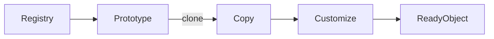

# Prototype Pattern

## Mục tiêu

Tạo object mới bằng clone từ mẫu.

## Vấn đề thực tế

Hệ thống cần sao chép campaign template có object graph phức tạp. Hiện tại khởi tạo lại từng nested object và vô tình chia sẻ mutable state, khiến thay đổi lan sang code nghiệp vụ và test.

## Dấu hiệu nhận biết

- Khởi tạo lại từng nested object và vô tình chia sẻ mutable state.
- Test phải dựng chi tiết không liên quan đến behavior cần kiểm chứng.
- Yêu cầu mới buộc sửa class đang ổn định thay vì thêm collaborator độc lập.

## Ý tưởng giải pháp

Dùng Prototype để đặt boundary quanh phần thay đổi. Policy chính phụ thuộc contract nhỏ; chi tiết triển khai được đưa vào object có trách nhiệm rõ ràng.

## Khi nên dùng

- Khi khởi tạo tốn kém hoặc cần template runtime.

## Khi không nên dùng

- Không dùng khi object chứa resource khó clone.

## Ưu điểm

- Cô lập thay đổi liên quan đến sao chép campaign template có object graph phức tạp.
- Test policy và implementation độc lập.
- Thể hiện rõ quyết định dùng Prototype trong vocabulary của code.

## Nhược điểm

- Tăng số lượng type và bước điều hướng.
- Không có lợi nếu sao chép campaign template có object graph phức tạp chỉ có một biến thể ổn định.
- Cần composition root rõ để tránh giấu call flow.

## Bài tập

Thực hiện yêu cầu: **clone template và đảm bảo deep-copy mutable state**. Trước khi refactor, viết characterization test khóa behavior hiện tại; sau đó thêm implementation mới mà không sửa policy đã ổn định.

### Gợi ý cách làm

1. Khoanh vùng lực thay đổi: sao chép object có cấu hình khởi tạo đắt.
2. Đặt contract nhỏ dùng vocabulary của use case, không dùng tên chung như `Behavior` hoặc `Manager`.
3. Di chuyển concrete detail ra sau contract; wiring tại composition root.
4. Viết test cho happy path, failure path và trường hợp implementation mới.
5. Hoàn thành khi: Clone phải định nghĩa rõ deep/shallow copy.

### Tiêu chí tự review

- Invariant chính có được nói rõ: **clone giữ đúng identity/value semantics**?
- Client đã ngừng phụ thuộc concrete detail nào, và dependency được wire ở đâu?
- Test có kiểm chứng **mutate clone và xác nhận original không đổi** thay vì chỉ assert class được gọi?
- Failure/return semantics giữa các implementation có nhất quán không?
- Prototype nguy hiểm khi deep/shallow copy không được định nghĩa rõ.

### Câu 1: Prototype giải quyết vấn đề gì?

**Trả lời:** Pattern này cô lập nhu cầu **sao chép object có cấu hình khởi tạo đắt** sau một contract rõ ràng. Giá trị chính không phải giảm số dòng code mà là giảm phạm vi thay đổi và cho phép test policy tách khỏi concrete detail.

### Câu 2: Trade-off quan trọng nhất là gì?

**Trả lời:** Thiết kế thêm type, indirection và wiring. Nếu chỉ có một biến thể ổn định hoặc logic rất nhỏ, giải pháp trực tiếp thường dễ đọc hơn. Hãy chứng minh bằng change axis, testability hoặc ownership boundary thay vì áp dụng theo thói quen.  
> **Ngữ cảnh áp dụng:** Áp dụng riêng cho **Prototype Pattern**: liên hệ checklist với sơ đồ và code trước/sau trong bài, rồi nêu change axis mà pattern bảo vệ.

### Câu 3: So sánh với Factory Method

**Trả lời:** Prototype hữu ích khi trạng thái mẫu quan trọng hơn logic chọn class; cần cẩn thận aliasing.

### Câu 4: Bạn kiểm thử pattern này thế nào?

**Trả lời:** Bắt đầu bằng behavior contract của prototype: mutate clone và xác nhận original không đổi. Sau đó thêm failure-path test cho exception/side effect, wiring test tại composition root và regression test để bảo đảm client không cần biết concrete implementation. Tránh mock từng method nội bộ vì điều đó khóa cấu trúc thay vì semantics.

## Luồng clone



Điểm cần quan sát là ranh giới shallow/deep copy và dữ liệu nào được chia sẻ an toàn giữa prototype với clone.

## Minh họa trước và sau refactor

### Trước khi áp dụng

```php
$copy = new Campaign($template->name(), $template->channels(), $template->rules());
```

### Sau khi áp dụng

```php
final class Campaign
{
    public function __clone()
    {
        $this->rules = array_map(static fn (Rule $r) => clone $r, $this->rules);
    }
}

$campaign = clone $template;
$campaign->rename('Khuyến mãi tháng 8');
```

> Ý tưởng trọng tâm: Clone prototype rồi thay phần khác biệt.

## Ví dụ chạy được

Xem [`examples/creational/builder-report`](../../examples/creational/builder-report/README.md) để chạy bản `before.php` và `after.php`.

## Bài tập thực hành

1. Khóa behavior hiện tại bằng characterization test.
2. Thực hiện yêu cầu: clone sâu phần mutable và giữ value object immutable.
3. Viết một test cho failure path đặc trưng của Prototype.
4. Ghi rõ khi nào giải pháp trực tiếp sẽ dễ hiểu hơn.

### Gợi ý thực hiện bài tập thực hành

1. Viết characterization test tái hiện pain point của prototype.
2. Đánh dấu chính xác nơi invariant “clone giữ đúng identity/value semantics” đang bị đe dọa.
3. Refactor một dependency hoặc branch mỗi lần; giữ output/public API trong bước đầu.
4. Chứng minh thiết kế bằng phép thử: **mutate clone và xác nhận original không đổi**.
5. Ghi lại trường hợp không áp dụng: Prototype nguy hiểm khi deep/shallow copy không được định nghĩa rõ.

### Câu hỏi quan sát

- Trong ví dụ này, lực thay đổi nào được Prototype cô lập?
- Client còn biết concrete class hoặc lifecycle detail nào không?
- Test nào chứng minh có thể thay implementation mà không sửa policy?

## Hướng refactor an toàn

1. Viết characterization test cho behavior hiện tại, đặc biệt quanh **chi phí khởi tạo và semantics clone**.
2. Đánh dấu đúng change axis và dependency cần đảo chiều; chưa tạo interface cho phần ổn định.
3. Tách một bước nhỏ, giữ public behavior và chạy test sau mỗi commit.
4. Kiểm tra deep copy của mutable child object.
5. So sánh độ đọc hiểu, số type và chi phí wiring với phiên bản trực tiếp trước khi chấp nhận refactor.

## Kiểm thử nên tập trung vào đâu?

- **Behavior/contract:** kiểm tra deep copy của mutable child object.
- **Failure semantics:** exception, kết quả rỗng và side effect phải nhất quán giữa các implementation.
- **Wiring:** composition root chọn đúng collaborator mà không để client phụ thuộc concrete type.
- **Regression:** test bảo vệ behavior cũ, không khóa private method hoặc cấu trúc class.

Prototype chỉ đáng dùng khi clone phản ánh đúng semantics; với object nhỏ, constructor/factory minh bạch hơn.

## Câu hỏi tự review

1. Pattern này đang bảo vệ **chi phí khởi tạo và semantics clone** hay chỉ tăng số lớp?
2. Test nào thất bại nếu một implementation vi phạm contract nhưng vẫn trả đúng kiểu dữ liệu?
3. Concrete detail nào đã biến mất khỏi client sau refactor?
4. Prototype chỉ đáng dùng khi clone phản ánh đúng semantics; với object nhỏ, constructor/factory minh bạch hơn.

