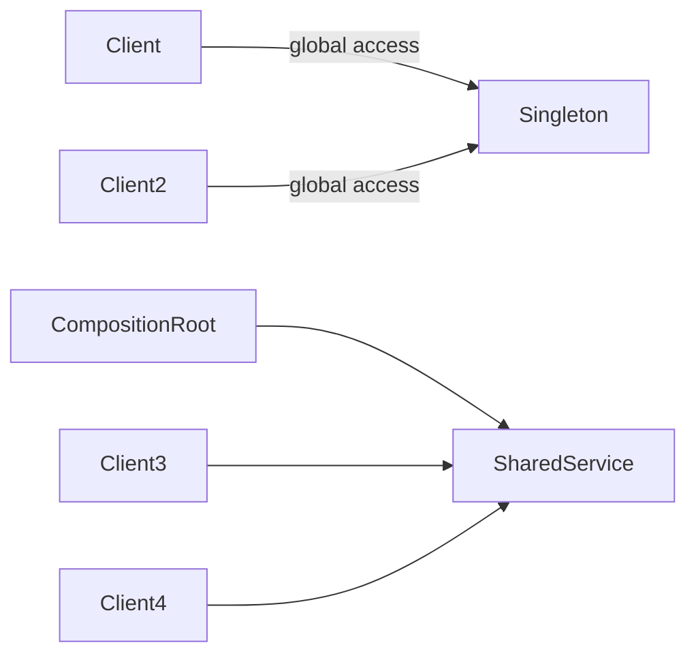

# Singleton Pattern

## Mục tiêu

Giới hạn một instance trong process.

## Vấn đề thực tế

Hệ thống cần chia sẻ một service trong process. Hiện tại global access che giấu dependency và làm test ảnh hưởng nhau, khiến thay đổi lan sang code nghiệp vụ và test.

## Dấu hiệu nhận biết

- Global access che giấu dependency và làm test ảnh hưởng nhau.
- Test phải dựng chi tiết không liên quan đến behavior cần kiểm chứng.
- Yêu cầu mới buộc sửa class đang ổn định thay vì thêm collaborator độc lập.

## Ý tưởng giải pháp

Dùng Singleton để đặt boundary quanh phần thay đổi. Policy chính phụ thuộc contract nhỏ; chi tiết triển khai được đưa vào object có trách nhiệm rõ ràng.

## Khi nên dùng

- Hiếm khi; chỉ khi identity duy nhất là invariant thật sự.

## Khi không nên dùng

- Tránh dùng làm global state hoặc thay DI.

## Ưu điểm

- Cô lập thay đổi liên quan đến chia sẻ một service trong process.
- Test policy và implementation độc lập.
- Thể hiện rõ quyết định dùng Singleton trong vocabulary của code.

## Nhược điểm

- Tăng số lượng type và bước điều hướng.
- Không có lợi nếu chia sẻ một service trong process chỉ có một biến thể ổn định.
- Cần composition root rõ để tránh giấu call flow.

## Bài tập

Thực hiện yêu cầu: **thay global singleton bằng dependency có lifecycle rõ**. Trước khi refactor, viết characterization test khóa behavior hiện tại; sau đó thêm implementation mới mà không sửa policy đã ổn định.

### Gợi ý cách làm

1. Khoanh vùng lực thay đổi: kiểm soát một instance toàn cục.
2. Đặt contract nhỏ dùng vocabulary của use case, không dùng tên chung như `Behavior` hoặc `Manager`.
3. Di chuyển concrete detail ra sau contract; wiring tại composition root.
4. Viết test cho happy path, failure path và trường hợp implementation mới.
5. Hoàn thành khi: Test không phụ thuộc state từ test trước.

### Tiêu chí tự review

- Invariant chính có được nói rõ: **lifetime dùng chung không biến thành global state khó kiểm soát**?
- Client đã ngừng phụ thuộc concrete detail nào, và dependency được wire ở đâu?
- Test có kiểm chứng **chạy test khác thứ tự và reset state** thay vì chỉ assert class được gọi?
- Failure/return semantics giữa các implementation có nhất quán không?
- Singleton thường nên được thay bằng explicit dependency + lifecycle tại composition root.

### Câu 1: Singleton giải quyết vấn đề gì?

**Trả lời:** Pattern này cô lập nhu cầu **kiểm soát một instance toàn cục** sau một contract rõ ràng. Giá trị chính không phải giảm số dòng code mà là giảm phạm vi thay đổi và cho phép test policy tách khỏi concrete detail.

### Câu 2: Trade-off quan trọng nhất là gì?

**Trả lời:** Thiết kế thêm type, indirection và wiring. Nếu chỉ có một biến thể ổn định hoặc logic rất nhỏ, giải pháp trực tiếp thường dễ đọc hơn. Hãy chứng minh bằng change axis, testability hoặc ownership boundary thay vì áp dụng theo thói quen.  
> **Ngữ cảnh áp dụng:** Áp dụng riêng cho **Singleton Pattern**: liên hệ checklist với sơ đồ và code trước/sau trong bài, rồi nêu change axis mà pattern bảo vệ.

### Câu 3: So sánh với Dependency Injection/container scope

**Trả lời:** Singleton gắn lifecycle và global access; container singleton scope có thể giữ một instance nhưng vẫn inject dependency rõ ràng.

### Câu 4: Bạn kiểm thử pattern này thế nào?

**Trả lời:** Bắt đầu bằng behavior contract của singleton: chạy test khác thứ tự và reset state. Sau đó thêm failure-path test cho exception/side effect, wiring test tại composition root và regression test để bảo đảm client không cần biết concrete implementation. Tránh mock từng method nội bộ vì điều đó khóa cấu trúc thay vì semantics.

## Dependency ẩn và phương án thay thế



Sơ đồ giúp phân biệt global accessor với lifecycle scope do composition root/container quản lý; hai khái niệm không đồng nghĩa.

## Minh họa trước và sau refactor

### Trước khi áp dụng

```php
final class Connection
{
    private static ?self $instance = null;
    public static function instance(): self { return self::$instance ??= new self(); }
}
Connection::instance()->query('...');
```

### Sau khi áp dụng

```php
final class OrderRepository
{
    public function __construct(private PDO $connection) {}
}

// Composition root quản lý lifecycle và inject dependency rõ ràng.
$pdo = new PDO($dsn);
$orders = new OrderRepository($pdo);
```

> Ý tưởng trọng tâm: Quản lý một instance tại composition root/container.

## Ví dụ chạy được

Xem [`decisions/examples/004-singleton-policy.md`](../../decisions/examples/004-singleton-policy.md) để chạy bản `before.php` và `after.php`.

## Bài tập thực hành

1. Khóa behavior hiện tại bằng characterization test.
2. Thực hiện yêu cầu: chuyển lifecycle về composition root hoặc container.
3. Viết một test cho failure path đặc trưng của Singleton.
4. Ghi rõ khi nào giải pháp trực tiếp sẽ dễ hiểu hơn.

### Gợi ý thực hiện bài tập thực hành

1. Viết characterization test tái hiện pain point của singleton.
2. Đánh dấu chính xác nơi invariant “lifetime dùng chung không biến thành global state khó kiểm soát” đang bị đe dọa.
3. Refactor một dependency hoặc branch mỗi lần; giữ output/public API trong bước đầu.
4. Chứng minh thiết kế bằng phép thử: **chạy test khác thứ tự và reset state**.
5. Ghi lại trường hợp không áp dụng: Singleton thường nên được thay bằng explicit dependency + lifecycle tại composition root.

### Câu hỏi quan sát

- Trong ví dụ này, lực thay đổi nào được Singleton cô lập?
- Client còn biết concrete class hoặc lifecycle detail nào không?
- Test nào chứng minh có thể thay implementation mà không sửa policy?

## Hướng refactor an toàn

1. Viết characterization test cho behavior hiện tại, đặc biệt quanh **global lifetime và hidden dependency**.
2. Đánh dấu đúng change axis và dependency cần đảo chiều; chưa tạo interface cho phần ổn định.
3. Tách một bước nhỏ, giữ public behavior và chạy test sau mỗi commit.
4. Chạy hai test độc lập để phát hiện state rò giữa test.
5. So sánh độ đọc hiểu, số type và chi phí wiring với phiên bản trực tiếp trước khi chấp nhận refactor.

## Kiểm thử nên tập trung vào đâu?

- **Behavior/contract:** chạy hai test độc lập để phát hiện state rò giữa test.
- **Failure semantics:** exception, kết quả rỗng và side effect phải nhất quán giữa các implementation.
- **Wiring:** composition root chọn đúng collaborator mà không để client phụ thuộc concrete type.
- **Regression:** test bảo vệ behavior cũ, không khóa private method hoặc cấu trúc class.

Singleton thường làm coupling vô hình; container scope hoặc composition root thường kiểm soát lifecycle tốt hơn.

## Câu hỏi tự review

1. Pattern này đang bảo vệ **global lifetime và hidden dependency** hay chỉ tăng số lớp?
2. Test nào thất bại nếu một implementation vi phạm contract nhưng vẫn trả đúng kiểu dữ liệu?
3. Concrete detail nào đã biến mất khỏi client sau refactor?
4. Singleton thường làm coupling vô hình; container scope hoặc composition root thường kiểm soát lifecycle tốt hơn.

