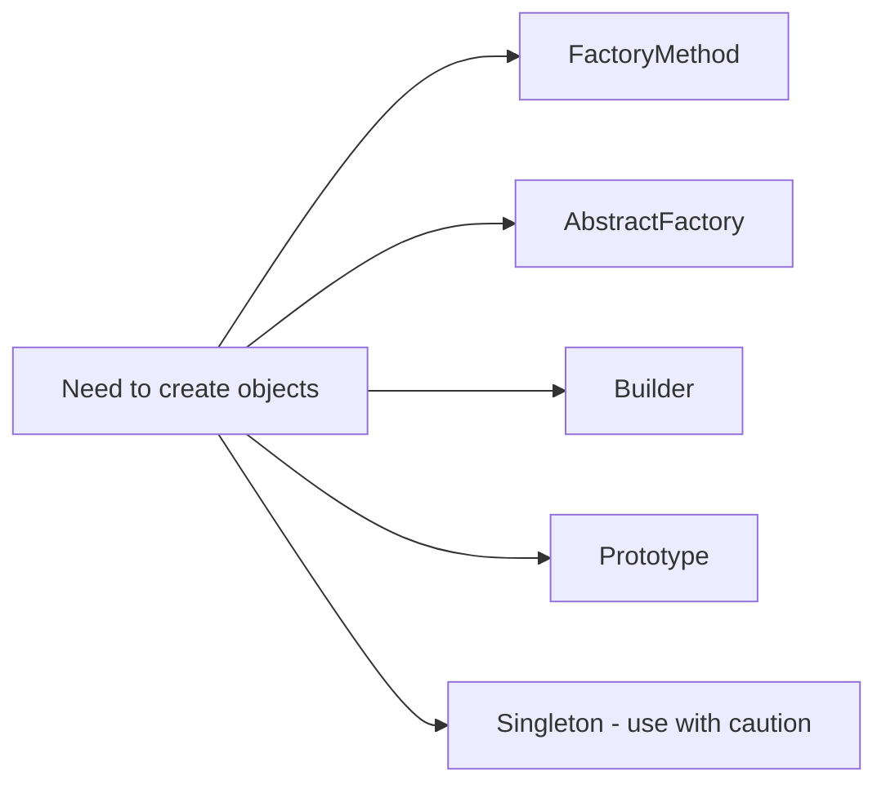

# Creational Patterns

Nhóm Creational tập trung vào quyết định tạo object: ai sở hữu việc khởi tạo, cấu hình nào hợp lệ và làm sao tránh để client phụ thuộc concrete class.

## Mục tiêu học tập

- Phân biệt `new` trực tiếp, factory, family factory, builder, prototype và lifecycle singleton.
- Chọn abstraction dựa trên độ biến động của quá trình tạo object, không dựa trên số class.
- Kiểm thử creation contract, invariant và dependency được inject.

## Nội dung

| Tài liệu | Giá trị chính |
|---|---|
| [Factory Method Pattern](01-factory-method.md) | Học và áp dụng chủ đề **Factory Method Pattern** qua context, trade-off và bài tập liên quan. |
| [Abstract Factory Pattern](02-abstract-factory.md) | Học và áp dụng chủ đề **Abstract Factory Pattern** qua context, trade-off và bài tập liên quan. |
| [Builder Pattern](03-builder.md) | Học và áp dụng chủ đề **Builder Pattern** qua context, trade-off và bài tập liên quan. |
| [Prototype Pattern](04-prototype.md) | Học và áp dụng chủ đề **Prototype Pattern** qua context, trade-off và bài tập liên quan. |
| [Singleton Pattern](05-singleton.md) | Học và áp dụng chủ đề **Singleton Pattern** qua context, trade-off và bài tập liên quan. |

## Cách học đề xuất

1. Bắt đầu bằng code đang `new` object ở nhiều nơi và xác định ai nên sở hữu quyết định tạo.
2. So sánh Factory Method, Abstract Factory và Builder bằng cùng một domain.
3. Viết test cho product contract và invariant của object được tạo.
4. Thử thêm một product family hoặc construction step để quan sát blast radius.
5. Kết thúc bằng quyết định: constructor trực tiếp, named constructor hay pattern nào là đủ.

## Tiêu chí hoàn thành

- Chọn đúng pattern dựa trên variability của creation.
- Phân biệt product family với object construction nhiều bước.
- Test được object hợp lệ mà không phụ thuộc concrete creator.
- Giải thích vì sao Singleton thường không phải giải pháp creation phù hợp.

## Bản đồ lựa chọn

